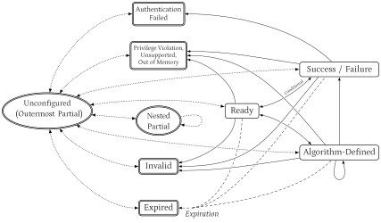

[[ACE-unpriv]]
== Book 1. Unprivileged Architecture: Instructions and Architectural States

// Good judgment comes from experience.
// Experience comes from bad judgment.
// —MULLAH NASRUDIN, 1200s AD

[[ACE-unpriv-intro]]
=== Introduction

ACE relies on certain fundamental concepts, which are introduced here.
While this leads to some repetition, it improves the clarity of the presentation.

[[ACE-concepts]]
==== Fundamental Concepts and Definitions

Cryptographic Context:::
(((Cryptographic Context)))
The *Cryptographic Context* (CC) is the foundation of ACE.
All cryptographic operations performed by ACE execute within the constraints defined by a CC.
A CC contains secrets, usually keys, but it is more than just a key container:
it is an indivisible structure consisting of a *Metadata Header* (MDH) and *Content*.
The MDH has a fixed format and specifies the algorithm that can be used with the secrets, and various optional policies associated with the CC.
(((Cryptographic Context, Metadata Header)))
The Content has an Algorithm-specific format and holds the secrets and other sensitive material, as well as a representation of the Algorithm's state.
(((Cryptographic Context, Content)))
The Metadata requires integrity; the Content requires both integrity and confidentiality.
These requirements are architecturally enforced by ACE and by the algorithms it implements.

Context Register:::
(((Context Register)))
To create CCs, ACE uses *Cryptographic Registers* (CRs), per-hart architectural containers that safeguard their contents.
A CR is *provisioned* by writing Metadata and Content into it; this operation binds the latter to form a CC.
There is no store-like instruction to extract the Content of the CR in a manner that compromises its confidentiality.
A CC may be used for cryptographic operations only while resident in a CR.
Only the ACE unit may access or modify a CC residing in a CR, in accordance with the rules set by the architecture and by the Algorithm bound to the CC.

Sealed Cryptographic Context:::
(((Cryptographic Context, sealed)))
To support context switching while protecting CCs outside architectural state, a CC may be *exported* from a CR as a *Sealed Cryptographic Context* (SCC)—an encrypted and authenticated representation of a CC that can later be *imported* into a CR. Export and import use a _Context Sealing Key_ (CSK), which may be programmable by M-mode. An SCC sealed under one CSK cannot be imported under a different CSK, providing cryptographic domain separation across spatial and temporal domains.

Algorithm:::
(((Algorithms)))
(((Cryptographic Context, object-oriented)))
An *Algorithm* (written with an upper-case "A")
is a state machine that performs cryptographic operations through the interface defined in this specification.
In the metadata of a CR, it is encoded as 16 bits of information.
ACE provides a small set of instructions for interacting with these state machines.
These instructions take the 16-bit identifier from the CR's metadata, along with standard RISC-V inputs and outputs such as GPRs, vector registers, and memory. Their semantics depend on the selected Algorithm. Consequently, a CC in a CR encapsulates Algorithm-specific behavior, allowing different primitives (e.g., AES-128, AES-256, and SM4) to be used interchangeably in the same modes (e.g., ECB, GCM-SIV, and XTS) without changes to the compiled code. Side-channel-attack-resistant variants are supported transparently.

Usage Control Policy:::
(((Cryptographic Context, usage control)))
(((Cryptographic Context, management operations)))
(((Cryptographic Context, usage operations)))
ACE distinguishes between CC/CR *management* and *usage* operations.
(((Cryptographic Context, export)))
Management operations include *configuration* (e.g., CR provisioning, SCC import, and cloning) and *export* of a CR as an SCC. Usage operations include cryptographic operations and state changes.
To prevent denial-of-service scenarios, management operations, in particular configuration operations, are less restricted than usage operations. _Usage Control_ policies restrict only certain CC/CR usage operations.

Localities:::
(((Cryptographic Context, Locality)))
ACE can bind CCs to *Localities*, i.e., restrict usage to specific devices or device classes, hardware configurations, physical or virtual boot cycles, and process domains at various privilege modes. This binding is achieved by using the Localities as _tweaks_ in the encryption and decryption of SCCs.

// ////////////////////////////////////////////////////////////////////

[[ACE-architectural-model]]
==== Architectural Model

This section is informative and non-normative.

ACE is architected as an _attached_ unit: the behavior of ACE instructions model messages sent over a tightly coupled coprocessor interface to the actual implementation. The ACE unit receives operations from the hart, executes them independently, and returns the results.

The present specification defines only the behavior, not implementation:

. ACE may be implemented within a CPU core or as a hardware unit shared by multiple cores, with separate architectural state for each client hart.

. ACE need not be implemented entirely in hardware. Partial or complete trap-and-emulate implementations are permitted.
For example, an implementation may perform symmetric cipher operations (cf. <<ACE-states-symmetric>>) in the ACE unit while emulating public-key cryptography (cf. <<ACE-ECC>> and <<ACE-PQC>>), whose primitives may require very large states. Emulating these operations in M-mode firmware avoids storing their states in the ACE unit, provided that the relevant CRs reside in secure SRAM or other secure memory.

It is required that CR state never be accessible in clear to any privileged mode except for M-mode and, possibly, authenticated Debug mode.
This forbids implementations of ACE in S/VS-mode or HV-mode.
Emulation of instructions and of Algorithms is only allowed in M-mode.
Trap-and-emulate and on-demand (lazy) SCC import rely on the ``*lcrstatus`` CSRs (cf. <<ACE-CSR-lcrstatus>>).

// ////////////////////////////////////////////////////////////////////

[[ACE-extensions-overview-unpriv]]
=== Extensions Overview

[,%header,cols="<18%,<64%,<18%"]
|===
| Extension       | Features                                                    | Defined in:
| `Zklv`          | ACE with support for vector registers.                      | <<ACE-instructions-detailed>>
| `Zklio`         | ACE with support for streaming instructions.                | <<ACE-usage-input-output>>
| `Zklmem`        | ACE with dedicated memory instructions.^1^                  | <<ACE-instruction-load>>, <<ACE-instruction-store>>
| `Zklmv`         | ACE with dedicated move instructions.^1^                    | <<ACE-instruction-mv>>
| `Zklexpire`     | ACE with support for the _ExpirationDate_ metadata field.   | <<ACE-Metadata-expiration-date>>
|===

// | `Zklaes128p`     | AES-128 encryption/decryption.                                                                                    | <<ACE-ECB-mode>>
// | `Zklaes192p`     | AES-192 encryption/decryption.                                                                                    | <<ACE-ECB-mode>>
// | `Zklaes256p`     | AES-256 encryption/decryption.                                                                                    | <<ACE-ECB-mode>>
// | `Zklsm4p`        | ShangMi 4 encryption/decryption.                                                                                  | <<ACE-ECB-mode>>
// | `Zklctrm`        | CTR and CTR with set initial counter.^2^                                                                          | <<ACE-keystream-modes>>
// | `Zklxctrm`       | XCTR and XCTR with set initial counter.^2^                                                                        | <<ACE-keystream-modes>>
// | `Zklxexm`        | XEX construction.^2^                                                                                              | <<ACE-XEX-XTS-modes>>
// | `Zklgcmm`        | GCM and GCM with set IV.^2^                                                                                       | <<ACE-GCM-mode>>
// | `Zklgcmsivm`     | GCM-SIV.^2^                                                                                                       | <<ACE-GCM-SIV-mode>>
// | `Zklocbm`        | OCB3 with set IV.^2^                                                                                              | <<ACE-OCB-mode>>
// | `Zklcmacm`       | CMAC.^2^                                                                                                          | <<ACE-CMAC-mode>>
// | `Zklesha2h`      | SHA-224, SHA-256, SHA-384, SHA-512, SHA-512/224, and SHA-512/256.                                                 | <<ACE-SHA-2>>
// | `Zklesha3h`      | SHA3-224, SHA3-256, SHA3-384, SHA3-512, SHAKE128, and SHAKE256.                                                   | <<ACE-SHA-3>>
// | `Zklsm3h`        | ShangMi 3 (SM3) hash function.                                                                                    | <<ACE-SM3>>
// | `Zklhmacm`       | HMAC function with provisionable key (with SHA2, resp., SHA3, when `Zklesha2h`, resp., `Zklesha3h` is supported). | <<ACE-HMAC>>
// | `Zklkmacm`       | KMAC function with provisionable key. Depends on `Zklesha3h`, since KMAC is only defined with SHA3.               | <<ACE-KMAC>>
// | `Zklascon`       | Ascon-AEAD128 (base, with set Nonce, or with Nonce Masking), Ascon-Hash256, Ascon-XOF128 and Ascon-CXOF128.       | <<ACE-Ascon-AEAD128>> to <<ACE-Ascon-CXOF128>>
// 3+| _Point arithmetic and signature generation and verification Algorithms for curves in various standards:_
// | `Zklsecp256r1c`  | -- NIST curve secp256r1.                                                                                          | <<ACE-ECC>>
// | `Zklsecp384r1c`  | -- NIST curve secp384r1.                                                                                          | <<ACE-ECC>>
// | `Zklsecp521r1c`  | -- NIST curve secp521r1.                                                                                          | <<ACE-ECC>>
// | `Zkled25519c`    | -- Edwards curve ed25519.                                                                                         | <<ACE-ECC>>
// | `Zkled448c`      | -- Edwards curve ed448.                                                                                           | <<ACE-ECC>>
// | `Zklbpp256r1c`   | -- Brainpool curve brainpoolP256r1.                                                                               | <<ACE-ECC>>
// | `Zklbpp384r1c`   | -- Brainpool curve brainpoolP384r1.                                                                               | <<ACE-ECC>>
// | `Zklbpp512r1c`   | -- Brainpool curve brainpoolP512r1.                                                                               | <<ACE-ECC>>
// | `Zklsm2c`        | -- Chinese 256-bit SM2 curve.                                                                                     | <<ACE-ECC>>
// 3+| _Post-Quantum Cryptography:_
// | `Zklmlkem512k`   | -- `ML-KEM-512`                                                                                                   | <<ACE-PQC-ML-KEM>>
// | `Zklmlkem768k`   | -- `ML-KEM-768`                                                                                                   | <<ACE-PQC-ML-KEM>>
// | `Zklmlkem1024k`  | -- `ML-KEM-1024`                                                                                                  | <<ACE-PQC-ML-KEM>>
// | `Zklmldsa44s`    | -- `ML-DSA-44`/`HashML-DSA-44`                                                                                    | <<ACE-PQC-ML-DSA>>
// | `Zklmldsa65s`    | -- `ML-DSA-65`/`HashML-DSA-65`                                                                                    | <<ACE-PQC-ML-DSA>>
// | `Zklmldsa87s`    | -- `ML-DSA-87`/`HashML-DSA-87`                                                                                    | <<ACE-PQC-ML-DSA>>
// | `Zklkn`          | NIST Symmetric Suite. Depends on `Zklaes128p`, `Zklaes256p`, `Zklesha2h`, `Zklgcmm`, `Zklxexm`, and `Zklgcmsivm`. | --
// 3+| ^1^ Besides defining the basic encryption and decryption operations, these extensions also select which ciphers can be used with the various modes of operations that follow.
// 3+| ^2^ The mode is applicable to the AES and, with the exception of OCB, to SM4: the combination of OCB with SM4 is not architected, as it has not been standardized. In general, a mode is applicable to any block cipher with a compatible block size for which the combination has been standardized.

To claim `Zkl` conformance, the following are required:

. At least one of `Zklv` or `Zklio`.
. Support for AES128, AES192, and AES256, in ECB, GCM, and GCM-SIV modes, as well as SHA2, as defined in <<ACE-Algorithms>>.
. `Zklmem`, which may be implemented by trap-and-emulate (cf. <<ACE-error-architecture>>); in that case `Zklmv` must be implemented in hardware, since the emulating code uses it to move data between memory and the CR.

`ace.load` and `ace.store` are present on every conforming implementation, either in hardware or emulated.
`Zklmv` and `Zklexpire` are otherwise optional.

If `Zklv` is implemented, the ACEV subset of the vector extension must be implemented, with a
vector register of at least 128 bits, that is one of `Zvl128b`, `Zvl256b`, `Zvl512b` or
`Zvl1024b`. Form C of `ace.size` and `ace.getmdv` depend on this.

If `Zklio` is implemented, the ACEIOBUF is implemented.

A brief summary of the the principal instructions offered by ACE is given below, ahead of their full definitions.

* `ace.mgmt` (<<ACE-instruction-setst>>) transitions a CR between stages of its management lifecycle, and,
together with the ACE memory operations `ace.load` (<<ACE-instruction-load>>), `ace.store` (<<ACE-instruction-store>>), and `ace.mv` (<<ACE-instruction-mv>>),
enables the following operations:
** Provisioning (<<ACE-management-operations>>) loads metadata and clear Content into a CR, binding them.
** Exporting (<<ACE-management-operations>>) exports a CR to memory as an SCC.
** Importing (<<ACE-management-operations>>) imports an SCC into a CR.
* `ace.clear` (<<ACE-instruction-clear>>) unconfigures and clears a CR.
* `ace.exec` (<<ACE-instruction-exec>>) performs cryptographic operations as specified by the Algorithm configured in a CR and according to the state of the CR.
* `ace.setst` (<<ACE-instruction-setst>>) transitions a CC inside a CR between states of an Algorithm.
* `ace.getmd` (<<ACE-instruction-getmd>>) reads the metadata of a CR, and it is used to implement the pseudo-instruction `ace.getst` (<<ACE-instruction-getst>>), which extracts the state of a CR from the MDH of a CR. `ace.getst` is also provides error reporting.

<<ACE-instruction-extension-matrix>> is the authoritative statement of which
extension defines each instruction and CSR, and of what is available under
`Zklv` and `Zklio`.

[[ACE-instruction-extension-matrix]]
.Instruction/CSR–extension matrix
[width="100%",cols="<26%,^12%,<31%,<31%",options="header"]
|===
| Instruction / CSR | Defined by | With `Zklv` | With `Zklio`

| `ace.load`, `ace.store`
| `Zklmem`
2+<| Always present: in hardware, or by trap-and-emulate, as per the conformance requirements above

| `ace.exec`
| `Zkl` common
| Forms A–D
| Form D; Forms A–C via the substitutions of <<ACE-usage-input-output>>

| `ace.mv`
| `Zklmv`
2+<| When `Zklmv` is implemented; mandatory in hardware if `Zklmem` is emulated

| `ace.setst` (and the pseudo-instructions `ace.clear`, `ace.clearall`)
| `Zkl` common
| Forms A–C
| Forms A and B; Form C via substitution

| `ace.mgmt`
| `Zkl` common
| Forms A–C
| Forms A and B; Form C via substitution

| `ace.getmdl`, `ace.getmd` (and the pseudo-instructions `ace.getst`, `ace.getstx`)
| `Zkl` common
2+<| Available

| `ace.getmdv`
| `Zklv`
| Available
| —

| `ace.restrictl`, `ace.restricth`
| `Zkl` common
2+<| Available

| `ace.restrictv`
| `Zklv`
| Available
| —

| `ace.clone`
| `Zkl` common
2+<| Available

| `ace.derive`
| `Zkl` common
2+<| All four `Form` values; the auxiliary input is always a GPR

| `ace.size` / `ace.avail`
| `Zkl` common
| Forms A–C
| Forms A and B

| `ace.input`, `ace.output`
| `Zklio`
| —
| Available

| `acemvendorid`, `acemarchid`, `acemimpid`, `acemaxiobuflen`
| `Zkl` common
2+<| Always present

| `aceiobuflen`, `aceiobuftop`
| `Zklio`
| —
| Available

| `acestart`
| `Zkl` common
2+<| Always present

| `acemanagedcr`, `acesivl`/`acesivh`, `acesiv2l`/`acesiv2h`, `aceiql`/`aceiqh`
(and, on RV32, their `*h` shadows)
| `Zkl` common
2+<| Always present
|===

// ////////////////////////////////////////////////////////////////////

=== Programmer-Visible Architectural State

[[ACE-cryptographic-registers]]
==== Cryptographic Registers

{empty}
(((Cryptographic Context)))
ACE defines 32 Cryptographic Registers (CRs), numbered 0 to 31 and denoted `K0`–`K31`.

CRs are per-hart architectural state, like GPRs or vector registers.

CRs are not separated by privilege Mode: when a hart changes Mode, it sees the same set of CRs.

Unlike a conventional register, a CR can be _unconfigured_, meaning it does not contain a CC.

A CR is addressed either directly, via a 5-bit immediate, or indirectly, via a GPR value; an additional instruction-encoding bit selects the mode.

[NOTE]
====
Indirect CR addressing implies that CR renaming, while still possible, would significantly increase microarchitectural complexity.
We posit that CR renaming is not expected to be necessary, and may even be detrimental, for ACE, for the reasons outlined below.

. CRs are redefined far less frequently than GPRs or FP registers (excluding implicit internal state changes); and
. Speculating on the results of cryptographic operations usually leads to security issues.
====

===== Representation of Cryptographic Registers for Accessing their Contents

A CR can be viewed as a register of variable and discoverable length (more details in <<ACE-CR-representation>>).
While an ACE implementation works with an internal representation of a CR's content,
ACE provides a way to access a CR as if it were a register into which a Provisioning Input (PI) or Sealed Cryptographic Context (SCC), as defined in <<ACE-CC-formats>>, can be loaded.
To this purpose, ACE defines:

* Instructions `ace.load`, to load serialized data into CRs from memory (see <<ACE-instruction-load>>), and `ace.store` (see <<ACE-instruction-store>>) to export a CR's serialized content back to memory; and
* An instruction, `ace.mgmt`, to make this information available to the ACE unit and to convert the internal representation of CRs to an SCC (cf. <<ACE-instruction-setst>>).

===== The Context Register File

CRs reside in a dedicated, per-hart _CR file_ (CRF), a memory accessible only to the ACE implementation.
(((Context Register File)))

The CRF must guarantee the confidentiality and integrity of its contents, including preventing an attacker from rolling them back to a previous state via any access not explicitly permitted by the specification.
Accesses to this memory are not required to be hardened against physical side-channel attacks at the hardware level.
However, side-channel-protected implementation variants of Algorithms in the ACE unit must provide resistance to such attacks as well.

The amount of CRF capacity consumed by each CR depends on the Algorithm encoded in the MDH, and it may differ from one CR to another.

Insufficient residual CRF capacity may prevent execution of a configuration instruction.
Capacity is freed by unconfiguring other CRs.

The CRF capacity is implementation-defined.
Implementations must provide sufficient capacity for all supported operations.

Any corruption of the CRF associated with a hart is an unrecoverable error condition.
The ACE architectural state associated with the hart is reset, and ACE exception `ace_exc_fatal` is raised (see <<ACE-exceptions>> and <<ACE-error-architecture>> for the behavior when the Privileged Architecture is not implemented).
When a hart is reset, the architectural state of its ACE unit is reset as well.
Each hart's ACE state must be exported and then fully zeroized on power down; on resume, the ACE unit must reset and be reconfigured by software.

// ////////////////////////////////////////////////////////////////////

==== Providing Inputs and Outputs

[[ACE-ACEV]]
===== RVV/ACEV

// [WARNING]
// ====
// [.red]#ACEV need not be finalized before ACE ratification begins; it
// may be defined later, and the ACE specification amended accordingly.
// This allows additional requirements to be collected.#
// ====

ACE inputs and outputs may use vector registers or an architectural input/output buffer (ACEIOBUF)
that can be loaded from and stored to external memory. Both mechanisms may be supported simultaneously.

When vector registers are used, the full V extension is not required. ACE depends only on a minimal subset, termed _ACEV_.
(((ACEV)))
ACEV must be fully opcode-compatible with RVV: code written for ACEV executes with identical behavior under RVV.
The current set of features is:

* Vector registers of at least 128 bits.
* Configuration-setting instructions (`vsetvli`/`vsetivli`/`vsetvl`):
** ACE does not use vector masking and does not define masked versions of its instructions.
Therefore, ACEV only requires tail-agnostic and mask-agnostic configurations, and ACE operations on vector registers always use a tail-agnostic policy;
Bit 25 of the instruction encodings is reserved for potential future adoption of masked operations, should a compelling use case arise.
** Support for `LMUL` integer values of 1, 2, 4, and 8;
** Configuring ACEV with an unsupported configuration raises an illegal-instruction exception.
* Unit-strided vector loads and stores;
* `vmv.x.s` and `vmv.s.x` and the slide instructions `vslideup.v[xi]`, `vslidedown.v[xi]`, `vslide1up.vx`, and `vslide1down.vx`, to insert data into and extract data from vector registers;
* Vector logical operations: `vand.v[vxi]`, `vor.v[vxi]`, and `vxor.v[vxi]` (the immediate variants allow obtaining, for instance, a bitwise NOT); and
* `vclmul.v[vx]` and `vclmulh.v[vx]` from `Zvbc`. They may be implemented as trap-and-emulate.

NOTE: ACE does not depend on a concept of element.
From a logical point of view, the operations are not performed in the vector unit.
A vector register (groups) is as a bit string of length `VL` * `SEW` with `VL` = min(`AVL`,`VLMAX`), processing a certain number `b` of bits in each operation.

Floating-point, fixed-point, and general arithmetic vector operations are not required.
Complex operations for certain protocols may be performed in GPRs, with data inserted into vector registers and results extracted from them via `vmv.s.x`/`vmv.x.s` and the slide instructions.

When vector registers are used, ACE determines the lengths of its operands from `VL*SEW`.
The specific choice of `VL` and `SEW` is irrelevant; for example, `VL` = 2, `SEW` = 64 and `VL` = 4, `SEW` = 32 both define a 128-bit input.
The CPU instruction-decoding side of ACE uses `VL` and `SEW` to determine how much data to send to the ACE unit proper, but the ACE unit itself requires only the product `VL*SEW` (or `aceiobuftop`).

===== ACEIOBUF

ACEIOBUF is an optional architectural input/output buffer that may be used in place of vector registers.

ACEIOBUF is not part of the CRF.

`ace.input` loads data from memory into the ACEIOBUF to supply inputs to ACE operations.
`ace.output` stores outputs of ACE operations from the ACEIOBUF to memory.
When the ACEIOBUF is used instead of vector registers, `ace.exec` and `ace.setst` use their forms with no inputs and no outputs. These forms are combined with `ace.input` and `ace.output` as described in <<ACE-usage-input-output>>. `ace.derive` is unaffected: it moves data between two CRs and never reads a vector register or the ACEIOBUF.

When the ACEIOBUF is used, the length of the inputs and outputs is given in CSR `aceiobuflen` (<<ACE-CSR-aceiobuflen>>).

// ////////////////////////////////////////////////////////////////////

[[ACE-Metadata]]
==== Metadata

ACE recognizes two types of metadata that may be contained in a CC or associated with it.

. A 128-bit _MDH_ that determines the Algorithm, the type of key, and various usage policies associated with the key.
 This information is always present in a CC.
 The fields are arranged so that the first 64 bits suffice to determine the length of a PI or SCC.

 . An optional 128-bit _Implementation Qualifier_ block. It holds copies of three architectural registers that are the ACE analogues of the hart's `mvendorid`, `marchid`, and `mimpid` CSRs (see <<ACE-CSR-impl-ids>>).
  This qualifier appears only in an SCC which carries an implementation-specific content segment.
  An implementation uses it to decide whether it can use the implementation-specific content segment.

This section deals with the 128-bit MDH.
Its fields are summarized in <<ACE-metadata-header>>.
All _Reserved_ bits, as well as bits unused by a given Algorithm, are zero.

[[ACE-metadata-header]]
.Format of the 128-bit Metadata Header
[width="100%",cols="^9%,^6%,15%,70%",options="header"]
|===
|    Field  | Size | Name              | Description
|    [11:0] |  12  | _Algorithm_       | This field encodes the Algorithm (primitive, mode, or protocol) that is bound to the key material. See <<ACE-Algorithm-field>>.
|   [13:12] |   2  | _AlgorithmPolicy_ | Allowed Algorithm variant(s), such as, for a symmetric cipher, whether it can be used for encryption, decryption, or both. See <<ACE-Algorithm-field>>.
|   [15:14] |   2  | _AlgorithmExtension_ | Reserved for future expansion of _Algorithm_ and _AlgorithmPolicy_ fields. Currently zero.
|   [18:16] |   3  | _SCProtection_    | Side-channel protection level. The levels of side-channel protection are defined in <<ACE-SCProtection-field>>.
|   [24:19] |   6  | _State_           | Current state of the CR/Algorithm, encoded as an integer.  See <<ACE-State-field>>.
|   [28:25] |   4  | _StateExtension_  | Available to Algorithms to extend the _State_ field with additional information. See <<ACE-State-field>>.
|   [30:29] |   2  | _KeyType_         | This field determines whether the key is given by value, is a system-defined key, or randomly generated. See <<ACE-KeyType-field>>.
|   [31:31] |   1  | Reserved          | Reserved for future use.
|   [45:32] |  14  | _AuxDataLen_      | If different from 0 or 1, indicates that an additional, variable-length, implementation-dependent data section is added to the Content.
|   [47:46] |   2  | Reserved          | Reserved for future use.
|   [61:48] |  14  | _AuxInfo_         | Algorithm-specific auxiliary information. Currently used only by ML-KEM and ML-DSA. This field is zero for Algorithms that do not use it.
|   [63:62] |   2  | Reserved          | Reserved for future use.
|   [68:64] |   5  | _UsagePolicy_     | Usage (Control) Policy. Determines which modes are allowed to use the CR.
|   [77:69] |   9  | _Locality_        | Zero, or a value determining one or more Locality Secrets. See <<ACE-Localities>>.
|   [79:78] |   2  | Reserved          | Reserved for future use.
|   [95:80] |  16  | _AlgorithmUse_    | Used by Algorithms and implementations to store additional state information.
|  [115:96] |  20  | _ExpirationDate_  | If non-zero, the expiration date of this CC. See <<ACE-Metadata-expiration-date>>. Expressed in hours since 00:00, January 1, 2027 (about 119 years and 7 months).
| [127:116] |  12  | Reserved          | Reserved for future use.
|===

The fields are described in detail in the following subsections.

<<ACE-length-rule>> is the sole authoritative source for determining which MDH fields specify the sizes of provisioning inputs and Sealed Cryptographic Contexts, and the maximum internal memory required by the Algorithm encoded in the CR.

// ////////////////////////////////////////////////////////////////////

// [[ACE-system-format-field]]
// ===== _SystemFormat_ Bit
//
// The use of a system-defined format is signaled by the _SystemFormat_ bit MDH[31].
// If this bit is set, the format of the other 63 bits of the low half of the MDH, as well as of the part of the input that would otherwise contain MDH[127:64], is entirely system specific, as is the rest of the input.
// Once imported, the CR must be internally represented in a format that follows the architecture, with an implementation-defined mapping of policies, and can only be exported as a SCC.
// The architecture intentionally does not provide a way to export a CR in any format different from the SCC.

// ////////////////////////////////////////////////////////////////////

[[ACE-Algorithm-field]]
===== _Algorithm_ and _AlgorithmPolicy_ Fields

Algorithms are encoded in a 12-bit field.
Values 0–3071 are architecture-defined.
The list of encodings is maintained by RVI (see <<ACE-Algorithms>>).
The remaining values are available for custom Algorithms.

For encryption/decryption primitives and modes, the _AlgorithmPolicy_ field indicates whether the CC may be used for encryption (lower bit set), decryption (upper bit set), or both. At least one of the bits must be set.

For asymmetric primitives supporting signatures, the lower bit permits signature generation and the upper bit permits verification. In this case, both bits may be zero.

For other primitives, the _AlgorithmPolicy_ field may encode additional Algorithm identifiers to expand the effective encoding space of the _Algorithm_ field.

// The information contained in the _Algorithm_ field affects the length of a PI and of an SCC (<<ACE-length-rule>>).

// ////////////////////////////////////////////////////////////////////

[[ACE-SCProtection-field]]
===== _SCProtection_ Field

The architecture defines the following side-channel protection levels.

[[ACE-SC-protection-levels]]
.Encoding of Side-Channel Protection levels
[%autowidth,float="center",align="center",cols="^1,<7",options="header"]
|===
| Value  | Description
|   0    | Data-independent execution latency (DIEL) for cryptographic operations.
|   1    | DIEL; first-order SCA protection implementation.
|   2    | DIEL; first-order SCA protection, fault-tolerant implementation.
|  3-5   | Reserved for future use by the architecture.
|  6-7   | Reserved for custom implementation-defined protection levels.
|===

If custom implementation-defined protection levels 6 or 7 are used, the generating environment must use localities that prevent the use of the SCC on different architectures.

// The information contained in this field affects the CRF capacity occupied by a CR, but neither the length of a PI nor that of an SCC (<<ACE-length-rule>>).

// ////////////////////////////////////////////////////////////////////

[[ACE-KeyType-field]]
===== _KeyType_ Field

This field takes the value 0 if the key is given by an explicit value, and 1 if the key is given by a system-specific, 64-bit System Key Identifier (SKID).
Values 2 and 3 are currently reserved. See <<ACE-system-keys>>.

If the value is 0, keys are provisioned, exported, and imported by value.

If the value is 1, keys are provisioned, exported, and imported as a System Key Identifier (SKID), except for the all-ones (i.e., `ones(64)`) SKID value.

If the SKID is the all-ones value, the key material is generated randomly upon provisioning, and then exported by value with _KeyType_ set to 0.
Random generation applies to all keys at once in an Algorithm, unless otherwise specified.

// The information contained in this field affects the length of a PI and of an SCC, but not the CRF capacity occupied by a CR (<<ACE-length-rule>>).

// ////////////////////////////////////////////////////////////////////

[[ACE-State-field]]
===== _State_ and _StateExtension_ Fields

The _State_ field is used to track the current state of a CR and of the Algorithm encoded in its MDH.
Examples include whether the CR is _Unconfigured_, encrypting or decrypting data, initializing a hash function, absorbing data in it, and finalizing the digest,
computing elliptic curve point multiples, generating or verifying signatures, or is in an error state.

The _StateExtension_ field can be used by an Algorithm to store additional state information, usually orthogonal to the _State_ field, such as whether certain values have been provisioned or computed.

[[ACE-state-rules]]
====== Architected CR States

The architected values of _State_ common to all Algorithms are defined in the following three tables.

[[ACE-state-off]]
.Global CC State Numbers: Unconfigured State
[float="center",align="center",width="100%",cols="^7%,<28%,<16%,<49%",options="header"]
|===
| Value | Mnemonic                  | State Name     | Description
|   0   | `ace_state_unconfigured`  | _Unconfigured_ | The CR is not configured, i.e., it does not contain a valid CC.
|===

[[ACE-states-valid]]
.Global CC State Numbers: Valid States
[float="center",align="center",width="100%",cols="^7%,<28%,<16%,<49%",options="header"]
|===
| Value | Mnemonic                  | State Name     | Description
|   1   | `ace_state_ready`         | _Ready_        | The state of a just provisioned CC; ready for operation. No `ace.exec` instruction may be executed in this state unless the Algorithm explicitly allows it.
| 2-45  3+| Defined by the specification of the Algorithm encoded in the _Algorithm_ field.
|  46   | `ace_state_success`       | _Success_      | Algorithm completed successfully. No further cryptographic operations may be performed until the CR is reconfigured or transitioned to _Ready_, with the two exceptions given in <<ACE-State-field>>.
|  47   | `ace_state_failure`       | _Failure_      | Failure in an Algorithm, usually an authentication failure in AE(AD) Algorithms or a signature verification failure. No further cryptographic operations may be performed until the CR is reconfigured or transitioned to _Ready_, with the two exceptions given in <<ACE-State-field>>.
|===

[[ACE-states-error]]
.Global CC State Numbers: Error States
[float="center",align="center",width="100%",cols="^7%,<28%,<16%,<49%"]
|===
|  48    | `ace_state_unsupported`         | _Unsupported_     | Not supported (i.e., not implemented) Algorithm.
|  49    | `ace_state_invalid`             | _Invalid_         | The CR transitions to Error State _Invalid_.
|  50    | `ace_state_out_of_memory`       | _Out of Memory_   | Insufficient CRF memory for a configuration instruction. This may be set by privileged code if it does not handle CR allocation or fails to do so, returning an error instead.
|  51    | `ace_state_import_auth`         | _Authentication Failed_     | Authentication failure while completing an SCC import.
|  52    | `ace_state_privilege_violation` | _Privilege Violation_       | Violation of Usage Control policies.
|  53    | `ace_state_expired`             | _Expired_         | The CR has expired.
| 54, 55 | (Reserved)                      | {empty}           | Reserved for future use.
|===

State 0 is the _Unconfigured_ state.  It denotes that the CR is unconfigured.

States 1–55 are called _Complete_.
They include States from 1–47, which are called _Valid_, and
(((ACE, Algorithm, error states)))
States 48–55, which are termed _Error States_, and are used to report certain specific ACE errors.

State 1 is the _Ready_ state. All Algorithms must support State _Ready_ as their initial State.
The Valid States include both _Success_ (46) and _Failure_ (47) states, which must be used for normal completion of an Algorithm in the cases of its successful completion or failure.

When a CR is being provisioned, exported, or imported, it is in one of the following states, which are called _Configuration_ States:

[[ACE-SC-sealing-status]]
.Global CC State Numbers: Configuration States
[float="center",align="center",cols="^7%,<27%,<66%",options="header"]
|===
| Value | Mnemonic                  | Description
|   56   | `ace_cfgst_provisioning` | The CR is being configured.
|   57   | `ace_cfgst_exporting`    | The CR, which was in a _Valid_ state, has been placed in exporting mode, i.e., its contents have been encrypted and authenticated for export.
|   58   | `ace_cfgst_importing`    | The CR, which was in a _Valid_ state, has been placed in importing mode.
|   59   | `ace_cfgst_pp_exporting` | A partially provisioned CR has been placed in exporting mode.
|   60   | `ace_cfgst_pp_importing` | A partially provisioned CR which has been exported is being reimported.
|   61   | `ace_cfgst_es_exporting` | A CR in an Error State has been placed in exporting mode.
|   62   | `ace_cfgst_es_importing` | A CR in an Error State which has been exported is being reimported.
|   63   | (Reserved)               | Reserved.
|===

// States _Success_ and _Failure_ cannot be set directly by the caller.

The immediate in the `ace.setst` instruction (<<ACE-instruction-setst>>) is a 7-bit value, whereas the _State_ field is only 5 bits long.
This allows `ace.setst` to encode additional operations related to state changes.

(((ACE, Algorithm, invalid state)))
(((Context Register, invalidation)))
We say that a CR has been _invalidated_ when it has been transitioned to Error State `ace_state_invalid`.
Upon entering an Error State, the CR's contents are cleared as per Rule *SGR7* in <<ACE-algorithm-state-rules>>.

The currently defined Error States are listed in decreasing severity order, with Error State 48 being the most severe and Error State 53 the least severe.
Error States 54 and 55, if defined, will not necessarily have a lower priority than Error State 53, so the ordering may not hold for them.

Error conditions that lead to exceptions are treated in <<ACE-exceptions>>. See <<ACE-error-architecture>> for the behavior when the Privileged Architecture is not implemented.

If an Algorithm defines 47 or fewer valid states (including _Ready_, _Success_, and _Failure_), the current state is stored in the _State_ field.
For Algorithms with more than 47 valid states, additional state information may reside in the Content section in an Algorithm-specific format.

<<ACE-states-graph>> displays the default state transitions.

[[ACE-states-graph]]
.Default State Transitions
[float="center",align="center"]

// //

////
[[ACE-states-graph]]
.Default State Transitions
[tikz,,svg,float="center",align="center",preamble=true,command=lualatex]
....
\usetikzlibrary{calc,trees,matrix,positioning,chains,fit,intersections}
\usetikzlibrary{arrows,shapes.arrows,shapes.geometric,shapes.multipart,shapes.symbols}
\tikzset{
   state/.style={ rectangle, draw=black, thick, minimum height=1.66em, text centered, rounded corners=3pt},
   partial state/.style={trapezium, draw=black, thick, minimum height=1.66em, text centered, rounded corners=3pt},
   error state/.style={ rectangle, double, draw=black, semithick, minimum height=1.66em, text centered, rounded corners=3pt},
   off state/.style={ circle, double, draw=black, semithick, minimum height=1.66em, text centered, rounded corners=3pt},
   branch/.style={ fill, shape=circle, minimum size=3pt, inner sep=0pt},
   cross line/.style={preaction={draw=white, -, shorten >=3pt, shorten <=3pt, line width=2pt}},
   >=latex
}
\usepackage{fontspec}
\setmainfont[UprightFont={Petrona-Light.ttf},
             BoldFont={Petrona-Medium.ttf},
             ItalicFont={Petrona-LightItalic.ttf},
             BoldItalicFont={Petrona-MediumItalic.ttf},
            ]{Petrona-Light.ttf}
~~~~
\begin{tikzpicture}[scale=1.1]

  \node[off state,text width=2cm,inner sep=2pt] at (-1.75,0)  (off)  {\small Unconfigured or Partially Configured};

  \node[error state, text width=1.3cm] at (2,-2)    (invalidated)    {Invalid\vphantom{g}};
  \node[error state] at (2,2)                       (various errors) {\scriptsize\begin{tabular}{@{}c@{}}Privilege Violation,\\Not Implemented,\\Out of Memory\end{tabular}};
  \node[error state] at (2,3.5)                     (authfail)       {\footnotesize\begin{tabular}{@{}c@{}}Authentication\\Failure\end{tabular}};
  \node[error state, text width=1.3cm] at (2,-3.5)  (expired)        {Expired};

  \node[circle,thick,draw=black] at (4.75,2.75)     (configuration hub) {};
  \node[coordinate] at ($(expired.east)+(0.5,0)$)   (before expired)    {};

  \node[state, thick, text width=1.1cm] at (5.5,0)    (ready)           {Ready\vphantom{g}};
  \node[state, thick, text width=2.9cm] at (8.5,-1.5) (algorithm defined) {Algorithm-Defined};
  \node[state, thick, text width=2.9cm] at (8.5,1.5)  (success failure)   {Success / Failure};

  %%%%%%%%%%%

  \node[above=0mm  of configuration hub,xshift=5mm] (ignore) {\small\textit{Configuration}};
  \node[below right=0mm and -4mm of before expired] (ignore) {\small\textit{Expiration}};

  %%%%%%%%%%%

  \draw[-,densely dashed]   (before expired) to[out=9,in=270,looseness=0.8] (ready);
  \draw[-,densely dashed]   (before expired) to[out=7,in=225,looseness=0.8] (algorithm defined);
  \draw[-,densely dashed]   (before expired) to[out=3,in=225,looseness=0.8] (success failure);
  \draw[->,densely dashed]  ($(before expired)+(-0.1,0)$) -- (expired);

  \draw[<->,densely dotted] (configuration hub) to[out=-40,in=90,looseness=0.8] (ready);
  \draw[<->,densely dotted] (configuration hub) to[out=-20,in=125] ($(algorithm defined.north)+(-0.333,0)$);
  \draw[<->,densely dotted] (configuration hub) to[out=0,in=140] ($(success failure.north)!0.5!(success failure.north west)$);
  \draw[<->,densely dotted] (configuration hub) to[out=160,in=0] (authfail);
  \draw[<->,densely dotted] (configuration hub) to[out=190,in=10] (various errors);
  \draw[<->,densely dotted] (configuration hub) to[out=217,in=6,looseness=1.3] (off);
  \draw[<->,densely dotted] (configuration hub) to[out=243,in=40] (invalidated.north east);
  \draw[<->,densely dotted] (configuration hub) to[out=270,in=10,looseness=0.6] ($(expired.east)+(0,0.1)$);

  \draw[<->] (off) to[out=-52,in=180] (invalidated);
  \draw[<->] (off) to[out=78,in=180,looseness=0.7] (authfail);
  \draw[<->] (off) to[out=52,in=180] (various errors);
  \draw[<->] (off) to[out=-78,in=180,looseness=0.7] (expired);

  \draw[->] (algorithm defined) to[out=250,in=180] ($(algorithm defined)+(0,-1)$) to[out=0,in=290] (algorithm defined);
  \draw[->, cross line] (algorithm defined) -- (invalidated);
  \draw[->,cross line] ($(algorithm defined.north)+(-0.667,0)$) to[out=130,in=0] (various errors);

  \draw[<->,cross line] (off) -- (ready);
  \draw[<->,cross line] (off) to[out=-26,in=180,looseness=0.3] (algorithm defined);
  \draw[<->,cross line] (off) to[out=26,in=180,looseness=0.3] (success failure);

  \draw[->,cross line]  ($(success failure.south)+(-1,0)$)   to[out=225,in=10,looseness=0.8] node[near start, above, yshift=-3pt] () {*} ($(ready.east)!0.5!(ready.north east)$);
  \draw[<->,cross line] ($(algorithm defined.north)+(-1,0)$) to[out=135,in=-10,looseness=0.8] ($(ready.east)!0.5!(ready.south east)$);
  \draw[->,cross line] (algorithm defined) -- (success failure);

\end{tikzpicture}
....
////

// The information contained in this field affects the length of an SCC, but neither the length of a PI nor the CRF capacity occupied by a CR (<<ACE-length-rule>>).

The legend for the state transition graph is:

* The double circled state is the _Unconfigured_ State.
* Valid States have single rounded rectangular borders.
* Error States have double rounded rectangular borders.
* Continuous edges denote state transitions induced by both configuration and usage instructions.
* Dashed edges denote state transitions induced by reaching the expiration date.
* Dotted edges denote state transitions induced by configuration operations.
  Completing a provisioning operation leads only to State _Ready_.
  Completing an import may result in any admissible value of the _State_ and _StateExtension_ fields, since these are restored to the values at export.
  (Completing an import can result in non-complete CR if the SCC results from a CR exported mid-provisioning, mid-import, or mid-export.)
* The round _Configuration_ “hub” simplifies the graph by expressing that any Error State is always reachable—even from another Error State—through configuration operations (or via `ace.setst`).

[[ACE-algorithm-state-rules]]
====== State-Specific General Rules

The following rules are generic and apply to all Algorithms (*SGR* means "State General Rules"):

[horizontal]
SGR1:: The MDH's _State_ field reflects the current state whenever the CC is in _Ready_, _Success_, _Failure_, or any Error State.
This ensures that these states can be unambiguously determined from the _State_ field alone, without inspecting other fields or the Content.

SGR2:: Any transition listed in an Algorithm's specification may be triggered by performing an explicit `ace.setst` operation (<<ACE-instruction-setst>>), or may be induced by certain conditions specified in the Algorithm's specification. Transitions to, from, and between _Configuration_ States use the `ace.mgmt` instruction.

SGR3:: In States _Success_ and _Failure_, only the following ACE instructions are permitted: `ace.mgmt`, `ace.load`, `ace.store`, `ace.clear`, `ace.size`, `ace.setst`, `ace.getmd*`, `ace.getst`, `ace.clone`, `ace.restrict*`, and `ace.derive` where the source CR is in State _Success_ or _Failure_and the source endpoint is one of its fields that can be exported, as described in the specification of the Algorithm.
Reading such a field is not a cryptographic operation, so it is compatible with the rule that no
further cryptographic operation may be performed in these states, and it leaves the source CR in
its state: such an `ace.derive` cannot invalidate the source, only the destination.
Also permitted is an `ace.exec` whose sole purpose is to squeeze further output from an Algorithm
that produces an arbitrarily long one, such as a XOF, whether issued directly or as the source
endpoint of an `ace.derive` (even if squeezing is per se a cryptographic operation).
A CR in State _Success_ or _Failure_ may not be the *destination* of an `ace.derive`.
+
NOTE: `ML-KEM.Decaps` (<<ACE-PQC-ML-KEM>>) is the motivating case for this `ace.derive` behavior:
it leaves the shared secret in `sharedkey` and
transitions to _Success_, from which the only other exit is _Ready_, and _Ready_ clears
`sharedkey`. Without this provision the shared secret would be unreachable and ML-KEM could not
be used for its stated purpose.

SGR4:: In States _Success_ and _Failure_, `ace.setst` is only permitted to transition to _Ready_ or _Unconfigured_.

SGR5:: A transition from any valid state to _Ready_ using instruction `ace.setst` is always permitted, unless the Algorithm explicitly forbids it.
+
NOTE: Note that a CR can always be restored from a backup SCC, so preventing transitions to _Ready_--as "GCM with Set IV" (<<ACE-GCM-with-IV-mode>>) does--is not an effective mitigation against cryptographic attacks enabled by transitioning to _Ready_.

SGR6:: The CR state after `ace.setst` completes does not always match the instruction's immediate operand.
Beyond Error State transitions, some operations determine the next state dynamically.
For example, issuing `ace.setst` with an `ace_state_hash_verify` immediate and a verification parameter transitions the CR to either _Success_ or _Failure_.
Instructions such as `ace.exec` may also cause state changes.

SGR7:: Upon transitioning to an Error State, the Content of a CR beyond the MDH is cleared:
Internal resources associated with the Content shall also be released,
including any ADS, and the _AuxDataLen_ field is set to 0.
The CR then retains only the MDH.
Since the CR is in an Error State, it is in a Complete State.

SGR8:: The transitions from _Unconfigured_ to any Error State result from configuration instructions, or
from a usage instruction: no Algorithm allows one in State _Unconfigured_, so issuing one
transitions the CR to Error State _Invalid_ under <<ACE-algorithms-other-rules>>.
The transitions from these Error States to _Unconfigured_ result from explicitly clearing the CR.

SGR9:: The MDH of a CR in the _Unconfigured_ State can be read using `ace.getmd*` (<<ACE-instruction-getmd>>), returning all zero values.

SGR10:: Exporting a CR in an Error State exports only the MDH (all fields and values) and the authentication tag.
Requesting the SCC's size (`ace.size` <<ACE-instruction-size>>) will return 32 (bytes).
The resulting SCC can be reimported, allowing software to take appropriate actions even after a context switch.

SGR11:: If a CR is in any Error State, it can still be reconfigured, cloned, or cleared. `ace.setst` can only be used to change the Error State (for instance by an exception handler) or transition the CR to _Unconfigured_.

SGR12:: The MDH of a CR in an Error State can be read using `ace.getmd*` (<<ACE-instruction-getmd>>).

SGR13:: Attempts to _use_ a CR in any Error State will not perform any operation, and in particular they leave the _State_ field unchanged.
Such an attempt can be considered an operation that would cause a transition to  Error State `ace_state_invalid`, so the _State_ field is left unchanged to allow software to address the original error condition. No history of Error States is maintained by the architecture.

SGR14:: Any _usage_ instruction that would violate the Usage Control policies will not perform its operation, and raises ACE exception `ace_exc_privilege_violation`
(see <<ACE-error-architecture>> for the behavior if the Privileged Architecture is not implemented).

SGR15:: Usage and cloning of a CR in a Configuration State is not allowed:
Any attempt to do so raises ACE exception `ace_exc_privilege_violation`.

SGR16:: Instructions `ace.size`, `ace.getmd*`, `ace.getst`, `ace.setst` with `#immed7` equal to `ace_state_unconfigured` or an
Error State, `ace.clear`, and `ace.clearall`, which are normally considered usage instructions, are also allowed
when the CR is in a _Configuration_ State.

SGR17:: `ace.load` and `ace.mv` with a CR as destination
are allowed in States _ace_cfgst_provisioning_, _ace_cfgst_importing_, _ace_cfgst_pp_importing_, and _ace_cfgst_es_exporting_,

SGR18:: `ace.store` and `ace.mv` with a CR as source
are allowed in States _ace_cfgst_exporting_, _ace_cfgst_pp_exporting_, and _ace_cfgst_es_exporting_.

// ////////////////////////////////////////////////////////////////////

[[ACE-extra-content]]
===== _AuxDataLen_ Field

The _AuxDataLen_ MDH field records the length of the _Auxiliary Data Section_ (ADS) of the content, a variable-size, implementation-dependent part, as a number of 128-bit blocks. The maximum value is 2^14^-1, corresponding to 262128 bytes.

If _AuxDataLen_ is zero or one, there is no ADS.

The value one is used by the SCC import procedure to signal the state machine in the CR that ADS was present in the SCC, but it was discarded (see <<ACE-SCC-import>>).

If _AuxDataLen_ is not zero or one,
a copy of the originating implementation qualifier from the originating machine

``{fournbsp}{fournbsp}IMPQUAL := zeros(32) @ acemimpid @ acemarchid @ acemvendorid``

(cf. <<ACE-CSR-impl-ids>>) is included in the SCC.
These 16 bytes, as well as a separate authentication tag for the ADS are counted within the length recorded by the _AuxDataLen_ field. The importing implementation uses this value to determine whether the ADS can be used.

Since an ADS contains at least an authentication tag (16 bytes) and the originating implementation qualifier (also 16 bytes), the minimum length is 32 bytes, corresponding to an _AuxDataLen_ value of 2.

// The format of the ADS is described in <<ACE-data-formats>>.

// ////////////////////////////////////////////////////////////////////

[[ACE-UsagePolicy]]
===== _UsagePolicy_ Field

The _UsagePolicy_ field determines which modes are allowed to use the CR.

Bits 0, 1, 2, and 3 of the field, when set, disallow CC usage in U-mode, VS-mode, HS-mode, and M-mode, respectively. Bit 4 grants usage in Debug mode only if set. Bit 0 governs both U-mode and VU-mode, and bit 2 governs S-mode whether or not the H extension is implemented.

Any bit of this field is ignored if the corresponding mode is not supported or not enabled.

// ////////////////////////////////////////////////////////////////////

[[ACE-Localities]]
===== _Locality_ Field

The _Locality_ field identifies 128-bit Locality Secrets (LSs) listed in <<ACE-locality-indexes>>. The LSs are stored in a (possibly virtual) Locality Secrets Table (LST). Some entries are fixed or configurable only through an implementation-specific, authenticated hardware process. These entries are shared by all ACE units in the same SoC. The remaining entries are software-programmable, per-hart architectural state.

At SCC export and import, any Locality defined by the_Locality_ field cryptographically binds an SCC to the corresponding _current_ hardware and software environments. This binding ends when the SCC is imported into a CR. If a Locality Secret later changes, a subsequent export binds the SCC to the new value. Software is responsible to prevent unauthorized parties from directly accessing CRs.

<<ACE-locality-indexes>> lists the architected Localities.Eleven LST entries are defined. Entries 0–5 form the _HW Binding Group_, which binds SCCs to the hardware; entries 6–7 form the _Boot Session Group_; and entries 8–10 form the _SW Filter Group_. For each Locality, the table specifies its LST index, domain (SoC-wide, device-wide, VM-wide, or per-process), configurability, bit-field encoding, and value.

[[ACE-locality-indexes]]
.Architected Localities. Bits refer to the _Locality_ field in the MDH.
[width="100%",cols="^5%,15%,50%,^9%,^9%,^6%,^6%",options="header"]
|===
|  Idx  | Locality                  | Description                                                                            | Domain | Config?|  Bits  | Value
2+|    No HW Binding                | Independent of Chip, OEM, Device                                                      ^|  --   ^|   --   | [3:0]  |  0
|   0   | _SiPScrt_                 | Identifies the designer of the SoC. Permanent.                                         |  SoC   |   No   | [1:0]  |  1
|   1   | _ChipFamScrt_             | Identifies specific chip/SoC model/family. Permanent.                                  |  SoC   |   No   | [1:0]  |  2
|   2   | _ChipScrt_                | Unique for each SoC. Permanent.                                                        |  SoC   |   No   | [1:0]  |  3
|   3   | _OEMScrt_                 | Provisioned by OEM to differentiate their products from the competition.
{empty}                               Permanent, or reconfigurable via a custom hardware authenticated mechanism.            | Device |   HW   | [3:2]  |  1
|   4   | _ProdScrt_                | Identifies device/system type/model (product).
{empty}                               Permanent or reconfigurable like OEMScrt.                                              | Device |   HW   | [3:2]  |  2
|   5   | _DevScrt_                 | Unique device (entire system) secret. Shared across all harts in an SoC and shareable
{empty}                               across multiple SoCs in a single device using an implementation-defined mechanism.
{empty}                               Reconfigurable like OEMScrt.                                                           | Device |   HW   | [3:2]  |  3
2+|   No Boot Binding               | Independent of Physical or Virtual Boot Session                                       ^|  --   ^|   --   | [5:4]  |  0
|   6   | _PhysBootScrt_            | Unique per boot session of the host hardware and its firmware stack.
{empty}                     Configured by M-mode during the boot process of the host (see <<ACE-CSR-macephysbootscrt>>).     | Device |   M    | [5:4]  |  1
|   7   | _VirtBootScrt_            | Unique per boot session of the virtual hardware and its software stack.
Regenerated by H or higher at each virtual boot of a VM (see <<ACE-CSR-hacevirtbootscrt>>).                                  |   VM   |  H/M   | [5:4]  |  2
2+| Binding to Modes                |                                                                                       ^|  --   ^|   --   | [8:6]  | --
|   8   | _MLocality_               | Configurable at M.  Useful to separate Supervisor Domains/Security States.             |  < M   |   M    |   6    |  1
|   9   | _HLocality_               | Configurable at HS.                                                                    |  < HS  |   HS   |   7    |  1
|  10   | _SLocality_               | Configurable at (V)S.                                                                    | < (V)S |  (V)S  |   8    |  1
|===

Implementations are not required to populate every entry in the HW Binding Group, except for _ChipFamScrt_ and _DevScrt_.
If an entry is unconfigured, it is transparently replaced by the next defined entry in its chain: _SiPScrt_ {rightarrow} _ChipFamScrt_ {rightarrow} _ChipScrt_, and _OEMScrt_ {rightarrow} _ProdScrt_ {rightarrow} _DevScrt_.

A requested Locality may be substituted, but never dropped. If no replacement can be found —
because the requested entry is unconfigured and no later entry of its chain is configured
either — then the Metadata is invalid, and the CR transitions to Error State _Invalid_.

The value `3` of bits [5:4] of the _Locality_ field is reserved:
A PI or SCC whose _Locality_ field carries it is invalid Metadata,
and the CR transitions to Error State _Invalid_.

_HLocality_ is active only when the H extension is enabled and V=1; otherwise, it mirrors _MLocality_.

NOTE: A system key identifier may refer to keys with unrelated purposes on different devices, leading to unspecified behavior.
Implementations must assign usage policies at least as restrictive as the key's own native policies, and supply an appropriate _Locality_ during CR provisioning.

Up to six architected Localities may be active concurrently: up to two from the HW Binding Group; at most one of _PhysBootScrt_ or _VirtBootScrt_; and up to three from the SW Filter Group.  The SCC generation and import algorithms described in <<ACE-export-import-algorithms>> enforce the policies associated with these Localities.

// The information contained in the _Locality_ field must _not_ affect any of the lengths of <<ACE-length-rule>>.

// ////////////////////////////////////////////////////////////////////

[[ACE-Metadata-expiration-date]]
===== _ExpirationDate_ Field

This field is only in effect if extension _Zklexpire_ is supported.

If _Zklexpire_ is supported, the ACE implementation must have access to a secure clock.

[NOTE]
====
This specification cannot enumerate requirements for a trustworthy clock, as
what constitutes adequacy depends on threat models, platforms, and integration
specifics — a challenge common to all time-dependent security features. As a rule
of thumb: *if a clock is adequate for M-mode security features or an on-SoC TPM, it is adequate for ACE.*
ACE imposes no stricter requirements. Crucially, software below M-mode must not be able to set the
clock, as that would allow indefinite extension of a CC's lifetime by moving
time backward.
====

If _Zklexpire_ is not supported, the implementation must reject PIs and SCCs with a non-zero _ExpirationDate_.

If non-zero, the 20-bit _ExpirationDate_ field specifies the CC's expiration time as whole hours elapsed since 00:00 UTC on 1 January 2027. The maximum representable time span is approximately 119 years and 7 months. The epoch is UTC so that a CC exported on one device and imported on another expires at the same instant regardless of the local time each observes.

The _ExpirationDate_ field is evaluated normatively at the following points:

* At issue of any `ace.exec`, usage-controlled `ace.setst`, or `ace.derive`.
* For `ace.derive`, both endpoints are checked.
* At every architectural resumption point.

If the secure clock indicates that the expiration date has passed at any of these evaluation points, the hardware immediately transitions the CR's _State_ field to Error State `ace_state_expired`, invalidates all intermediate computational state, and performs all Error State actions. These include implementation-specific tasks such as releasing CRF capacity held by the Content.

During management operations, such as exporting, importing, clearing, cloning CRs, and getting their size, do not perform this check: none of them is one of the evaluation points listed above. Consequently, the transition to Error State `ace_state_expired`is only triggered when an expired CR is being actively used, while still permitting expired contexts to be cleanly evicted, saved, or unconfigured.

// The _ExpirationDate_ field does not affect any lengths specified in <<ACE-length-rule>>.

// ////////////////////////////////////////////////////////////////////

[[ACE-AlgorithmUse]]
===== _AlgorithmUse_ Field

The _AlgorithmUse_ field can be used by an Algorithm to store additional information.

If not used by the Algorithm, the implementation may use this field.

// The information contained in this field must _not_ affect any of the lengths of <<ACE-length-rule>>.

// ////////////////////////////////////////////////////////////////////

[[ACE-RBG]]
==== Requirements on Random Bit Generators

In certain cases either the ACE Unit or the Algorithms implemented in it require an RBG.
The RBG must use an entropy source and a DRBG satisfying the requirements described in the `Zkr` specification.

// ////////////////////////////////////////////////////////////////////

[[ACE-Memory-Alignment]]
==== Memory Alignment Constraints

The effective address of an `ace.load` or an `ace.store` must be a multiple of 16 bytes.
If it is not, no data is transferred and a load, resp. store, address-misaligned exception is
raised on that address.
A PI or an SCC must therefore be held at a 16-byte aligned address, which matches the 16-byte
granularity in which these two instructions transfer.

`ace.input` and `ace.output` are byte-granular and impose no alignment constraint of their own:
a misaligned effective address behaves as it does for an ordinary load or store on the
implementation.

There are no atomicity requirements for any ACE memory instruction.

// ////////////////////////////////////////////////////////////////////

[[ACE-error-architecture]]
==== Error Handling Architecture

First of all, we address the behavior of ACE in case of error when the ACE Privileged Architecture is not implemented.
For ACE, this may only occur in an M-mode-only hart.
In this case, ACE exceptions are replaced by direct transitions of the CR to an Error State, per the mapping in <<ACE-exception-error-correspondence>>.

[[ACE-exception-error-correspondence]]
.Behavior upon exception conditions when the Privileged Architecture is not available.
[float="center",align="center",cols="<1,<3",options="header"]
|===
| ACE Exception                  | Behavior when the Privileged Architecture is not available.
| `ace_exc_fatal`                | Implementation and platform defined behavior.
| `ace_exc_no_csk` (See <<ACE-CSK-requirements>> and <<ACE-CSR-macecsk>>.) | The exception is raised as described; on an M-mode-only hart M-mode is both the only mode that can observe it and the only one that can establish a CSK.
| `ace_exc_complete_cr_data_access` | The instruction performs no operation: nothing is read, nothing is written, and the CR undergoes no state transition.
| `ace_exc_CR_off` (See <<ACE-CSR-lcrstatus>>.)| Does not apply without Privileged Architecture, since the `*lcrstatus` CSRs are not available.
| `ace_exc_unsupported`          | Transition to Error State _Unsupported_.
| `ace_exc_out_of_memory`        | Transition to Error State `ace_state_out_of_memory`.
| `ace_exc_privilege_violation`  | Transition to Error State `ace_state_privilege_violation`.
| `ace_exc_unconfigured_buffer`  | When an ACE instruction is issued that uses the CR with the ACEIOBUF, and the latter is unconfigured or absent, the instruction performs no operation: nothing is read, nothing is written, and the CR undergoes no state transition. This case is exempt from the `ACELEN` granularity rule of <<ACE-algorithms-other-rules>>, which would otherwise invalidate the CR.
|===
The error conditions in <<ACE-exception-error-correspondence>> are placed in their natural priority order.

Conversely, exception handlers must set a CR's _State_ to Error State
_Unsupported_,
_Out of Memory_, resp.,
_Privilege Violation_
when the following three conditions are met: they cannot resolve exception
`ace_exc_unsupported`,
`ace_exc_out_of_memory`, resp.,
`ace_exc_privilege_violation`; cannot forward it to another handler, including an in-process handler; and do not suppress the process that caused it.
In that case the handler must also resume execution at the instruction following the trapping one, by advancing `xepc`; otherwise the same exception is raised again.

In the following, as well
as in <<ACE-Algorithms>>, <<ACE-priv>>, and <<ACE-pseudocode-examples>>,
we shall always describe the behavior when the Privileged Architecture is in effect, with the understanding that raising exceptions will be replaced by the above behaviors when the Privileged Architecture is not implemented.

We now give additional explanation of some of the types of error conditions that may occur during the lifecycle of an ACE unit:

Fatal:::
+
--
This category has the highest priority amongst the ACE specific error categories.
The detection of the errors in this category can not be disabled by any CPU state.

A fatal condition causes an entire reset of the state associated with the hart
and raises ACE exception `ace_exc_fatal`.

The main fatal condition is the integrity failure of the CRF associated with a hart (<<ACE-cryptographic-registers>>), but implementations may define additional fatal conditions.
CRF corruption may be detected asynchronously, recorded in the ACE unit, and ACE state reset may occur also asynchronously.
The first ACE instruction or ACE CSR access issued (or in flight) after detection does not perform its
operation and raises `ace_exc_fatal`; `xepc` holds that instruction's address.
If every `ACES` field in effect is Off at the time of detection, the condition is retained, not
discarded: it is reported on the first ACE instruction or ACE CSR access issued once `ACES` ceases
to be Off. Detection is therefore never disabled, only the reporting of it is deferred — an
instruction issued while `ACES` is Off raises an illegal-instruction exception, which
<<ACE-exception-codes>> ranks above `ace_exc_fatal`.
The cause is not delegable below M-mode.
The ACE state reset completes before the trap is taken.

Other conditions may be detected synchronously, i.e., at issue of an ACE instruction or ACE CSR access.
--

Data Access to a Fully Configured CR:::
+
--
Issuing `ace.load`, `ace.store`, or `ace.mv` on a CR in a Complete State
raises ACE exception `ace_exc_complete_cr_data_access`. The instruction is well formed and the CR
is valid; the CR is simply not open for a management operation, so this is a misuse rather than an
encoding defect.
--

// LCRstatus OFF:::
// +
// --
// Accessing CR #__i__ while one of the `*lcrstatus`[__i__] fields for a higher-privileged mode is Off raises ACE exception `ace_exc_CR_off`.
// This allows the emulation of an Algorithm, and the on-demand (lazy) loading of CRs: a handler may deliberately leave a CR marked _Off_ and import its saved SCC only upon the first access that traps (see <<ACE-CSR-lcrstatus>>).
// --

Unsupported Algorithms:::
+
--
Invalid parameters in the MDH at provisioning or import set the CR to Error State
`ace_state_unsupported` and raise ACE exception `ace_exc_unsupported`.
The hardware sets the Error State itself so that a handler which cannot resolve the condition has
nothing left to do: it may simply return, and the caller then observes an unusable CR through
`ace.getst`. A handler that instead intends to emulate the Algorithm overrides this by setting the
CR's `*lcrstatus` field to _Off_ (<<ACE-CSR-lcrstatus>>), after which every access to that CR
traps and is serviced by the emulator.
--

// Privilege Violations:::
// +
// --
// Usage instructions on CRs can be restricted to specific privilege levels (_UsagePolicy_ in <<ACE-Metadata>>).
// Violations of this policy raise ACE exception `ace_exc_privilege_violation`.
// --

// Invalidating Conditions:::
// +
// --
// Certain error conditions _invalidate_ a CR, namely cause it to transition to some Error State with effects // described in <<ACE-State-field>>.
// This means that it cannot be used further except by unconfiguring it, re-provisioning or, if the Algorithms // supports it, by transitioning it to State _Ready_.
//
// The following conditions cause a transition to Error State _Invalid_:
//
//  . Non-allowed immediate, Form, or auxiliary parameter in an `ace.setst` instruction in the current state.
//  . Non-allowed Form of an `ace.exec` instruction in the current state.
//  . Non-allowed parameters to `ace.restrict*`.

// The following conditions cause a transition to Error State _Expired_:
//
// [start=4]
//  . An `ace.setst` or an `ace.exec` instruction is issued with an expired CR.
//  . If, upon resumption of interrupted usage operations, the CR has expired.
//  . The same rules apply to `ace.derive`, where the source CR and the destination CR are considered and handled independently.
//
// [NOTE]
// ====
// Invalidating the CC on certain failure modes prevents its continued use in an inconsistent or undesirable state.
// ====
// --

Algorithmic Errors:::
+
--
Algorithmic errors may occur in import processes or in the Algorithms themselves:

. In the first case, the error is Error State _ace_state_import_auth_.
. Algorithm-specific errors may cause the CR to transition to Error State _Invalid_, or transition it to some other State (usually an Error State), according to the behavior specified by the Algorithm.

We note that successful or failed verification of an authentication tag in an AEAD Algorithm or of a signature is _not_ an algorithmic error, as the Algorithm is performing as expected.
--

// ////////////////////////////////////////////////////////////////////

[[ACE-CSR-unpriv]]
==== CSRs

ACE provides a number of unprivileged CSRs.
// The privileged CSRs are documented in <<ACE-priv>>.

[[ACE-CSRs-unpriv]]
.ACE Unprivileged CSRs.
[cols="^10%,^10%,<18%,<62%"]
[float="center",options="header"]
|===
|  Address         | Privilege | Field                       | Description
|  0xXXX           |     RO    | `acemvendorid`              | Manufacturer of the ACE unit. See <<ACE-CSR-impl-ids>>.
|  0xXXX           |     RO    | `acemarchid`                | Architecture version, per vendor, of the ACE unit. See <<ACE-CSR-impl-ids>>.
|  0xXXX           |     RO    | `acemimpid`                 | Implementation, per vendor, of the ACE unit. See <<ACE-CSR-impl-ids>>.
|  0xXXX           |     RO    | `acemaxiobuflen`            | ACE maximum input/output buffer length in bytes. Read only.
|  0xXXX           |    URW    | `aceiobuflen`               | ACE input/output buffer length in bytes.
|  0xXXX           |    URW    | `aceiobuftop`               | ACE input/output buffer limit for current transfers in bytes.
|  0xXXX           |    URW    | `acestart`                  | ACE start byte index.
|  0xXXX           |    URW    | `acemanagedcr`              | Number of the currently managed CR, or 32 if all are either unconfigured or fully configured.
|  0xXXX-0xXXX+1   |    URW    | `acesivl`/`acesivh`         | SIV of the SCC currently being managed for import or export
|  0xXXX-0xXXX+1   |    URW    | `acesiv2l`/`acesiv2h`       | SIV2 of the SCC currently being managed for import or export
|  0xXXX-0xXXX+1   |    URW    | `aceiql`/`aceiqh`           | IMPQUAL of the SCC currently being managed for import or export
|  0xXXX-0xXXX+1   |    URW    | `acesivlh`/`acesivhh`       | RV32 only: Shadows of bits [63:32] of `acesivl`/`acesivh`
|  0xXXX-0xXXX+1   |    URW    | `acesiv2lh`/`acesiv2hh`     | RV32 only: Shadows of bits [63:32] of `acesiv2l`/`acesiv2h`
|  0xXXX-0xXXX+1   |    URW    | `aceiqlh`/`aceiqhh`         | RV32 only: Shadows of bits [63:32] of `aceiql`/`aceiqh`
|===

On RV32 every 64-bit ACE CSR _X_, in this Book, is accompanied by a 32-bit CSR
named _X_`h` giving access to bits [63:32] of _X_; a read or write of _X_ itself then accesses bits
[31:0]. The shadow has the same privilege as the register it shadows. The six such registers are
`acesivl`, `acesivh`, `acesiv2l`, `acesiv2h`, `aceiql`, `aceiqh`.

If the ACE extension is not present or if an ACES field is Off,
these CSRs, with the exception of
the read-only identification CSRs `acemvendorid`, `acemarchid`,
`acemimpid` and `acemaxiobuflen`,
are not available. Accessing them will raise an illegal-instruction exception.
Therefore, ACE does not need integration in `Smstateen`/`Ssstateen`.

The WARL policy of an ACE CSR that has a maximum is uniform: writing a value larger than the maximum
sets the register to the maximum, so software must read the register back after writing it. Each
such register is given its maximum in its own description below.

The RW CSRs constitute state that must be saved before nested use and restore it before resuming the interrupted instruction, following the same software convention as `vstart`:

. `acestart`, `aceiobuftop`, and `acemanagedcr` must always be saved and restored.
. If `aceiobuflen` is non-zero, then also `aceiobuftop` must be saved and restored.
. If `acemanagedcr` {ne} 32, then also `acesivl`, `acesivh`, `acesiv2l`, `acesiv2h`, `aceiql`, `aceiqh` must be saved and restored.

// ////////////////////////////////////////////////////////////////////

[[ACE-CSR-impl-ids]]
===== `acemvendorid`, `acemarchid`, and `acemimpid`

{empty}
(((CSR, `acemvendorid`)))
(((CSR, `acemarchid`)))
(((CSR, `acemimpid`)))
`acemvendorid`, `acemarchid`, and `acemimpid` identify the version of the ACE unit, analogously to the `mvendorid`, `marchid`, and `mimpid` CSRs for the hart.

. Their values out of ACE unit reset identify the version of the ACE unit. Software cannot modify these values.

. The `acemvendorid` CSR is a 32-bit read-only register providing the JEDEC manufacturer ID of the provider of the ACE unit (or 0 if not commercial).

. The `acemarchid` CSR is a 32-bit read-only register encoding the base microarchitecture of the ACE unit.
Non-commercial IDs are allocated globally by RVI exactly as for the `marchid` values, while commercial IDs are specific to the `acemvendorid`.

. The `acemimpid` CSR is a 32-bit read-only register that provides a unique encoding of the version of the ACE unit implementation. This register must be readable in any implementation, but a value of 0 can be returned to indicate that the field is not implemented. The implementation value should reflect the design of the ACE unit itself and not any surrounding system.

These three CSRs, together, form the _Implementation Qualifier_ (see <<ACE-extra-content>>).

// ////////////////////////////////////////////////////////////////////

[[ACE-CSR-acemaxiobuflen]]
===== `acemaxiobuflen`

{empty}
(((CSR, `acemaxiobuflen`)))
`acemaxiobuflen` is an XLEN-bit RO CSR that reports the maximum configurable length of the ACEIOBUF in bytes.
The value is hardwired and specific to the implementation of the ACE unit.

`acemaxiobuflen` must be at least as large as the largest basic processing unit (granularity) of any implemented Algorithm.

If `Zklio` is not implemented, the ACEIOBUF does not exist: `acemaxiobuflen` reads as zero, and the CSRs `aceiobuflen` and `aceiobuftop` are not present.

// ////////////////////////////////////////////////////////////////////

[[ACE-CSR-aceiobuflen]]
===== `aceiobuflen`

{empty}
(((CSR, `aceiobuflen`)))
`aceiobuflen` is an XLEN-bit URW CSR that programs the ACEIOBUF length in bytes for use by `ace.input` and `ace.output`.
Writing this register—even when re-writing the current value—also zeroes the buffer and sets `aceiobuftop` to the same length.

When `aceiobuflen` is zero, the ACEIOBUF is _unconfigured_.
Attempting to execute an operation that expects an input or an output in the ACEIOBUF while the latter is unconfigured raises exception `ace_exc_unconfigured_buffer`.

The maximum of `aceiobuflen` is `acemaxiobuflen`.

Context switching code must save and restore the contents of the ACEIOBUF up to `aceiobuflen`.

[NOTE]
====
As per the ACE Privileged Architecture, the dirtiness of the ACEIOBUF is not tracked except as part of the entire ACE state in `*status`.
Software should set `aceiobuflen` to zero once the contents of the ACEIOBUF are no longer needed.
Context switching code would then not save and restore the contents of the ACEIOBUF.
====

// ////////////////////////////////////////////////////////////////////

[[ACE-CSR-aceiobuftop]]
===== `aceiobuftop`

{empty}
(((CSR, `aceiobuftop`)))
`aceiobuftop` is an XLEN-bit URW CSR that sets the upper bound in bytes of the buffer range used by `ace.input` and `ace.output`.

`aceiobuftop` plays for the ACEIOBUF the role that `VL` plays in the V extension: it defines the operand length `ACELEN` = `aceiobuftop` {times} 8 and the operand window [0, `aceiobuftop`).

For operations involving the ACEIOBUF, `acestart` (cf. <<ACE-CSR-acestart>>) is the position within that window at which processing starts or resumes, analogously to `vstart`; when `acestart` {ne} 0, the bytes processed are those at offsets [`acestart`, `aceiobuftop`).
Shortening an operand is done by lowering `aceiobuftop`, never by raising `acestart`.

The maximum of `aceiobuftop` is `aceiobuflen`.

Modifying `aceiobuftop` does not alter buffer contents. It allows per-operation length adjustments without reconfiguring the ACEIOBUF via `aceiobuflen`, an expensive operation that clears the buffer and may trigger internal garbage collection. This mirrors the use of `VL*SEW` reconfiguration to supply a partial “last block” or a short IV/nonce to Algorithms.

Writing a value that is invalid or unsupported for a given Algorithm may still cause the CR to transition to Error State _Invalid_ when an instruction expecting an input from or an output to the ACEIOBUF is later issued or restarted.
This may occur, for instance, when `aceiobuftop` is a length not supported by the Algorithm, or when `acestart` does not correspond to an interruption point the Algorithm allows.

// ////////////////////////////////////////////////////////////////////

[[ACE-CSR-acestart]]
===== `acestart`

{empty}
(((CSR, `acestart`)))
`acestart` is an XLEN-bit RW CSR.

`acestart` tracks the progress of resumable ACE instructions, e.g., `ace.load`, `ace.store`, `ace.input` and `ace.output`.
The vector register forms of the `ace.mv` instruction used in CR management code honor `acestart` as well.

Progress tracking by `acestart` also applies to `ace.exec` when iteratively processing a multi-block operand, as `ace.exec` may be interrupted between blocks, asd well as to `ace.derive`, whose `ace.exec` endpoints advance the state machines of the source and destination CRs in the same way.
The vector input and output Forms of `ace.mv` honor acestart, like the non-vector versions, to track the CR transfer point, and also use `vstart` to track the position in the vector register corresponding to the CR transfer point in case the input/output is multi-block.

ACE does not have an _intrinsic_ concept of element length, hence `acestart` counts the number of _bytes_ processed so far by `ace.exec`, or read/written by `ace.input`/`ace.output` or `ace.store`/`ace.load`.

`acestart` is always a byte count. Progress that is not byte-structured — that of the point
multiplications and signature operations of <<ACE-ECC>> and <<ACE-PQC>>, for instance — is recorded
in the _AlgorithmUse_ field instead, as rule AGR8 of <<ACE-algorithms-other-rules>>
prescribes.

Only these instructions honor a nonzero `acestart`; all other instructions ignore it and are restarted.

Hardware (including the ACE unit) writes this register on interruption.
A value recorded by a precise interruption is a prefix-complete point of the transfer; see <<ACE-Memory-Model>>.
Software may save and restore the register across context switches.

`acestart` is the position within the operand window at which processing starts or resumes, analogously to `vstart` in the V extension; for ACEIOBUF operands the window itself is always [0, `aceiobuftop`) (see <<ACE-CSR-aceiobuftop>>).

Upon successful completion of any instruction that honors `acestart`, `acestart` is set to 0.
The only exception is `ace.mv`, which by design accumulates `acestart` across instructions to support piecewise transfers and, if used in the vector version, uses `vstart` to track progress within the vector register. The `vstart` value depends on the chosen vector element size.

Using `ace.input`, `ace.output`, or an alternative sequence for `ace.exec` or `ace.setst` for any Form with an input or output
when `acestart` {ge} `aceiobuftop` (and `aceiobuflen` nonzero), the operand window [`acestart`, `aceiobuftop`) is empty.
This will result in no operation being performed, and `acestart` is then set to zero as the operation would do if it had been performed to the end.

For CR-directed transfers (`ace.load`, `ace.store`, `ace.mv`), `acestart` is bounded above by the size in bytes of the PI/SCC being transferred, as determined from the first 8 bytes of the MDH. A value larger than the applicable bound replaces `acestart` with that bound when these instructions are issued.

For certain Algorithms, writing zero to `acestart` to force a full restart of `ace.exec` would
produce an inconsistent result, and it is not permitted once per-block state effects have been
committed (see <<ACE-Memory-Model>>).
An *interruption point* of an Algorithm in a given state is an `acestart` value that the Algorithm
can itself produce on a precise halt in that state. Unless the Algorithm defines a coarser set,
these are the whole multiples of its granularity within the operand window, together with the
value 0; Subalgorithm `process_VLI` (<<ACE-process-VLI>>) defines its own, at the boundaries
at which its inner loop yields. An Algorithm that admits a different set states it.

More generally, writing a value that is invalid or unsupported for a given Algorithm — including a
value that is not an interruption point the Algorithm allows — causes the CR to transition to Error
State _Invalid_ when an instruction is later issued or restarted.

// ////////////////////////////////////////////////////////////////////

[[ACE-CSR-acemanagedcr]]
===== `acemanagedcr`

{empty}
(((CSR, `acemanagedcr`)))
`acemanagedcr` is an XLEN-bit RW CSR, but currently only 6 bits are used.

It contains the number of the currently managed CR, or 32 if all are either unconfigured or fully configured.

Internal values of SIV, SIV2, IMPQUAL are associated with this CR.

Values from 33 to 63 are reserved; writing one leaves `acemanagedcr` unchanged.

NOTE: Because the register is writable at any privilege level, the `acemanagedcr` check that `ace.mgmt`
performs (<<ACE-instruction-setst>>) detects an accidentally interleaved management operation but
does not prevent a deliberate one: software that writes 32 can open a second operation and destroy
the in-flight SIV, SIV2 and IMPQUAL values. Serializing management operations is therefore a
software obligation (<<ACE-CR-representation>>). No confidentiality property depends on the check;
the loss is confined to the interleaved operations, which fail authentication or must be restarted.

// ////////////////////////////////////////////////////////////////////

[[ACE-CSR-acesiv]]
===== `acesivl`/`acesivh`

{empty}
(((CSR, `acesiv`)))
`acesivl`/`acesivh` are two 64-bit RW CSRs which contain
bits [63:0] and [127:64] of the SIV value, respectively.

// ////////////////////////////////////////////////////////////////////

[[ACE-CSR-acesiv2]]
===== `acesiv2l`/`acesiv2h`

{empty}
(((CSR, `acesiv2`)))
`acesiv2l`/`acesiv2h` are two 64-bit RW CSRs which contain
bits [63:0] and [127:64] of the SIV2 value, respectively.

// ////////////////////////////////////////////////////////////////////

[[ACE-CSR-aceiq]]
===== `aceiql`/`aceiqh`

{empty}
(((CSR, `aceiq`)))
`aceiqh`/`aceiql` are two 64-bit RW CSRs which contain
bits [63:0] and [127:64] of the IMPQUAL value, respectively.

// ////////////////////////////////////////////////////////////////////

[[ACE-CSK-requirements]]
=== Architectural Requirements on the Context Sealing Key

The ACE unit must have a configured Context Sealing Key (CSK) before it can operate. Without an active CSK, every ACE instruction and every ACE CSR access raises `ace_exc_no_csk`, except access to the `macecsk` CSR group and the read-only identification CSRs `acemvendorid`, `acemarchid`, `acemimpid`, and `acemaxiobuflen` (<<ACE-CSR-impl-ids>>, <<ACE-CSR-acemaxiobuflen>>).  The latter CSRs remain readable to allow firmware to identify the ACE unit without having to configure it.

A CSK can be set in one of four mutually exclusive ways:

. A value programmed by M-mode through the `macecsk` CSR group (see <<ACE-CSR-macecsk>>).
. A separate secure HW block (e.g., Caliptra cite:[caliptra]), or a port to a secure HW block, which is exclusive to M-mode, is used to configure CSK values and export them using a dedicated interface based on public key encryption.
. A fixed, hardwired value, generated at manufacturing time (either per die or shared across batches).
. A value generated by a secure RBG (see <<ACE-RBG>>) at boot and not accessible to any software.

The four models have different applicability. The third and fourth are primarily suited to specialized embedded deployments: a hardwired CSK cannot be reconfigured or revoked, while a boot-generated CSK does not survive power loss and therefore cannot preserve SCCs.

In the second model, only M-mode may request the secure hardware block configure the CSK for its hart. The request must use a handle or wrapped key.
In this model the clear key must not be exposed to software, including M-mode.
Addressing and key transport are platform-specific and outside the scope of this specification. Furthermore, if M-mode needs to access CR contents for the purpose of emulation, an implementation-defined mechanism to access the CRF must be provided.

The ACE unit is immediately available under the third model. Under the other models, it becomes available only after a CSK has been established. A hart reset resets the associated ACE state, including the CSK, and leaves the unit unavailable until the CSK is re-established.

Except for M-mode and in first model, CSK values must _never_ be readable by software in clear.
//An implementation that permits CSK reprogramming via the `macecsk` CSR group must follow the activation rules in <<ACE-CSR-macecsk>>.

[IMPORTANT]
====
When a process is migrated between harts, its SCCs must remain importable. This requires the destination hart to use the same CSK as the source hart. The OS and hypervisor are responsible for ensuring that M-mode establishes the required CSK on the destination hart. The mechanism by which supervisor software requests this operation is platform-dependent and outside the scope of this specification.
====

M-mode firmware must account for the configuration model used for the CSK. Persistence mechanisms for configurable CSKs are implementation-specific. Transferring a CSK to another endpoint—such as the M-mode firmware of another device, a local TPM (for example, to preserve the CSK across suspension or host hibernation), or a cloud-based HSM—*requires* an authenticated public-key wrapping mechanism. Such a mechanism is outside the scope of this specification.

// ////////////////////////////////////////////////////////////////////

[[ACE-interaction-with-debug]]
=== Interaction with Debug Mode

All ACE state is inaccessible in Debug mode, and no ACE instruction may be
executed in it, unless an implementation-defined _authenticated-debug_ signal
is asserted.

[NOTE]
====
The natural source for the authenticated-debug signal is the authentication
interface of the Debug Module defined by the RISC-V Debug specification
(`dmstatus.authenticated`); the mapping is implementation-defined.
====

In authenticated Debug mode:

. ACE instructions and CSRs are accessible with M-mode privilege, subject to the exceptions below.
. The `macecsk` CSR group is inaccessible for both reads and writes. Entering authenticated Debug mode neither zeroizes nor replaces the CSK; the active CSK remains available to management instructions.
. A CC may be _used_ only if bit 4 of its _UsagePolicy_ field (<<ACE-Metadata>>) is set. Debug code is otherwise limited to management operations. It may export existing contexts as SCCs, provision and use contexts created for Debug mode, and restore the saved state before exiting. An existing CC may be used only if its _UsagePolicy_ explicitly authorizes Debug-mode use.

Upon entering Debug mode while the authenticated-debug signal is _deasserted_:

. All CRs are zeroized and set to _Unconfigured_.
. The ACEIOBUF is zeroized, and `aceiobuflen`, `aceiobuftop`, and `acestart` are set to zero.
. All applicable `*lcrstatus` fields and `*status.ACES` fields are accessible and set to _Dirty_.
. The software-configurable Locality Secrets — _PhysBootScrt_, _VirtBootScrt_, _MLocality_, _HLocality_, and _SLocality_ — are zeroized. Their CSRs subsequently read as zero.
. The HW Binding Group entries cannot be zeroized and are therefore _masked_. Until the next ACE unit reset, the ACE unit receives zero for each such entry instead of its hardwired value.
. The CSK is zeroized. If the CSK is hardwired, the ACE unit receives the all-zero value instead of the hardwired key until the next ACE unit reset.

[NOTE]
====
Normal execution cannot resume after entry into unauthenticated Debug mode because the ACE state has been destroyed.

Debugging that preserves ACE state therefore requires authenticated Debug mode. Recovery requires an ACE unit reset, which restored access to the hardwired HW Binding values and, under the third CSK model, the hardwired CSK, followed by re-establishment of the CSK and Locality Secrets by the privileged software stack and re-provisioning of the contexts.

Under the programmable CSK models, if M-mode re-establishes the same CSK, SCCs exported before entry into Debug mode become importable again, providing a complete recovery path through the ordinary context-saving mechanisms.
====

// ////////////////////////////////////////////////////////////////////

[[ACE-instructions-detailed]]
=== Instructions

ACE provides a number of unprivileged instructions.
This section specifies their semantics and encodings.

[IMPORTANT]
====
We recall that the `custom-1`, and `custom-2` opcodes used throughout this section are placeholders.
====

The notation `K{Xd}` denotes the CR whose index is held in GPR `Xd`.
`Kn|K{Xn}` indicates two alternative encodings: a 5-bit immediate CR index (`Kn`) or a CR number supplied by GPR `Xn`.

`%offset` denotes the immediate of the corresponding base-ISA instruction format, sign-extended to
XLEN and added to the base register: the I-type `immed12` for `ace.load`, and the S-type pair
`immed[11:5]`/`immed[4:0]` for `ace.store`, `ace.input`, and `ace.output`. The effective address of
a transfer is `X[rs1] + sext(%offset)`. For a multi-byte or resumed transfer that value is the
address corresponding to the *first* byte of the transfer, not to the byte at which the transfer
resumes, in general either a byte offset of `acestart` is added
to `X[rs1] + sext(%offset)` to form the restart address.
The correspondence between addresses and transfer offsets is given by each instruction.

[NOTE]
====
ACE has no counterparts to the vector crypto extension's Element Group Width (EGW), Effective Element Width (EEW), or Element Group Size (EGS). Because ACE instructions such as `ace.exec` are decoupled from the operations they perform, ACE specifies only the total input or output size, `ACELEN`, in bytes. For vector operands, `ACELEN` is `VL * SEW` bits; for ACEIOBUF operands, it is `aceiobuftop * 8` bits (see <<ACE-algo-notation>>).
====

[[ACE-general-rules-instructions]]
==== General Rules

The following rules apply to all ACE instructions, unless expressly stated otherwise.

[horizontal]
GR1:: Using `X0` as an indirect CR index raises an illegal-instruction exception, unless this is expressly used to encode an instruction.
Currently, the only encoding is `ace.clearall`.
+
An indirect index outside [0..31] also raises an illegal-instruction exception.
+
An instruction that names one CR carries a selector bit `r`, at the position shown in its encoding diagram. Namely, `r` = 0 when the CR index is the 5-bit immediate held in that field, and `r` = 1 when it is the value held in the GPR that field names. The only exceptions to this encoding rule are `ace.load` and `ace.store`, which use a different value in `func3` for this purpose, since all other bits are used by immediates and register encodings.
An instruction that names two CRs carries the two-bit field `R` instead, encoded as in `ace.clone` (<<ACE-instruction-clone>>).

GR2:: A 64-bit operand is one GPR on RV64 and encoded in a pair `(X[s+1],X[s])` as `X[s+1] @ X[s]` on RV32,
and a 128-bit operand is encoded as `X[s+1] @ X[s]` on RV64 and using a GPR quartet on RV32
as `X[s+3] @ X[s+2] @ X[s+1] @ X[s]`. This holds whether the operand is a source or a destination.
The lowest register number of a pair must be even and that of a quartet a multiple of four;
otherwise an illegal-instruction exception is raised.

GR3:: If `X0` is used as a destination or source register, but not to index a CR, then
anything written to it is discarded, and it reads as zero. This applies also to
the use of a register pair `(X1,X0)` or quartet `(X3,X2,X1,X0)` in certain ACE instructions.

GR4:: ACE instructions with vector operands that use `acestart` for resumption update `acestart` and `vstart` simultaneously and independently, each according to its own semantics: both denote the same point of progress, `acestart` counting it in bytes and `vstart` in elements of the width in effect. Neither is derived from the other.
This allows the ACE unit and the vector unit to work in sync while accessing local information more efficiently, but also to explicitly “desync” the two values in certain contexts (such as in the implementation of nested CR management operations).

GR5:: The _UsagePolicy_ of the MDH determines whether certain instruction can be issued, and sometimes when, in a given privilege mode.
Furthermore, certain instructions may modify the state of the CR.
For all instructions, the authoritative table for these two properties is <<ACE-instruction-properties>>.
No instruction description restates them.
+
[[ACE-instruction-properties]]
.State modification and usage control, per instruction
[width="100%",cols="<18%,^14%,^14%,^14%,<40%",options="header"]
|===
| Instruction(s)   | May modify ACE state | May modify other state | Usage-controlled | Notes

| `ace.load`                  | Yes             | No  | No^*^                | Updates `acestart`.
| `ace.store`                 | Only `acestart` | Yes | No^*^                | Updates `acestart`.
| `ace.exec`                  | Yes             | Yes | Yes                  | {empty}
| `ace.mv`                    | Yes             | Yes | No^*^                | ACE/other state change depends on direction. It always advances `acestart`.
| `ace.setst`                 | Yes             | No  | Yes, except as noted | Not usage-controlled when `#immed7` is `ace_state_unconfigured` — that is `ace.clear` and `ace.clearall` (<<ACE-instruction-clear>>) — or an Error State. Either may be issued in any privilege mode regardless of the CC's _UsagePolicy_.
| `ace.mgmt`                  | Yes             | No  | No                   | {empty}
| `ace.getmd*`                | No              | Yes | No                   | {empty}
| `ace.restrict*`             | Yes             | No  | No                   | Every change it can make narrows the CC; see <<ACE-instruction-restrict>>.
| `ace.clone`                 | Yes             | No  | No                   | {empty}
| `ace.derive`                | Yes             | No  | Yes                  | The _UsagePolicy_ of the source CR and that of the destination CR are evaluated independently (<<ACE-instruction-derive>>).
| `ace.size`, `ace.avail`     | No              | Yes | No                   | {empty}
| `ace.input`                 | Yes             | No  | No                   | Modifies the ACEIOBUF and `acestart`, but no CR.
| `ace.output`                | Only `acestart` | Yes | No                   | Modifies `acestart`, but no CR.
| `ace.clear`, `ace.clearall` | Yes             | No  | No                   | Encodings of `ace.setst`; see its row above.
| `ace.getst`, `ace.getstx`   | No              | Yes | No                   | Built on `ace.getmdl`.
5+| ^*^ means that the instruction is useable only if the _State_ field is not one of the Complete States (cf. <<ACE-State-field>>).
|===

GR6:: _Management of CRs._
Opening a CR for export and import, as well as executing `ace.clear`, is always allowed in any State, even if not explicitly mentioned in an Algorithm specification.
For the restrictions on `ace.clone`, cf. <<ACE-instruction-clone>>.

GR7:: _A 128-bit MDH in a vector operand._
Where a Form of an ACE instruction carries the whole 128-bit MDH in a vector register or group, that
operand must satisfy `VL` {times} `SEW` {ge} 128; otherwise an illegal-instruction exception is
raised. <<ACE-extensions-overview-unpriv>> records which vector extensions provide such a register.

// ////////////////////////////////////////////////////////////////////

[[ACE-management-operations]]
==== Provisioning, Import, and Export

_This subsection is informative._

Broadly speaking, and setting aside error handling, *Provisioning* consists of the following three steps:

. Use `ace.mgmt` (<<ACE-instruction-setst>>) to prepare a CR to be provisioned, check the validity of MDH[63:0], and load the entire MDH in the CR.
. Use `ace.load` (<<ACE-instruction-load>>) to load the rest of the provisioning information into the CR.
. Use `ace.mgmt` to complete the provisioning process and make the CR available to software.

*Importing* an SCC into a CR is similar:

. Use `ace.mgmt` to prepare a CR to accept an SCC, check the validity of MDH[63:0], and load the entire MDH in the CR.
. Use `ace.load` to load the rest of the SCC information into the CR.
. Use `ace.mgmt` to complete the import process by authenticating and decrypting the SCC, and make the CR available to software.

*Exporting* a CR as an SCC consists of the following steps:

. Use `ace.getmd` or `ace.getmdv` (<<ACE-instruction-getmd>>) to get the MDH of the CR to be exported, in order to determine its size and allocate resources.
. Store the MDH into memory.
. Use `ace.mgmt` to prepare a CR to produce an SCC. This includes encrypting its contents and computing the authentication tag(s).
. Use `ace.store` (<<ACE-instruction-store>>) to store the rest of the SCC to memory.
. Use `ace.mgmt` to complete the export process by restoring the CR in a form available to software.

While the CRF, as a memory device, must resist rollback attacks, individual CRs do not have to resist rollback via export and import, and cannot.
While re-importing previous CC states may allow multi-time pad attacks on modes such as CTR, XCTR, GCM, and OCB, exploiting this
would require a level of control over the target software that typically also implies access to plaintext.
Re-importing a previous CC state is also desirable, however. For instance, it allows restarting an operation that failed because a payload was corrupted in transit. Adding and enforcing policies to control resumability and cover every legitimate case would overcomplicate the feature.

Lower-privileged modes may save, restore, or overwrite CRs configured by higher-privileged modes.
Hence, higher-privileged software must clear any CRs it uses before relinquishing control to lower-privileged modes.
When switching to a lower-privileged component, only CRs previously saved for that same component may be restored, and CRs that component was not using must be erased.
This aligns with standard context-switching hygiene.

// ////////////////////////////////////////////////////////////////////
//    { bits:  7, name: 0x0b, attr: ['custom-0'] },

[[ACE-instruction-load]]
==== ace.load

_Encoding_::
`ace.load` is an I-type instruction.
+
[wavedrom, , svg]
....
{reg:[
    { bits:  7, name: 0x2b, attr: ['custom-1'] },
    { bits:  5, name: 'context', attr: ['Kd','K{Xd}'] },
    { bits:  3, name: 'ace.load', attr: [0x0,0x1] },
    { bits:  5, name: 'Xs1' },
    { bits: 12, name: 'immed12' },
]}
....
+
`func3` = `0b000` selects the immediate CR index in the `context` field and `func3` = `0b001` selects the CR indexed by the GPR named by that field.

_Mnemonics_::
`ace.load{fournbsp}{nbsp}{nbsp}{nbsp}Kd|K{Xd}, %offset(Xs1)`

_Description_::
+
--
`ace.load` imports a PI or an SCC into the CR `Kd` or `K{Xd}`, starting with the first byte after the 16-byte MDH.
`%offset(Xs1)` is the address of *that* byte, not of the MDH: software passes the MDH separately, to the `ace.mgmt` that opened the CR, and so does not transfer it here.

This instruction requires that the CR be ready to import information and that the MDH has already been loaded by passing it as a parameter in a GPR pair (quartet for RV32), resp., vector register, to the `ace.mgmt` instruction used to open the CR for provisioning or import.

If the CR is in a Complete State, ACE exception `ace_exc_complete_cr_data_access` is raised.

[[ACE-cr-transfer-model,The CR transfer model]]
*The CR transfer model.* The following holds for `ace.load` and for `ace.store`, and is stated here
once. The implementation obtains the payload length `size` from the first 8 bytes of the MDH, which
software supplies as part of the entire MDH block: using the _State_ field the payload is identified as
as a PI or an SCC, and the fields in <<ACE-length-rule>> determine its length. `size` excludes the
MDH but, in the case of an SCC, includes SIV and, where present, SIV2 and IMPQUAL. Either
instruction may transfer more than the effective XLEN. `acestart` is a byte offset into that
payload, so the MDH bytes that software transfers on its own are not counted in it; it is always a
multiple of 16, and an implementation may halt a transfer only at a 16-byte boundary. Let `end` be
the offset at which the instruction stops, which each instruction gives below. The transfer index
advances the memory address and the offset within the serialized representation of the CR together,
beginning at the current `acestart`, so a resumed transfer moves the bytes at offsets [`acestart`,
`end`) — that is `end` − `acestart` bytes, not `end` — the first of them being the one at memory
address `Xs1 + %offset + acestart`. A resumption therefore never re-transfers a byte and never
displaces the remainder of the payload.

For `ace.load`, `end` = `size`: for each _j_ from `acestart` to `size` − 1, the byte at memory
address `Xs1 + %offset + `_j_ is loaded into the _j_-th byte after the MDH of the serialized
representation of the CR.

Let `max_admissible` = the implementation's maximum SCC payload length for the Algorithm,
which is a multiple of 16 bytes.
`ace.load` transfers offsets `[acestart, end)` where

{fournbsp}{fournbsp}``end`` = `min(size, max_admissible)`.

An SCC is composed by two parts, a preamble and the content.
After the MDH, Offsets are assigned per <<ACE-SCC>>:
. `SIV` at [0,16), `Content1` next,
then, if `AuxDataLen` {ge} 2
`IMPQUAL` and `SIV2`, and `Content2` (which may be empty).
Bytes of `SIV`, `SIV2`, `IMPQUAL` that fall within [acestart, end) are routed to the
hart-local CSRs, not to the CR image; Content bytes go to the CR image.
If `end` < `size`, the ADS is discarded: the completing `ace.mgmt` sets
`actual_impdatalen` = 1 per <<ACE-SCC-import>>.

When a system-defined format is used, the semantics of `ace.load` are implementation-dependent.
--

// ////////////////////////////////////////////////////////////////////

[[ACE-instruction-store]]
==== ace.store

_Encoding_::
`ace.store` is an S-type instruction.
+
[wavedrom, , svg]
....
{reg:[
    { bits:  7, name: 0x2b, attr: ['custom-1'] },
    { bits:  5, name: 'immed[4:0]' },
    { bits:  3, name: 'ace.store', attr: [0x2,0x3] },
    { bits:  5, name: 'Xs1' },
    { bits:  5, name: 'context', attr: ['Ks2','K{Xs2}'] },
    { bits:  7, name: 'immed[11:5]' },
]}
....

_Mnemonic_::
`ace.store %offset(Xs1), Ks2|K{Xs2}`
(((ACE, instruction, ace.store)))

_Description_::
+
--
Exports raw data from the CR `Ks2` or `K{Xs2}`, starting with the first byte after the 16-byte MDH, to memory at address `%offset(Xs1)`.

The MDH must be read from the CR using `ace.getmd` into a pair of GPRs (quartet for RV32) or `ace.getmdv` into a vector register,
and saved to memory by the software.

<<ACE-cr-transfer-model>> of <<ACE-instruction-load>> applies, in the direction from the CR to memory.

*Bound.* Let `imglen` be the serialized CR image length in bytes, excluding the MDH, and let `end` = min(`size`, `imglen`). For each _j_ from `acestart` to `end` − 1, `ace.store` writes the byte at offset _j_ after the MDH to memory address `Xs1 + %offset + `_j_. It never reads beyond the CR image.

NOTE: `size` may exceed `imglen` because `ace_cfgst_exporting` does not distinguish a PI-shaped payload from an SCC-shaped one and therefore may specify the longer SCC length (<<ACE-length-rule>>). The bound prevents reads past the CR image into the CRF (<<ACE-cryptographic-registers>>). `ace.load` needs no equivalent bound because its payload type is determined by the _State_ field.

If the CR is in a Complete State, then ACE exception `ace_exc_complete_cr_data_access` is raised.
--

// NOTE: Modifying the CR being used by the interrupted `ace.store` always forces
// the store to restart. Software that aims to optimize this case will have to
// inspect `ConfigStatus` in the metadata of each CR and detect if the store
// hasn't completed to impede the restart.

// The order in which the LSU issues the component memory operations of the transfer is
// implementation dependent, subject to <<ACE-Memory-Model>>.
//
// NOTE: PI can be stored because a provisioning operation may be interrupted, and this allows resuming it.

// ////////////////////////////////////////////////////////////////////

[[ACE-instruction-exec]]
==== ace.exec

_Synopsis_::
Perform a cryptographic operation in the ACE unit.

_Mnemonic_::
+
--
The `ace.exec` instruction admits four Forms, namely
(((ACE, instruction, ace.exec)))

[upperalpha]
. `ace.exec  Vd, Kn|K{Xn}, Vs2` {nbsp} takes an input vector and writes to an output vector.
. `ace.exec  {fournbsp} Kn|K{Xn}, Vs2` {nbsp} takes an input vector but does not write to an output vector.
. `ace.exec  Vd, Kn|K{Xn} {fournbsp}{nbsp}` {nbsp} does not take an input but writes to an output vector.
. `ace.exec  {fournbsp} Kn|K{Xn} {fournbsp}{nbsp}` {nbsp} does not take an input vector and does not write to an output vector.
--

_Encoding_::
`ace.exec` is an R-type instruction.
+
--
[wavedrom, , svg]
....
{reg:[
    { bits:  7, name: 0x5b, attr: ['custom-2'] },
    { bits:  5, name: 'rd', attr: ['Vd','—','Vd','—'] },
    { bits:  3, name: 0x0, attr: ['ace.exec'] },
    { bits:  5, name: "'rs1' (n)", attr: ['Kn|K{Xn}'] },
    { bits:  5, name: 'rs2', attr: ['Vs2','Vs2','—','—'] },
    { bits:  1, name: 0x0 },
    { bits:  1, name: 'r' },
    { bits:  1, name: 0x0 },
    { bits:  2, name: 'Form', attr: ['0    0','0    1','1    0','1    1'] },
    { bits:  2, name: 0x0, attr: ['funct2'] },
]}
....

For the four Forms A–D above, the encodings are:

[upperalpha]
. `Form` = `0b00`.
. `Form` = `0b01` and `rd` = `0b00000`.
. `Form` = `0b10` and `rs2` = `0b00000`.
. `Form` = `0b11` and `rd` = `rs2` = `0b00000`.

The CR operand is always encoded in `rs1`. In each Form, unused register fields must be zero: `rd` when there is no output vector, and `rs2` when there is no input vector. Non-zero values in an unused field are reserved and raise an illegal-instruction exception, except for encodings assigned to those fields by `Zklmv` (<<ACE-instruction-mv>>).
--

_Description_::
+
--
Performs a cryptographic operation as defined by the Algorithm in CR `Kn` or `K{Xn}`.
The instruction may take an input and produce an output.

If `Zklv` is not implemented, only Form D `ace.exec`
is supported and `ace.input`, `ace.output` are used to provide inputs and
extract outputs from `ace.exec`, as described in <<ACE-usage-input-output>>.
--

// ////////////////////////////////////////////////////////////////////

[[ACE-instruction-mv]]
==== ace.mv

The `Zklmv` subextension adds dedicated move instructions between scalar/vector registers and a CR.
The instructions in this extension are encoded as new forms of `ace.exec`.

_Mnemonics_::
+
--
The `ace.mv` instruction admits the following variants:
(((ACE, instruction, ace.mv)))

[upperalpha]
. `ace.mv  Kd|K{Xd}, Xs2` copies 128 bits of content from two or four GPRs into a CR.
. `ace.mv  Kd|K{Xd}, Vs2` copies one or more 128-bit blocks of content from a vector register into a CR.
. `ace.mv  Xd,  Ks1|K{Xs1}` extracts 128 bits of content from a CR into two or four GPRs.
. `ace.mv  Vd,  Ks1|K{Xs1}` extracts one or more 128-bit blocks of content from a CR into a vector register.
--

_Encodings_::
+
--
The hart adds the following encodings to Forms B and C of `ace.exec`. As throughout
`ace.exec`, the CR operand is encoded in `rs1`. The sub-opcode occupies the register field that the
corresponding Form of `ace.exec` leaves unused: `rd` in Form B, `rs2` in Form C.

[upperalpha]
. `ace.mv  Kd|K{Xd}, Xs2`   is encoded as `Form` = `0b01` and `rd` = `0b00001`.
. `ace.mv  Kd|K{Xd}, Vs2`   is encoded as `Form` = `0b01` and `rd` = `0b00010`.
. `ace.mv  Xd,  Ks1|K{Xs1}` is encoded as `Form` = `0b10` and `rs2` = `0b00001`.
. `ace.mv  Vd,  Ks1|K{Xs1}` is encoded as `Form` = `0b10` and `rs2` = `0b00010`.

`rs1` always specifies the source or destination CR. In Forms A and B, `rs2` specifies the source GPR or vector register.
In Forms C and D, `rd` specifies the destination GPR or vector register.
For forms B and D, the vector length must be a multiple of 16 bytes.
--
//
// In the mnemonics of variants A and B the CR is written first because it is the
// destination of the move; it is nonetheless encoded in `rs1`, not in `rd`.

_Description_::
+
--
In each variant the CR is the one named by `rs1`.

*Bound.* Let `size` be the length in bytes of the PI or SCC being transferred, determined from
the first 8 bytes of the MDH as <<ACE-cr-transfer-model>> of <<ACE-instruction-load>> prescribes, let
`imglen` be the serialized CR image length in bytes excluding the MDH, and let `end` =
min(`size`, `imglen`). In every variant below:

* If `acestart` {ge} `end`, the instruction performs no operation — no CR byte, GPR, or vector
  register is written and `acestart` is unchanged — and an illegal-instruction exception is
  raised.
* If `acestart` + `n` > `end`, where `n` is the number of bytes the variant would otherwise
  transfer, only the bytes at offsets [`acestart`, `end`) are transferred, and `acestart` is
  set to `end`.

NOTE: `end` is bounded by `imglen` for the same reason as in `ace.store`
(<<ACE-instruction-store>>): `size` may exceed the image a CR actually holds, so a bound on
`size` alone would still permit a read past it into the CRF. Note that `size`, and hence the
value `ace.size` reports, may then overstate the payload; this is accepted, as removing the
overstatement would complicate the management protocol for no gain in safety.

[NOTE]
====
`ace.mv` takes its transfer length from the instruction rather than from the MDH, so unlike
`ace.load` and `ace.store` it is not self-limiting.
However, `ace.mv` always transfers one or more 16-byte blocks.
For each transferred block, `acestart` is advanced by 16 bytes.
For the vector version of `ace.mv`, `vstart` contains the number or elements transferred.
For instance, if the current vector element width is 32 bits, each transferred 16-byte blocks advances `vstart` by 4, and if the current vector element width is 64 bits, each transferred 16-byte blocks advances `vstart` by 2. If this form of `ace.mv` is interrupted, then `acestart` will report the total number of bytes transferred, and `vstart` allows to resume the transfer from the first non-transferred vector element.
Any write, resp., read, past the serialized CR's length is ignored, resp., reads as zero.
====

The four variants are given by the following table.
For all variants, if the CR is in a Complete State, ACE exception `ace_exc_complete_cr_data_access` is raised.
If the CR's _State_ is not one of the values in the fourth column of its row, an illegal-instruction exception is raised without state change. A vector variant for which `vl * (SEW/8)` is not a multiple of 16 raises an illegal-instruction exception without state change; the V-enabled check is performed first.

// In each of them `acestart` advances by
// the number of bytes transferred: 16 in a scalar variant; and `vl * (SEW/8)` in a vector one.
// A variant is valid only if the `ConfigStatus` field of the metadata of the CR holds one of the
// values in the fourth column in its row, and raises an illegal-instruction exception otherwise.
// A vector variant requires `vl * (SEW/8)` to be a multiple of 16, transitioning the CR to
// Error State _Invalid_ if not, and raises an illegal-instruction exception if V is not enabled.

[[ACE-mv-variants]]
.Variants of `ace.mv`
[float="center",align="center",width="100%",cols="^10%,^18%,<44%,<28%",options="header"]
|===
| `Form` | Sub-opcode | Transfer | Admissible _State_

| `0b01` | `rd` = `0b00001`
| The 128-bit GPR operand at `rs2` is copied into the CR at offset `acestart`.
| `ace_cfgst_provisioning`, `ace_cfgst_importing`, `ace_cfgst_pp_importing`, `ace_cfgst_es_importing`

| `0b01` | `rd` = `0b00010`
| `vl` elements of `V[rs2]` are moved into the CR at offset `acestart`.
| `ace_cfgst_provisioning`, `ace_cfgst_importing`, `ace_cfgst_pp_importing`, `ace_cfgst_es_importing`

| `0b10` | `rs2` = `0b00001`
| 16 bytes of the CR at offset `acestart` are copied to the 128-bit GPR operand at `rd`.
| `ace_cfgst_exporting`, `ace_cfgst_pp_exporting`, `ace_cfgst_es_exporting`

| `0b10` | `rs2` = `0b00010`
| `vl` elements of the CR at offset `acestart` are moved to `V[rd]`.
| `ace_cfgst_exporting`, `ace_cfgst_pp_exporting`, `ace_cfgst_es_exporting`
|===
--

// ////////////////////////////////////////////////////////////////////

[[ACE-instruction-setst]]
==== ace.setst/ace.mgmt

_Synopsis_::
Change the state of the Algorithm encoded in the CC in a CR.

_Mnemonic_::
The `ace.sets/ace.mgmt` instruction admits four Forms, namely
(((ACE, instruction, ace.setst)))
(((ACE, instruction, ace.mgmt)))
+
[upperalpha]
. `ace.setst/ace.mgmt Kd|K{Xd}, #immed7{fournbsp}{nbsp}{nbsp}{nbsp}` with no auxiliary input.
. `ace.setst/ace.mgmt Kd|K{Xd}, #immed7, Xs{nbsp}{nbsp}` with an auxiliary input in a GPR (RV64) or in a register pair (RV32).
. `ace.setst/ace.mgmt Kd|K{Xd}, #immed7, Vs{nbsp}{nbsp}` with an auxiliary input in a vector register.
. `ace.setst/ace.mgmt Kd|K{Xd}, #immed7, Xs{nbsp}{nbsp}` with an auxiliary input in two GPRs (RV64) or four GPRs (RV32).

//

_Encoding_::
`ace.setst` is an R-type instruction.
`ace.mgmt` is a synonym for `ace.setst`.
+
--
[wavedrom, ,svg]
....
{reg:[
    { bits:  7, name: 0x5b, attr: ['custom-2'] },
    { bits:  5, name: 'Kd|K{Xd}' },
    { bits:  3, name: 'ace.setst', attr: ['0    0    1','0    1    0','0    1    1','1    0    0'] },
    { bits:  5, name: 'rs1', attr: ["no aux input (0)",'Xs (64-bit)','Vs','Xs (128-bit)'] },
    { bits:  1, name: 'r' },
    { bits:  4, name: 0x0 },
    { bits:  7, name: 'immed7' },
]}
....

The selector occupies bit 20 here rather than bit 26, as in `ace.exec`, because bits [31:25] are
taken by `#immed7`.

When `r` = 1 and the CR register is `X0`: if `#immed7` = 0, the instruction is `ace.clearall` (<<ACE-instruction-clear>>); all other values of `#immed7` are reserved and raise an illegal-instruction exception.

The encodings of the three Forms are:
[upperalpha]
. `ace.setst` = `0b001`. `rs1` = `0b00000`.
. `ace.setst` = `0b010`.
. `ace.setst` = `0b011`.
. `ace.setst` = `0b110`.
--

// ////////////////////////////////////////////////////////////////////

_Description_::
+
--
The instruction changes the _State_ and _StateExtension_ fields of the MDH of `Kd` or `K{Xd}`.
It is used for three purposes:
[loweralpha]
. Advance from one stage of an Algorithm to another (for instance, from initialization of a hash function to data absorption and then to digest finalization); and
. Set specific state information of an Algorithm (such as elliptic curve points or private/public keys), which is intended to be orthogonal to the states mentioned in the previous point, or to provide prerequisites for entering another state that can be set independently.
. Set up a management operation and complete it.

`#immed7` is a constant from a set of admissible values.
These values include both general values, which apply to all Algorithms, as well as values specific to the Algorithm encoded in a CR.

Certain state values may require an auxiliary input, which may be passed as a 64-bit GPR operand
`Xs` on RV64, a GPR pair `X[s+1] @ Xs` in RV32, or a vector (group) `Vs`. The vector (group) may be replaced by ACEIOBUF if `Zklio` is implemented.

Normally, `#immed7` contains the _State_ value to be set. In most cases, after the instruction completes, the _State_ field takes the value specified in `#immed7`.
Some states may transition to a different state automatically after completing `ace.setst`, and it is the norm in the case of nested CR management operations.

The allowed state transitions are described in <<ACE-State-field>> and in the specifications of each Algorithm.
Note that:

* It is allowed to issue `ace.setst` instructions to the current state.
When the Algorithm needs to prevent this, it will automatically transition to a different state after completing `ace.setst`.
* If `#immed7` is zero, i.e., the value corresponding to the _Unconfigured_ state, the CR is cleared.
* An Error State code (see <<ACE-states-error>>) is always permitted for `#immed7`.
This invalidates the CR contents and may partially or fully release its resources.
* Setting an Error State does _not_ trigger an exception, even if reaching that state implicitly would normally raise one.
Further usage of the same CR—for instance, a later `ace.exec` or `ace.setst` to a valid state—will raise exceptions in that case.

Values of `#immed7` {ge} 64, depending on the Algorithm, may be used to change other state information in the CR, such as _StateExtension_.

Using an `#immed7` that is not supported by the architecture or by the current Algorithm causes the CR to transition to Error State _Invalid_.
--

When the `#immed7` value is one of 56, 57, or 58, the instruction is used to initiate provisioning, export, or import operations, as described in <<ACE-management-immeds>>.
The values in the range 60-62 cannot be used directly as the `#immed7` of an `ace.mgmt` instruction: any attempt to do so will cause the CR to transition to Error State _Invalid_.
The instruction may also receive the MDH of `Kd` or `K{Xd}` beforehand in one of Forms C or D.
In this case the change to _State_ is performed after the import of the MDH.

[[ACE-management-immeds]]
.Values (decimal) of `#immed7` to be used for provisioning, importing, and exporting
[float="center",align="center",width="100%",cols="^7%,<27%,<66%",options="header"]
|===
| Value | Mnemonic                  |  Description
|  56   | `ace_cfgst_provisioning`  |  Prepare a CR for provisioning.
|  57   | `ace_cfgst_exporting`     |  Prepare a CR for export.
|  58   | `ace_cfgst_importing`     |  Prepare a CR for import.
|  63   | `ace_management_end`      |  Complete current management operation.
|===

The values of `#immed7` in in <<ACE-management-immeds>> can be used in all Forms, whereby
[upperalpha]
. Form A only sets the _State_ field of the MDH according to the value of `#immed7` and the current _State_ of the CR.
. In Form B, the lower 64 bits of the MDH are in the 64-bit GPR operand at `Xs` (`GR2`). The instruction receives the upper 64 bits of the MDH as zero.
. In Form C, the MDH is in the 128 lowest bits of `Vs`. The vector itself must be at least 128 bits long.
. In Form D, the MDH is the 128-bit GPR operand at `Xs` (`GR2`).

Depending on the previous state of the CR, the actual _State_ after `ace.mgmt` may be different:

. After `ace.mgmt`, with #immed7 = `ace_cfgst_importing`, the CR's _State_ becomes `ace_cfgst_pp_importing` if the data to import correspond to a partially provisioned CR, and `ace_cfgst_es_importing` if the data being imported corresponds to an CR that was in an Error State.
. After `ace.mgmt`, with #immed7 = `ace_cfgst_exporting`, the CR's _State_ becomes `ace_cfgst_pp_exporting` if the CR being exported was a partially provisioned one, and `ace_cfgst_es_exporting` if CR begin exported was in an Error State.

// 56  `ace_cfgst_provisioning`
// 57  `ace_cfgst_exporting`
// 58  `ace_cfgst_importing`
// 59  `ace_cfgst_pp_exporting`
// 60  `ace_cfgst_pp_importing`
// 61  `ace_cfgst_es_exporting`
// 62  `ace_cfgst_es_importing`

The semantics of `ace.mgmt` are as follows.
Three steps are common to every operation below and are not repeated in each of them:
`ace.mgmt` first checks that `acemanagedcr` holds either the target CR's number or 32, and
raises an illegal-instruction exception if it holds anything else; on completion it writes the
target CR's number to `acemanagedcr` if it opened a management operation and 32 if it completed
one; and in either case it clears `acestart`.

* *`ace.mgmt` is used to start a provisioning, resp., import process.*
+
--
Before issuing `ace.mgmt`, software must obtain the MDH. Let `ml` be this value.

NOTE: In the case we are starting an import process, `ml` must be first saved by software it in its local state.
It is provided as the auxiliary input to the `ace.mgmt` operation used to complete the process
to restore the _State_ value saved by software.

The `ace.mgmt` operation used to start a provisioning, resp., import process must be Form C or D in order to provide `ml`.
Form A with `ace_CR_provision_start` or `ace_CR_import_start` is equivalent to passing a 128-bit zero string as the auxiliary input.
Form B with `ace_CR_provision_start` or `ace_CR_import_start` is equivalent to passing the auxiliary input as the 64 lower bits of the MDH
and setting the upper 64 bits to 0.

`ace.mgmt` then performs following operations:

.. The target CR is cleared.
.. If the combination of _Algorithm_, _AlgorithmPolicy_, and _SCProtection_ in `ml` is not supported,
   ACE exception `ace_exc_unsupported` is raised.
.. In case of provisioning:
... _State_ is set to _Unconfigured_ and _StateExtension_ to 0, i.e., during provisioning, _State_ is _Unconfigured_.
... `AuxDataLen` must be 0. If `AuxDataLen` is not zero in the MDH of a PI, provisioning must stop,
and the CR is transitioned to Error State _Invalid_ (which is a Complete State).
.. In other cases where the Metadata is invalid, such as, for instance, a nonzero reserved field:
the CR is transitioned to Error State _Invalid_.
+
NOTE: ACE exception `ace_exc_unsupported` is raised only at provisioning or import time for an invalid or unsupported Algorithm or SCA protection level.
The CR's _State_ field is already set to Error State `ace_state_unsupported` by the hardware that raised the exception, so that the CR cannot be used and the caller can detect this. A handler that cannot resolve the condition therefore needs to do nothing further. A handler that intends to emulate the Algorithm instead sets the CR's `*lcrstatus` field to _Off_, so that any access is trapped for emulation (see <<ACE-CSR-lcrstatus>>); the emulator then holds the CR in its own protected memory and services every operation on it, including SCC import and export.
ACE exception `ace_exc_unsupported` is _not_ raised when accessing or using a CR in State `ace_state_unsupported`.

.. The implementation attempts to allocate CRF capacity according to the requirements of the _Algorithm_, _AlgorithmPolicy_, and _SCProtection_ fields of the MDH, as prescribed by <<ACE-length-rule>>. No other field must affect the amount of capacity required.
    If capacity allocation is not possible, ACE exception `ace_exc_out_of_memory` is raised.
.. If provisioning: CR._State_ is set to `ace_cfgst_provisioning`;
.. If importing: CR._State_ depending on `ml`._State_:
... If `ml`._State_ is an Error State, then CR._State_ is set to `ace_cfgst_es_importing`;
... If `ml`._State_ is a Valid State (i.e. Complete, but not Error), then CR._State_ is set to `ace_cfgst_importing`;
... If `ml`._State_ = `ace_cfgst_pp_exporting`, then CR._State_ is set to `ace_cfgst_pp_importing`;
... else CR._State_ is set to `ace_cfgst_importing`.
--

* *`ace.mgmt` is issued with `ace_CR_management_end`*:
`ace.mgmt` with immediate `ace_cfgst_provisioning` reads first the MDH of the target CR.
Depending on whether MDH._State_ is
+
--
[loweralpha]
. `ace_cfgst_provisioning`,
. `ace_cfgst_importing`, `ace_cfgst_pp_importing`, or `ace_cfgst_es_importing`, resp.
. `ace_cfgst_exporting`, `ace_cfgst_pp_exporting`, or `ace_cfgst_es_exporting`,

the instruction will proceed to complete a provisioning, importing, resp., exporting process, as are described next.
--

* *`ace.mgmt` is used to complete a provisioning process.*
+
--
In this case, `ace.mgmt` does not need a saved metadata header from the start of the provisioning process, hence if a Form B, C, or D, was used in place of Form A, the auxiliary input is simply ignored.

The operation makes the provisioned CR available to software (“sealing”) and sets
_State_ to _Ready_ and _StateExtension_ to 0.

The ACE unit performs any necessary readjustment of the CR's content to turn it into the format internally consumed by the ACE Unit.

A process may be preempted during a CR's provisioning.
Only the information in the original PI is exported, and it remains unencrypted.
The configuration of the CR may require random generation of some material which is intended to remain secret. This material must be generated only at this stage (i.e., when `ace.mgmt` is used to complete a provisioning process). The same applies to key material retrieved from a System Key Store, and any value derived, expanded, or re-shared from it.
This guarantees that such material is not leaked.
--

* *`ace.mgmt` is used to complete an import process.*
+
--
The software uses Form B, resp. Form C, of `ace.mgmt` to pass along the value of `ml` saved when the import process was started.
This is the MDH image to be authenticated as ``AD[0]``.
If a Form A is used, the effect is as if the instruction received a zero auxiliary input, i.e., in what follows it is as if `ml` is zero.
If a Form B is used, the effect is as if the instruction received an input with the lower 64 bits set to the passed auxiliary value `ml`, and the upper 64 bits set to 0, i.e., in what follows it is as if the 64 upper bits of `ml` are set to zero.

If `ml`._State_ is a Complete State, the operation
restores the saved CR's _State_ from `ml`, and then
decrypts and authenticates the imported SCC, and makes the CR available to software.
Otherwise:

.. If `ml`._State_ is a Complete State (we are importing the export of a fully configured CR)
... CR.MDH._State_ is set to `ml`._State_.
... The ACE unit decrypts and authenticates the CR's content.
... If authentication fails, the target CR is transitioned to Error State _Authentication Failed_. No exception is raised.
... The ACE unit performs any necessary readjustment of the CR's content to turn it into the format internally consumed by the ACE Unit.
.. If `ml`._State_ is not a Complete State (we are either importing the export of a not fully configured CR or a nested CR export):
... CR.MDH._State_ is set to `ml`._State_.
--

* *`ace.mgmt` is used to start an export process.*
+
--
Let `ml` <- the MDH of the CR.
Software must first save this value in its local state to restore its _State_ when completing the export process.
`ace.mgmt` can be of any form, but any auxiliary input provided through Forms B, C, or D is ignored.
`ace.mgmt` performs following operations:

.. If `ml`._State_ is a Complete State:
+
Prepare the CR to produce an SCC.
This includes encrypting its contents (empty in the case of an Error State) and computing the authentication tag(s):
The architecturally observable behavior is described in <<ACE-CR-representation>>.

... if `ml`._State_ is an Error State, CR's _State_ is set to `ace_cfgst_es_exporting`.

... if `ml`._State_ is in a Valid State, CR's _State_ is set to `ace_cfgst_exporting`.

.. If `ml`._State_ is not a Complete State: (we are exporting a not fully configured CR or we are initiating a nested CR export):
+
No encryption or authentication occurs; the contents of the CR are exported verbatim, in the same order in which they appear in the PI (for a partially provisioned CR) or in the SCC (for a partially imported CR, or a CR previously prepared for export whose export process was itself interrupted).
... The CR's _State_ is set to `ace_cfgst_pp_exporting`.

These values of CR._State_  are the value on which `ace.store` (<<ACE-instruction-store>>) and the CR-reading variants of `ace.mv` (<<ACE-instruction-mv>>) are gated, so no export can proceed until CR._State_ is set.
--

* *`ace.mgmt` is used to complete an export process.*
+
--
The software uses Form B, C, or D, of `ace.mgmt` to pass along the value of `ml` saved by the software in its own state upon initiation of the export process. If a Form A is used, the effect is as if the instruction received a zero auxiliary input.
Form B with is equivalent to passing a 128-bit input here the 64 lower bits of the MDH are set to the passed value and the upper 64 bits are set to 0.

Let `ml` be this auxiliary input.

Then:

.. If `ml`._State_ is a Complete State (i.e., including Error States), the instruction makes the exported CR available
to the ACE unit again in the clear format, and allows software to access it:
... The implementation must restore the state of the CR to the state it was in when the export process was initiated:
  This can be done by decrypting its contents or, alternatively, restoring them from an internal backup.

.. If `ml`._State_ is not a Complete State, no changes to the CR's contents are made.

.. The CR's _State_ is set to `ml`._State_.
--

* *If `ace_CR_management_end` is issued when the target CR's _State_ is a Complete State* (i.e., no management operation open on the target CR), the instruction does not perform any state change and raises an illegal-instruction exception.

[IMPORTANT]
====
The auxiliary operand of a completing `ace.mgmt` is consumed for *one* purpose only:
its _State_ field restores the CR's _State_ to the value that field held when the
management operation was started, since it may have been modified in the interim,
for instance by an exception taken during the operation. No other field of the MDH
is written from `ml`, and the operand has no other effect on the CR. In particular,
`ace.mgmt` is not a means of substituting any other metadata into a CR.
====

* General rules:

** Whenever `ace.mgmt` fails for any other reason, the target CR transitions to Error State `ace_state_invalid`.

** The full provisioning, export, and import operations are described in detail in <<ACE-export-import-algorithms>>.

** Whenever _State_ transitions from `ace_cfgst_importing` to a Complete State, the implementation must authenticate the architecture-defined SCC segment before any decrypted Content becomes usable, regardless of whether the serialized bytes were supplied by `ace.load`, `ace.mv`, trap-and-emulation, or another architecturally permitted transfer mechanism. On authentication failure, the CR must be cryptographically erased and transitioned to Error State `ace_state_import_auth`; it must not transiently or architecturally enter a usable state.

** Whenever _State_ transitions a Complete State to `ace_cfgst_exporting`, the implementation must generate the SCC, including SIV, SIV2, and IMPQUAL,
as specified in <<ACE-export-import-algorithms>>.

//

[NOTE]
====
Management procedures may be interrupted and resumed, although `ace.mgmt` itself is non-preemptible, despite being potentially a long-running operation.

For longer-running `ace.mgmt` operations—such as starting or completing an export, or completing an import—implementations can either defer interrupts until the instruction completes, or preserve the prior CR state, restore it before taking the trap, and re-execute `ace.mgmt` upon return.
Because state restoration requires internal buffering, implementers may choose either strategy based on available CRF capacity.

The above rules also allow an interrupted import to resume on another hart or on a different ACE unit implementation, provided the target unit supports the Algorithm encoded in the SCC.

Software must allow resumption of interrupted configuration or export procedures while remaining binary-compatible across implementations that may or may not support it.
A context-switch handler can always force a restart by clearing partially configured or exported CRs at context save and restore time.
Such clearing must be the exception, however:
Since an SCC can span several kilobytes, a handler that unconditionally clears partially configured or exported CRs at every context switch may prevent a long management process from ever completing. System software must therefore either let such processes make progress across context switches or bound the sizes of the contexts it admits.

The ACE ISA has been co-designed with the CR management sequences in <<ACE-management-code-snippets>> to support resumption, nested context switching and lazy SCC loading,
====

// ////////////////////////////////////////////////////////////////////

[[ACE-instruction-getmd]]
==== ace.getmd*

_Synopsis_::
Export the MDH of a CR.

_Mnemonics_::
+
--
[%hardbreaks]
`ace.getmdl{nbsp}Xd, Ks|K{Xs}`(((ACE, instruction, ace.getmdl)))
`ace.getmd{nbsp}{nbsp}Xd, Ks|K{Xs}`(((ACE, instruction, ace.getmd)))
`ace.getmdv{nbsp}Vd, Ks|K{Xs}`(((ACE, instruction, ace.getmdv)))
--

_Encoding_::
+
--
`ace.getmd{l,h}` is an R-type instruction and its encoding shares opcode and `func3` with `ace.exec`, but `funct2` is set to `0b11`.

[wavedrom, , svg]
....
{reg:[
    { bits:  7, name: 0x5b, attr: ['custom-2'] },
    { bits:  5, name: 'Xd' },
    { bits:  3, name: 0x0, attr: ['ace.exec'] },
    { bits:  5, name: 'rs1', attr: ['Ks|K{Xs}'] },
    { bits:  5, name: 0x00  },
    { bits:  1, name: 0x0 },
    { bits:  1, name: 'r' },
    { bits:  1, name: 0x0 },
    { bits:  1, name: 'h' },
    { bits:  1, name: 'v' },
    { bits:  2, name: 0x3, attr: ['funct2'] },
]}
....

If bit `h` (bit 28) is 0, the instruction is `ace.getmdl`; if `h` is 1, it is `ace.getmd`.

If bit `v` (bit 29) is 0, the result is written to a GPR (GPR pair for RV32).

If bit `v` is 1, the entire MDH is written to the lowest 128 bits of a vector register (group).
In this case, bit `h` must be 0; the combination `v` = `h` = 1 is an illegal instruction.
--

_Description_::
+
--
If the CR has _State_ = _Unconfigured_, these instructions return zero (which includes _State_ = _Unconfigured_).

On RV64:

* `ace.getmdl` copies bits [63:0] of the MDH of CR `Ks` or `K{Xs}` into GPR `Xd`.

* For `ace.getmd` the destination is a GPR pair. The instruction copies bits [63:0] of the MDH of CR `Ks` or `K{Xs}` into GPR `Xd` and bits [127:64] of the MDH of the CR into GPR `X[d+1]`.

* `ace.getmdv` (vector register output version) copies bits [127:0] into vector register `Vd`.

On RV32:

* The destination is the GPR pair `X[d+1] @ X[d]` for `ace.getmdl`, the GPR quartet `X[d+3] @ X[d+2] @ X[d+1] @ X[d]` for `ace.getmd`. In both cases the destination registers are written atomically.

* The semantics of `ace.getmdv` are the same as on RV64.
--

// ////////////////////////////////////////////////////////////////////

[[ACE-instruction-restrict]]
==== ace.restrict*

_Synopsis_::
Restrict the policies encoded in a CC in a CR.

_Mnemonic_::
+
--
[%hardbreaks]
`ace.restrictl{nbsp}{nbsp}Kd|K{Xd}, Xs1`(((ACE, instruction, ace.restrict)))
`ace.restricth{nbsp}{nbsp}Kd|K{Xd}, Xs1`
`ace.restrictv{nbsp}{nbsp}Kd|K{Xd}, Vs1`
--

_Encoding_::
+
--
`ace.restrict` is an R-type instruction.
The encoding shares opcode and `func3` with `ace.exec`, but `funct2` (i.e., the two msbs of `funct7`) is `0b01`.
[wavedrom, , svg]
....
{reg:[
    { bits:  7, name: 0x5b, attr: ['custom-2'] },
    { bits:  5, name: 'Kd|K{Xd}' },
    { bits:  3, name: 0x0, attr: ['ace.exec'] },
    { bits:  5, name: 'Xs1' },
    { bits:  5, name: 0x0 },
    { bits:  1, name: 0x0 },
    { bits:  1, name: 'r' },
    { bits:  1, name: 0x0 },
    { bits:  1, name: 'h' },
    { bits:  1, name: 'v' },
    { bits:  2, name: 0x1, attr: ['funct2'] },
]}
....

If bit `h` (bit 28) is 0, the instruction is `ace.restrictl`; if `h` is 1, it is `ace.restricth`.

If bit `v` (bit 29) is 0, the input is taken from a GPR (GPR pair for RV32), and the instruction is `ace.restrictl` or `ace.restricth` depending on `h`.

If bit `v` is 1, bit `h` must be 0, and the input is taken from the lowest 128 bits of a vector register (group).

The combination `v` = `h` = 1 is an illegal instruction.

--

// comment

_Description_::
+
--
`ace.restrictl` modifies the fields _AlgorithmPolicy_ and _SCProtection_ in bits [63:0] of the MDH of the CR.

`ace.restricth` modifies fields _Locality_, _UsagePolicy_, _ExpirationDate_, and possibly _AlgorithmUse_ in bits [127:64] of the MDH of the CR.

`ace.restrictv Kd|K{Xd}, Vs1` is equivalent to performing `ace.restrictl Kd|K{Xd}, Xs1` with `Xs1` containing `Vs1[63:0]`
followed by `ace.restricth Kd|K{Xd}, Xs1` with `Xs1` containing `Vs1[127:64]`, where an error in the first instruction will cause the second one to be skipped.

Let `MDH` be the MDH of the CC in the destination CR.

On RV64, the semantics of the instructions are:

* For `ace.restrictl`, `Xs` follows the format of bits [63:0] of the MDH,
and for `ace.restricth`,  `Xs` follows the format of bits [127:64] of the MDH.

* Only the fields _AlgorithmPolicy_, _SCProtection_, _Locality_, _UsagePolicy_, _ExpirationDate_
and _AlgorithmUse_ of `MDH` can be modified, and only where the corresponding field of `Xs` is
non-zero. How each one is modified is given by the rules below, which in most cases narrow the
field rather than overwrite it. A zero field of `Xs` leaves its counterpart in `MDH` unchanged,
and every other field of `Xs` is ignored.

* If the Algorithm configured in the CR does not make use of the field _AlgorithmPolicy_,
  or, for the encoded value of MDH._Algorithm_, _AlgorithmPolicy_ is used to encode an extension of _Algorithm,
  then `Xs`._AlgorithmPolicy_ must be zero,
  else the CR transitions to Error State _Invalid_.

* No operation disabled by _AlgorithmPolicy_ may be (re)enabled:
   Any such attempt causes the CR to transition to Error State _Invalid_.
   In some Algorithms, a zero value is not permitted, as in disabling both encryption and decryption:
   In this case, attempting to do so causes the CR to transition to Error State _Invalid_.

* If the CR's current state is _only_ allowed while performing an operation currently
  permitted by `MDH`._AlgorithmPolicy_, a change to _AlgorithmPolicy_ that would
  disable that operation causes the CR to transition to Error State _Invalid_.

* If `Xs`._SCProtection_ is zero, `MDH`._SCProtection_ is _not_ changed. A non-zero
  `Xs`._SCProtection_ is a _request_ to raise the side-channel protection of the CC to
  that level, and is subject to the following rules.

** Side-channel protection may not be downgraded.
   Any such request causes the CR to transition to Error State _Invalid_.
   The ordering of the implementation-custom level (6 or 7) relative to the architected levels is implementation-defined.

** The request may fail because a stronger SCA protection level may requires more CRF capacity.
   If the implementation cannot allocate that capacity,
   ACE exception `ace_exc_out_of_memory` is raised. If the handler fails to free
   sufficient capacity or does not perform this operation, then it must set Error State `ace_state_out_of_memory` before returning control.

* If `Xs`._Locality_ is non-zero, it is used to update `MDH`._Locality_, subject
   to the following rules, applied independently to each subfield of the
   _Locality_ field (<<ACE-locality-indexes>>):

  . If a subfield of `MDH`._Locality_ was zero, the corresponding subfield of `Xs`._Locality_ is its new value.
  . If a subfield of `MDH`._Locality_ was non-zero, its Locality may be replaced with a stricter one only within the two HW Binding chains:
   ** _SiPScrt_ {rightarrow} _ChipFamScrt_, _ChipScrt_; _ChipFamScrt_ {rightarrow} _ChipScrt_; and
   ** _OEMScrt_ {rightarrow} _ProdScrt_, _DevScrt_; _ProdScrt_ {rightarrow} _DevScrt_.
  . A non-zero Boot Session Group or SW Filter Group subfield cannot be changed.
  . Any other change, and in particular generalizing (i.e., weakening) a Locality, is not permitted: attempting to do so causes the CR to transition to Error State _Invalid_.
  . Once the _Locality_ field has been modified,
  when the CR is exported, it will use the new Locality values to tweak the export algorithm.

// [NOTE]
// ====
// Replacements are confined to the HW Binding chains because their entries are
// configured by hardware mechanisms of equal or higher trust as a chain narrows.
// The entries of the SW Filter Group are instead configured by software at
// _decreasing_ privilege (M, HS, (V)S): allowing, for example, _MLocality_
// {rightarrow} _SLocality_ would re-bind a CC away from a secret that only
// M-mode can rotate, to one controlled by less privileged software, removing
// the revocation and confinement the original binding provided. A different
// binding in the Boot Session and SW Filter Groups can only be established by
// provisioning a new CC.
// ====

* A zero in any of the bits `Xs`._UsagePolicy_ means that the corresponding policy is _not_ changed.

* A one in any of the bits `Xs`._UsagePolicy_ makes the corresponding policy stricter.
  For bits 0 to 3, which disallow use by a mode when set, the corresponding bit of
  `MDH`._UsagePolicy_ is set to 1, so that usage by that mode is no longer allowed.
  For bit 4, which _grants_ use in Debug when set, the corresponding bit of
  `MDH`._UsagePolicy_ is instead cleared to 0, withdrawing that grant.
+
In both cases a one in `Xs`._UsagePolicy_ can only remove a permission and never add
one, so `ace.restrict` cannot be used to widen the set of modes that may use a CC.

* If `Zklexpire` is not implemented, a non-zero `Xs`._ExpirationDate_ causes the CR to transition
  to Error State _Invalid_. An implementation that cannot evaluate the field must not appear to
  accept a restriction on it.

* If `Xs`._ExpirationDate_ is zero, the corresponding policy in `MDH`._ExpirationDate_ is _not_ changed.

* If `Xs._ExpirationDate_` < `MDH._ExpirationDate_`, then `MDH._ExpirationDate_` <- `Xs._ExpirationDate_`, else
`MDH._ExpirationDate_` is unchanged.

* `MDH`._AlgorithmUse_ is changed only if the Algorithm in the CR defines it as writable by
  `ace.restrict*`, and then only as that Algorithm prescribes. Where the Algorithm uses the field
  to hold state — a transfer or output counter, as in <<ACE-PQC-ML-KEM>>, <<ACE-PQC-ML-DSA>> and
  <<ACE-ECC>>, or a squeeze counter, as in <<ACE-Ascon-Hash256>> — `Xs`._AlgorithmUse_ must be
  zero, else the CR transitions to Error State _Invalid_. Permitting software to rewind or advance
  such a counter would let it reload part of a key field or skip the checks performed when a field
  finishes loading.

On RV32, the output is a register pair `X[s]` and `X[s+1]`, which is read atomically, and
  `X[s+1] @ X[s]` replaces `Xs` in the RV64 description.

`ace.restrictl/ace.restricth/ace.restrictv` can be used in any state; however, care is required:
Disabling a currently permitted operation, such as encryption or signature generation, while in a State corresponding to the disabled operation causes the CR to transition to Error State _Invalid_.

`ace.restrict*` is exempt from usage control because every change it can make narrows the CC: policies are only removed, side-channel protection only strengthened, Localities only tightened, and an expiration date only brought forward.
Permitting it in a mode that the CC's _UsagePolicy_ excludes therefore cannot grant that mode any capability it did not already have.
This mirrors `ace.clear` (<<ACE-instruction-clear>>), which is likewise not usage-controlled and is a strictly stronger denial primitive.
--

// ////////////////////////////////////////////////////////////////////

[NOTE]
====
This instruction enables several practical use cases:

*   Enabling side-channel protection when supported by the microarchitecture,
    even if the original CC was not configured with it.
*   Allowing privileged code to give a CC to several processes in a
    fine-grained manner. This can be achieved by cloning the CR and customizing
    the Localities for each clone.
*   Similarly, enabling privileged code to split a CC capable of both
    encryption and decryption into two CCs, one only capable of encryption and
    the other only capable of decryption, thereby creating a one-way channel
    between processes.

The ability to perform such customizations saves both time and computational
resources by avoiding additional round-trips to trusted environments.
====

// ////////////////////////////////////////////////////////////////////

[[ACE-instruction-clone]]
==== ace.clone

_Synopsis_::
Copy a CR into another CR.

_Mnemonic_::
`ace.clone Kd|K{Xd}, Ks|K{Xs}`
(((ACE, instruction, ace.clone)))

_Encoding_::
The encoding shares opcode and `func3` with `ace.exec`, however `funct2` is 2.
The instruction is an R-type instruction.
+
[wavedrom, , svg]
....
{reg:[
    { bits:  7, name: 0x5b, attr: ['custom-2'] },
    { bits:  5, name: 'Kd|K{Xd}' },
    { bits:  3, name: 0x0, attr: ['ace.exec'] },
    { bits:  5, name: 'Ks|K{Xs}' },
    { bits:  5, name: 0x0 },
    { bits:  2, name: 'R' },
    { bits:  3, name: 0x0 },
    { bits:  2, name: 0x2, attr: ['funct2'] },
]}
....
+
Bits [26:25], i.e., field `R`, take the following values depending on how the
CRs are given:
+
[upperalpha]
. `00`{nbsp}{nbsp} if the source and the output CRs are both encoded as
  immediate values.
. `01`{nbsp}{nbsp} if the source CR is encoded as immediate and the output CR
  is selected using a GPR.
. `10`{nbsp}{nbsp} if the source CR is selected using a GPR and the output CR
  is encoded as an immediate value.
. `11`{nbsp}{nbsp} if the source and the output CRs are both selected using the
  values of GPRs.

// Comment to ensure proper indentation in the next Description

_Description_::
+
--
Clones the source CR `Ks` (or the CR indexed by `Xs`) into the destination CR `Kd` (or the CR indexed by `Xd`).

The destination CR becomes a perfect copy of the source CR: all internal data, including MDH and internal state, are copied verbatim.

The instruction achieves the same result as exporting the source CR to an SCC and importing the SCC into the destination CR, except that it is not allowed if the source CR's _State_ is not a Complete State.

If the destination CR's _State_ is not a Complete State, the instruction performs no operation and raises ACE exception `ace_exc_privilege_violation`. Overwriting a CR whose management operation is still open would discard that operation and leave `acemanagedcr` and the `SIV`, `SIV2` and `IMPQUAL` storage inconsistent with it.
--

// ////////////////////////////////////////////////////////////////////

////

I suggest something similar to "Architect a generic KDF" where the output of one Algorithm, say in CR1, that would be produced by the output of an ace.exec, can be piped directly to the input of a second CR2.
So, instead of, say,  ace.exec V1, CR1, {optional INPUT1} followed by ace.exec {optional OUTPUT2}, CR2, {INPUT1}, we would just have ace.derive CR2, CR1, length.
We more flexibility for the other cases. For instance if we are piping a secret value indexed by  index i   from CR1 into a secret value indexed by index j into CR2, we would have ace.derive CR2, CR1, (length, i, j) and we have to encode the tuple somehow in the aux input, like length << 32 | i << 16 | j.
Finally, we need the case where we pipe the output of an ace.exec on CR1 into a secret in CR2 and the case of a secret in CR1 into an input of CR2. These are four cases, and sadly there is no encoding space left in ace.derive. We reduce ace.derive to one form only, with an aux input in a GPR only.
Summarizing:
* Form = 0 => pipe secret into secret, encode GPR as length << 32 | i << 16 | j on RV64 (on RV32 it would be s2 even, X[s2] contains  i << 16 | j X[s2+1] contains length).
* Form = 1 => pipe ace.exec CR1 output into secret. Encode GPRs in the same way, but i is now zero.
* Form = 2 => pipe CR1 secret into ace.exec CR2 input. Encode GPRs in the same way, but j is now zero.
* Form = 3 => pipe ace.exec CR1 output into ace.exec CR2 input. Encode GPRs as above.

In all cases, the length determines the amount of data that is transferred.

A fixed size output from CR1 (such as a secret) is transferred in full, or truncated, or zero padded, depending on the length.
A variable size size output from CR1 (such as output from ace.exec in case it can be repeated, such as squeezing a XOF,) may be truncated at the end if length is between multiples of the output sizes).

A fixed size input to CR2 (such as a secret) is received in full, or truncated by ignoring it after a certain point, or zero padded, depending on the length.
A variable size size input to CR2 (such as multiple inputs to ace.exec in case it can be repeated, such as absorbing data) may be truncated at the end if length is between multiples of the output sizes, but it can also be left open if, for instance, it is provided to a process_VLI state, in which case the called can complete it by adding their own padding with additional ace.exec calls.

////

[[ACE-instruction-derive]]
==== ace.derive

_Synopsis_::
Pipe data from one CR into another without exposing it to software.

_Mnemonic_::
`ace.derive Kd|K{Xd}, Ks1|K{Xs1}, Xs2`
(((ACE, instruction, ace.derive)))

_Encoding_::
+
--
The encoding is almost identical to `ace.clone`, with bit 27 set to 1 instead of 0.
The instruction is an R-type instruction.

[wavedrom, , svg]
....
{reg:[
    { bits:  7, name: 0x5b, attr: ['custom-2'] },
    { bits:  5, name: 'Kd|K{Xd}' },
    { bits:  3, name: 0x0, attr: ['ace.exec'] },
    { bits:  5, name: 'Ks1|K{Xs1}' },
    { bits:  5, name: 'Xs2' },
    { bits:  2, name: 'R' },
    { bits:  1, name: 0x1 },
    { bits:  2, name: 'Form' },
    { bits:  2, name: 0x2, attr: ['funct2'] },
]}
....

Bits [26:25], i.e., field `R`, are encoded exactly as for `ace.clone` (<<ACE-instruction-clone>>).

The auxiliary input is always a GPR: `ace.derive` has no form without one and no vector form.

Bits [29:28], i.e., field `Form`, select which endpoint is used on each side:

[[ACE-derive-forms]]
.Endpoints selected by the `Form` field of `ace.derive`
[float="center",align="center",width="100%",cols="^10%,<40%,<40%",options="header"]
|===
| `Form` | Source, in CR `Ks1`{nbsp}\|{nbsp}``K{Xs1}`` | Destination, in CR `Kd`{nbsp}\|{nbsp}``K{Xd}``
|  `00`  | Exportable field `i`                        | Secret field `j`
|  `01`  | Output of an `ace.exec` (`i` is zero)       | Secret field `j`
|  `10`  | Exportable field `i`                        | Input of an `ace.exec` (`j` is zero)
|  `11`  | Output of an `ace.exec` (`i` is zero)       | Input of an `ace.exec` (`j` is zero)
|===
--

_Description_::
+
--
`ace.derive` moves `length` bytes from an endpoint of the source CR to an endpoint of the
destination CR. The data never becomes visible to software: it is the mechanism by which the output
of one Algorithm becomes the input, or the key, of another.

The source and the destination CRs must be different.

The auxiliary GPR carries the transfer length and the two field indices:

* On RV64, `Xs2` = `length << 32 {vvert} i << 16 {vvert} j`.
* On RV32, the auxiliary operand is the GPR pair ``X[s2+1]``:``X[s2]``, with
  `X[s2]` = `i << 16 {vvert} j` and `X[s2+1]` = `length`;

`length` is a number of bytes. The indices `i` and `j` select an exportable field of the source,
resp. destination, CC. Each Algorithm defines the indices of its own exportable fields; they start
at 1, so that the value 0 — used on whichever side carries an `ace.exec` endpoint instead — never
names a field. Fields configured by a System Key Identifier are assigned an index but cannot be
written. An index that names no field of the corresponding Algorithm causes that CR to transition
to Error State _Invalid_.

`ace.derive` endpoints behave exactly as the corresponding `ace.exec` instructions would:
For `Form` `01` and `11` the source CR advances as if the `ace.exec` producing that output had been
issued on it; and for `Form` `10` and `11` the destination CR advances as if the `ace.exec`
consuming that input had been issued on it. A single `ace.derive` with `Form` `11` therefore
replaces the pair of instructions it collapses, with the same state effects on both CRs, but without
exposing the transferred data to software. The main restriction is that `ace.derive` must replace
`ace.exec` instructions that do not set `acestart` or do it in a synchronized way,
i.e., the block size of the destination must divide the block size `b` of the source, and `length`
must be a multiple of `b`, or the destination uses `ace.exec` to absorb the input into a state.

How `length` relates to the size of each endpoint depends on whether that endpoint's size is fixed or
variable:

* A *fixed-size source*, such as a secret field, is transferred in full, truncated, or zero-padded
  to `length`. There is no mechanism to transfer only a partial segment of the source.
* A *variable-size source*, such as the repeatable output of an `ace.exec` — squeezing a XOF, for
  instance — is produced until `length` bytes have been delivered, and is truncated inside a unit
  of output if `length` is not a whole multiple of that unit. The transfer respects the granularity
  offered by the source algorithm in the following way: if the length of the transfer is not a multiple
  of that granularity, the last output of what would be an `ace.exec` is truncated and the unused
  part of the output of discarded.
* A *fixed-size destination*, such as a secret field, is filled in full, or truncated by ignoring
  the data beyond its end, or zero-padded, according to `length`.
* A *variable-size destination*, such as the repeatable input of an `ace.exec` — absorbing data,
  for instance — consumes up to `length` bytes and is truncated inside a unit in the same way. Such
  a destination may also be left *open*: if it is a state implemented by Subalgorithm `process_VLI`
  (<<ACE-process-VLI>>), the caller may continue supplying data to it with ordinary `ace.exec`
  instructions after the `ace.derive`, and complete it in the usual way.

Preflight checks: `ace.derive` performs the following checks, in order before any data movement or state change.

. Decode both CR indices; illegal-instruction if either is invalid (GR1).
. Raise illegal-instruction if the resolved indices are equal.
. Evaluate _UsagePolicy_ and _ExpirationDate_ of BOTH CRs; on any violation,
raise the corresponding exception/transition with NO state change to either CR.
. Validate _State_, _StateExtension_, and _State_ of both CRs against the endpoints
selected by Form; the source CR must be in a state that allows it to output values
(this can be either that it contains information that can be transferred or that it
accepts Form C `ace.exec` instructions), and the destination CR be in a state that allows it to receive values
(this means that it contains provisionable fields, or that it
accepts Form B `ace.exec` instructions); on failure, transition only the offending CR to _Invalid_
and leave the other CR untouched, or both if both offend.
. Validate i, j against the Algorithms' field tables; length against the
  block-size rule; on violation, transition the offending CR to _Invalid,
  leave the other CR untouched, or both if both offend.

Only then begin the transfer; on a mid-transfer fault, commit the prefix per IRR6.

Violation of the block-size restriction raises an illegal-instruction exception without state change.

Whether the transferred data is deterministic depends entirely on the Algorithm in the source CR:
`ace.derive` itself performs no key derivation and draws no random material.

If `ace.derive` writes a key of the destination CR, that CR must be in State _Ready_;
if it is not, the destination CR transitions to Error State _Invalid_ and no data is transferred.
The same applies if the destination index `j` names a field configured by a System Key Identifier,
which cannot be written.

Both CRs are endpoints of a usage operation. The _UsagePolicy_ of each is evaluated independently
against the current privilege mode, as is its expiration, and the rules of <<ACE-State-field>> for
a CR in an Error State apply to each of them separately.
--

//
//
////

Examples of piping between Cryptographic Contexts with ace.derive:::

. *Form `11` — output of one `ace.exec` into the input of another.* The pair

`{fournbsp}{fournbsp}` `ace.exec V1, K1, {INPUT}` +
`{fournbsp}{fournbsp}` `ace.exec {OUTPUT}, K2, V1`

leaks the intermediate value `V1` to software. The single instruction

`{fournbsp}{fournbsp}` `ace.derive K2, K1, Xs2` `{nbsp}{nbsp}` with `Form` = `11`

performs the same two operations, advancing both state machines exactly as the two `ace.exec`
instructions would, and the intermediate value never leaves the ACE unit.

. *Form `01` — output of an `ace.exec` into a secret.* A key agreed or derived by the Algorithm in
`K1` becomes a key of the CC in `K2`. `K2` is provisioned beforehand in the ordinary way — a CC
whose _KeyType_ selects a randomly generated key serves as a placeholder — and must be in State
_Ready_; the `ace.derive` then overwrites its secret field `j`.

. *Form `00` — field into secret.* An exportable field of one CC is copied into a secret field of
another, for instance to give two CCs with different _UsagePolicy_ or _Locality_ the same
underlying key. Both indices are significant here. This is the shape used by <<ACE-PQC-ML-KEM>>.

. *Form `10` — secret into the input of an `ace.exec`.* A stored secret is absorbed by the Algorithm
in `K2`, for instance as the key of a MAC or as a customization string, without being materialized
in a register.

In every case `length` gives the number of bytes transferred, and the truncation, zero-padding and
open-destination rules of <<ACE-instruction-derive>> apply.

////

// ////////////////////////////////////////////////////////////////////

[[ACE-instruction-size]]
==== ace.size

_Synopsis_::
Return the size of an SCC in bytes, or zero in case of error.

_Mnemonic_::
+
--
There are three Forms of the `ace.size` instruction:
(((ACE, instruction, ace.size)))

[upperalpha]
. `ace.size Xd, Ks|K{Xs}` - Size from a context.
. `ace.size Xd, Xs` - Size from MDH[63:0] in one (RV64) or two (RV32) GPRs.
. `ace.size Xd, Vs` - Size from MDH in one vector register.
--

// Without this comment, the next part is not properly formatted...

_Encoding_::
+
--
The encoding shares opcode, `func3`, and `funct2` (the two msbs of `funct7`) with `ace.exec`, but with bit 27 equal to 1.

[wavedrom, , svg]
....
{reg:[
    { bits:  7, name: 0x5b, attr: ['custom-2'] },
    { bits:  5, name: 'Xd' },
    { bits:  3, name: 0x0, attr: ['ace.exec'] },
    { bits:  5, name: 'Ks/K{Xs}/Xs/Vs' },
    { bits:  5, name: 0x0 },
    { bits:  1, name: 0x0 },
    { bits:  1, name: 'r' },
    { bits:  1, name: 0x1 },
    { bits:  2, name: 'F' },
    { bits:  2, name: 0x0, attr: ['funct2'] },
]}
....

The `F` field and the `r` bit may assume the following values:

* `F` = `0b00`, `r` = `0` {implies} Form A: Size from a context given as `Ks`.
* `F` = `0b00`, `r` = `1` {implies} Form A: Size from a context given indirectly as `K{Xs}`.
* `F` = `0b01`, `r` = `0` {implies} Form B: Size from MDH in one (RV64) or two (RV32) GPRs.
* `F` = `0b10`, `r` = `0` {implies} Form C: Size from MDH using vector.
--

_Description_:: {empty}
+
--
`ace.size` returns in GPR `Xd` the total size in bytes of the memory buffer that would be necessary
to store the exported SCC or the (partially configured) PI. For an SCC the size includes the
authentication tag(s) and the ADS; for a PI it is the size of the entire
PI. Knowing this size is necessary for any feature that relies on exporting a CR, including context
switching.

The three Forms differ only in where the MDH is taken from, as the mnemonics above give: from the CR
itself for Form A, from Bits [63:0] supplied in `Xs` (in `X[s+1] @ Xs` on RV32) for Form B, and from Bits [127:0] supplied in `Vs` for Form C.

The instruction returns `0` on error: for Form A when the CR is unconfigured, and for Forms B and C
when the _Algorithm_, _AlgorithmPolicy_ or _SCProtection_ encoded in the supplied MDH is
unsupported, or the MDH is otherwise malformed. Form B will only check the format of bits [63:0] of `Xs`.
A return of `32` is *not* an error indication: it is
the size of the SCC of a CC whose _State_ is an Error State (<<ACE-length-rule>>), and the caller can
tell the two apart by inspecting the _State_ field of the MDH it supplied.
--

//

// ////////////////////////////////////////////////////////////////////

[[ACE-instruction-input]]
==== ace.input

_Synopsis_::
Load data into the ACEIOBUF.

_Mnemonic_::
`ace.input %offset(Xs), Xl`
(((ACE, instruction, ace.input)))

_Encoding_::
+
--
`ace.input` is an S-type instruction. The base address `Xs` occupies the `rs1` field and the
length `Xl` the `rs2` field, as in `ace.store` (<<ACE-instruction-store>>).

// [IMPORTANT]
// ====
// Under opcode `custom-1` the direction of the memory access is given by `funct3`, not by the
// opcode: `ace.input` reads memory while `ace.store` and `ace.output` write it, and all three
// share the opcode and the S-type format. This differs from the base ISA, where `LOAD` and
// `STORE` have distinct opcodes. An implementation that derives the direction of a transfer
// from the opcode alone will mis-handle these three instructions.
// ====

[wavedrom, , svg]
....
{reg:[
    { bits:  7, name: 0x2b, attr: ['custom-1'] },
    { bits:  5, name: 'immed[4:0]' },
    { bits:  3, name: 0x4, attr: ['ace.input'] },
    { bits:  5, name: 'Xs' },
    { bits:  5, name: 'Xl' },
    { bits:  7, name: 'immed[11:5]' },
]}
....
--

_Description_::
+
--
If `Zklv` is not implemented, inputs can be read directly from memory and outputs written directly to memory.
For this reason, the architecture defines `ace.input` and `ace.output` (cf. next section).

[[ACE-iobuf-transfer-window,the ACEIOBUF transfer window]]
*The ACEIOBUF transfer window.* The following holds for `ace.input` and for `ace.output`, and is
stated here once. Both transfer the bytes of the operand window: for each `j` from `acestart` to
min(`Xl`, `aceiobuftop`) − 1, byte `j` of the ACEIOBUF and the byte at memory address
`%offset(Xs)` + `j` are exchanged, in the direction the instruction gives. Bytes below `acestart`,
and bytes at or beyond min(`Xl`, `aceiobuftop`), are not accessed on either side. Upon successful
completion, `acestart` is set to 0. If `Xl` = 0, or `acestart` {ge} min(`Xl`, `aceiobuftop`), the
operand window is empty: the operation transfers nothing, and `acestart` is set to 0 exactly as it
would be had the transfer run to the end of the window (<<ACE-CSR-acestart>>); leaving `acestart`
unchanged instead would make a resumption loop that retries on an empty window fail to terminate.
If `Xl` is greater than `aceiobuftop`, only the bytes of the window are transferred; software can
detect this case by comparing `Xl` with `aceiobuftop`. Either instruction may be used only if the
ACEIOBUF is enabled and `aceiobuflen` is nonzero; otherwise ACE exception
`ace_exc_unconfigured_buffer` is raised.

For `ace.input` the direction is from memory: the byte at memory address `%offset(Xs)` + `j` is
copied to byte `j` of the ACEIOBUF.

The intended usage of `ace.input` and `ace.output` is explained in detail in
<<ACE-usage-input-output>>.
--

// ////////////////////////////////////////////////////////////////////

[[ACE-instruction-output]]
==== ace.output

_Synopsis_::
Save the contents of the ACEIOBUF to memory.

_Mnemonic_::
`ace.output %offset(Xs), Xl`
(((ACE, instruction, ace.output)))

_Encoding_::
+
--
`ace.output` is an S-type instruction, encoded exactly as `ace.input` and `ace.store`, with
which it shares the opcode.

[wavedrom, , svg]
....
{reg:[
    { bits:  7, name: 0x2b, attr: ['custom-1'] },
    { bits:  5, name: 'immed[4:0]' },
    { bits:  3, name: 0x5, attr: ['ace.output'] },
    { bits:  5, name: 'Xs' },
    { bits:  5, name: 'Xl' },
    { bits:  7, name: 'immed[11:5]' },
]}
....
--

_Description_:: {empty}
+
--
This is the output operation corresponding to `ace.input`.
<<ACE-iobuf-transfer-window>> of <<ACE-instruction-input>> applies, with the direction reversed:
byte `j` of the ACEIOBUF is written to memory address `%offset(Xs)` + `j`.
--

// ////////////////////////////////////////////////////////////////////

[[ACE-pseudo-instructions-detailed]]
=== Pseudo-Instructions

// ////////////////////////////////////////////////////////////////////

[[ACE-instruction-clear]]
==== ace.clear, ace.clearall

_Synopsis_::
Clears and unconfigures a CR, or the ACE state.

_Mnemonic_::
`ace.clear Kd|K{Xd}` +
(((ACE, instruction, ace.clear)))
`ace.clearall`
(((ACE, instruction, ace.clearall)))

_Encoding_::
The pseudo-instructions `ace.clear`/`ace.clearall` are implemented as `ace.setst` (see <<ACE-instruction-setst>>) with no auxiliary operands and the immediate for _State_ set to `ace_state_unconfigured` (as defined in <<ACE-State-field>>).

_Description_::
+
--
`ace.clear` unconfigures the state of the CR `Kd` or `K{Xd}`, clears its contents, marks it as _Unconfigured_ in ts metadata, and releases the resources in the CRF.

`ace.clearall` unconfigures all the CRs and the ACEIOBUF, zeroing the buffer and setting
`aceiobuflen`, `aceiobuftop` and `acestart` to 0, and writes 32 to `acemanagedcr`.
It uses the encoding of `ace.setst` described above with indirect CR addressing and `Xd` = `X0`.

Clearing (i.e., unconfiguring) a CR that was not already _Unconfigured_ sets its `*lcrstatus` field, and the `ACES` fields in effect, to _Dirty_. The CR's own _State_ field becomes _Unconfigured_.
--

// ////////////////////////////////////////////////////////////////////

[[ACE-instruction-getst]]
==== ace.getst, ace.getstx

_Synopsis_::
Returns the _State_ field, resp. the _StateExtension_ field, of the metadata of the source CR.
This is useful to determine whether a CR is in an Error State, as defined in <<ACE-State-field>>.

_Mnemonic_::
`ace.getst Xd, Ks|K{Xs}`
`ace.getstx Xd, Ks|K{Xs}`
(((ACE, instruction, ace.getstx)))

_Encoding_::
The operation is a pseudo-instruction.

_Description_::
+
--
`ace.getst` is implemented as a read of the source CR's metadata using `ace.getmdl`,
followed by instructions to extract the _State_ field.
For instance, on RV64, `ace.getst` can be implemented as:

. `ace.getmdl Xd, Ks` or `K{Xs}`
. `srli  Xd, Xd, 21`
. `andi  Xd, Xd, 0x1F`

and `ace.getstx` as:

. `ace.getmdl Xd, Ks` or `K{Xs}`
. `srli  Xd, Xd, 26`
. `andi  Xd, Xd, 0x0F`
--

//

// ////////////////////////////////////////////////////////////////////

[[ACE-instruction-available]]
==== ace.avail

_Synopsis_::
Verify whether an Algorithm is supported, or the first 64 bits of a metadata block are valid.

_Mnemonic_::
`ace.avail Xd, Xs`
(((ACE, instruction, ace.avail)))

_Encoding_::
`ace.avail` is an alias for Form B of `ace.size`, as the latter returns 0 in case of error.
On RV32, MDH[63:0] is passed in `X[s+1] @ Xs`.

// ////////////////////////////////////////////////////////////////////

[[ACE-out-of-reset-unpriv]]
=== ACE Unprivileged State out of Reset

This section and <<ACE-out-of-reset-priv>> are the authoritative statement of ACE state out of
reset; no CSR description restates its own reset value.

Out of ACE unit reset:

. All CRs are in State _Unconfigured_ with zeroized contents.
. If `Zklio` is available, `aceiobuflen` = 0 (i.e., the ACEIOBUF unconfigured), `aceiobuftop` = 0, and the ACEIOBUF is zeroized;
. `acestart` = 0;
. The value of `acemanagedcr` is 32.
. `acesivl`/`acesivh`, `acesiv2l`/`acesiv2h` and `aceiql`/`aceiqh`, together with their RV32 shadows, are zero.

// ////////////////////////////////////////////////////////////////////

[[ACE-usage-input-output]]
=== Replacing Vector Inputs and Outputs with ace.input and ace.output

When `Zklio` is available, some instructions with vector inputs and outputs may be replaced by instruction sequences without vector inputs and outputs.

`ace.input` and `ace.output` only supply inputs to cryptographic operations and read their outputs.
They perform no computation and, apart from the ACEIOBUF, do not change state.
All computation and all other state changes remain in `ace.exec`, `ace.setst`, `ace.mgmt`, and `ace.derive`.

. A Form D `ace.exec` can replace any of Forms A, B, or C.
Any input and any output will be read from or written to the ACEIOBUF if `Zklio` is available.
If `Zklio` is not available, an illegal-instruction exception is raised.

.. Form A `ace.exec` cannot be replaced by Form B: the input cannot be read from a vector register while the output is written to the ACEIOBUF. Such an attempt raises an illegal-instruction exception.

.. Form A `ace.exec` cannot be replaced by Form C: the input cannot be read from the ACEIOBUF while the output is written to a vector register. Such an attempt raises an illegal-instruction exception.

. `ace.setst` and `ace.mgmt` follow the same rule: if `Zklio` is available, the form with a vector
input (Form C) can be replaced by a Form A, and the ACEIOBUF is used for the input. If `Zklio` is
not available and a Form A is issued where a Form C is expected, an illegal-instruction exception
is raised.
+
NOTE: These exceptions signal that the substitution is unavailable, not that the Form is wrong for
the Algorithm's current state. The latter invalidates the CR instead (<<ACE-algorithms-other-rules>>).

. Any substitution is allowed only if the ACEIOBUF is enabled and `aceiobuflen` is non-zero.
  Otherwise, ACE exception `ace_exc_unconfigured_buffer` is raised.
+
If `aceiobuflen` is non-zero but `aceiobuftop` is a length invalid for the Algorithm, or `acestart` is not an interruption point the Algorithm allows, then: if the ACEIOBUF is used as an input, the CR transitions to Error State _Invalid_; if it is used only as an output, the instruction performs no operation — nothing is written and no state transition occurs.

NOTE: Because of these rules, the Algorithms sections say that a certain Form of `ace.exec`, `ace.setst`, or `ace.mgmt` is _expected_ rather than _required_ (or _only [...] allowed_). The substitutions are implicit and are not restated for each occurrence.

Examples of alternative sequences for `ace.exec`, `ace.setst`, and `ace.mgmt` using `ace.input` and `ace.output`
are given in <<ACE-replacement-instructions>>.

[[ACE-replacement-instructions]]
.Alternative Sequences for Various Instructions
[float="center",align="center",width="100%",cols="<22%,<39%,<39%",options="header"]
|===
| Instruction and Form | Original Instruction          | Alternative Sequence
| `ace.exec`, Form A   | `ace.exec{nbsp}{nbsp}Vd, Kn\|K{Xn}, Vs` | `1: ace.input{nbsp}{nbsp}%offset(Xs), Xl` +
`2: ace.exec{nbsp}{nbsp}{nbsp}Kn\|K{Xn}` +
`3: ace.output{nbsp}%offset(Xs),  Xl` +
| `ace.exec`, Form B   | `ace.exec{fournbsp}{nbsp}{nbsp}{nbsp}Kn\|K{Xn}, Vs`     | `1: ace.input{nbsp}{nbsp}%offset(Xs), Xl` +
`2: ace.exec{nbsp}{nbsp}{nbsp}Kn\|K{Xn}` +
| `ace.exec`, Form C   | `ace.exec{nbsp}{nbsp}Vd, Kn\|K{Xn}`     | `1: ace.exec{nbsp}{nbsp}{nbsp}Kn\|K{Xn}` +
`2: ace.output{nbsp}%offset(Xs),  Xl` +
| `ace.setst`, Form C  | `ace.setst{nbsp}Kd\|K{Xd}, #immed, Vs` | `1: ace.input{nbsp}{nbsp}%offset(Xs), Xl` +
`2: ace.setst{nbsp}{nbsp}Kd\|K{Xd}, #immed` +
| `ace.mgmt`, Form C  | `ace.mgmt{nbsp}Kd\|K{Xd}, #immed, Vs` | `1: ace.input{nbsp}{nbsp}%offset(Xs), Xl` +
`2: ace.mgmt{nbsp}{nbsp}Kd\|K{Xd}, #immed` +
|===

The usage and ordering of the alternative sequences are not enforced architecturally.
Thus, the caller may omit `ace.input` or `ace.output`, meaning that the contents of the ACEIOBUF are reused, or the output is ignored.
This does not expand the attack surface, since the caller always retains full control over the data passed to ACE instructions and their outputs.

// What the architecture does define, in place of any ordering requirement, are the rules already
// stated in this section — the permitted substitutions and the exceptions raised by the ones that
// are not permitted — together with the following, which govern what a caller observes when it
// departs from the sequences above:
//
// . The ACEIOBUF retains its contents until they are overwritten by an `ace.input`, until the
//   buffer is reconfigured by a write to `aceiobuflen` (<<ACE-CSR-aceiobuflen>>), or until an
//   `ace.exec` writes its output into it. Omitting an `ace.input` therefore presents the previous
//   contents to the Algorithm; omitting an `ace.output` leaves the result in place, where a later
//   `ace.output` can still retrieve it.
//
// . The length of the operand an Algorithm sees is `ACELEN` = `aceiobuftop` {times} 8, and is
//   *not* affected by how many bytes the preceding `ace.input` actually transferred. A caller that
//   supplies `Xl` < `aceiobuftop` leaves the bytes at offsets [`Xl`, `aceiobuftop`) at their
//   previous values, and those bytes are consumed as part of the operand.
//
// . The granularity rule of <<ACE-algorithms-other-rules>> applies to `ACELEN` as computed above, whatever
//   sequence produced the buffer contents.

// ////////////////////////////////////////////////////////////////////

[[ACE-resumability]]
=== Interruptibility and Resumability of ACE instructions

We define IRR = Interruptibility and Resumability Rule.

==== Uninterruptible Instructions

[horizontal]
IRR1:: Instructions `ace.mgmt`, `ace.getmd*`, `ace.restrict*`, `ace.clone`, non-vector `ace.mv`, and `ace.size` are uninterruptible. If one does not complete, it writes no destination vector register, GPR, CR byte, ACEIOBUF byte, or memory location.

IRR2:: `ace.setst` is uninterruptible under every condition defined by this specification.

IRR3:: Long-running ACE operations that access no external memory—including `ace.setst`, `ace.mgmt`, and `ace.exec` or `ace.derive` forms that do not access GPRs, vector registers, or the ACEIOBUF—continue while the hart is preempted. If an interrupted operation is still running when a handler accesses its CR, the hart waits for completion before resuming. Should another interrupt occur while instruction continues to execute, the second handler must to wait as well.

NOTE: Although `ace.mgmt` is uninterruptible, the management processes bracketed by its instructions remain interruptible between constituent instructions (<<ACE-instruction-setst>>).

//

==== Resumable instructions

[horizontal]
IRR4:: Resumable instructions are `ace.exec`, the vector versions of `ace.mv`, `ace.derive`, `ace.load`, `ace.store`, `ace.input`, and `ace.output`. They process multiple units serially from an architectural point of view. If an instruction is precisely halted or encounters an error after partial progress, the completed prefix is committed, the failing and subsequent units have no effect, and `acestart` records the prefix-complete point. The instruction is not retired; `xepc` contains its address.

IRR5:: For ACE memory instructions `ace.load`, `ace.store`, `ace.input`, and `ace.output`, the usual rule applies:
An implementation may treat a memory instruction as complete
(retiring it, or taking an interrupt with `xepc` past it) only after address translation and permission checks for every byte have succeeded. Otherwise it must precisely halt the instruction and report any fault synchronously on re-execution or resumption, with `acestart` at a prefix-complete point. Component accesses after the instruction is treated as complete must not fault. Transfer instructions may be restarted or resumed.

IRR6:: For block-iterated `ace.exec`, `ace.mv`, and `ace.derive`, fully processed blocks remain written and `acestart` records their total byte count. For transfer instructions, bytes below `acestart` remain transferred at both endpoints. A partially executed instruction therefore commits exactly the state that a shorter instruction performing only the completed operations would have committed, including the CR, `acestart`, `acemanagedcr`, `SIV`, `SIV2`, `IMPQUAL`, `*lcrstatus`, and effective `ACES` fields. This guarantees consistent context save, restore, and resumption. Implementations must honor `acestart` for `ace.exec` and `ace.derive`; handlers must not set it to zero to force a restart, since doing so could reapply state changes or corrupt data.
+
`ace.derive` is included because it may need to modify the source CRs state, for example while squeezing a sponge, and may destructively modify the destination. Re-execution from the beginning could therefore advance a state machine twice or overwrite data already consumed. Its interruption points are block boundaries and Algorithm-specific points, including the long-running computations in <<ACE-ECC>> and <<ACE-PQC>>. If input and output overlap, the result may be unpredictable, but remains a function only of architectural state that the executing context is otherwise permitted to observe.
+
Algorithm-specific resumable operations that transfer no data are subject to the same guarantee: each execution attempt must either complete the operation or advance its recorded progress.

IRR7:: If an Algorithm performs a a long-running operation in `ace.setst` or in a (block-processing step of) `ace.exec` operation,
the implementation may interrupt and resume the operation, but the manner in which it records progress is implementation-defined and it cannot be `acestart`
(for instance, it can use _AlgorithmUse_, as in <<ACE-ECC>> and <<ACE-PQC>>).
The use of Auxiliary Data for any information that is not architectural is mandatory.
All implementations must be capable of restart must and save the internal state so that restart
is always possible in place of resumption.
+
We exclude `ace.derive` because this could happen at both the source and destination endpoints, which would make resumption of, essentially, asynchronous flows of information, untreatable.

[NOTE]
====
For the transfer instructions, whose resumption is optional, cross-implementation resumption after migration works only when both implementations honour `acestart`; otherwise the portable recovery path is the visible restart described below, in which the CR is left in the _Unconfigured_ state and software reruns the management sequence. This does not extend to `ace.exec` and `ace.derive`, for which honouring `acestart` is mandatory everywhere. Software must support both resumption and restart of a transfer instruction, and the ACE instructions are designed to work correctly with either approach on every ACE implementation.

For instance, `ace.load`, `ace.store` may always (be caused to) fail, leaving the CR in an _Unconfigured_ state.  This signals that the configuration operation must be restarted. Software must then prepare the CR for the operation again. For import and provisioning, this entails providing the MDH to the `ace.mgmt` instruction used to prepare the CR anew.
====

// In this case, when the interrupt/exception handler accesses an input or an output of the operation, different behaviors are allowed:
// . Background completion: The hart may have to wait for the operation to finish when the privileged handler accesses the state affected by these instructions;
// . Atomic completion: the operation is completed before any asynchronous interrupt is taken;
// . Precise halt and resumption: the operation is halted with `acestart`
//   recording a prefix-complete point (<<ACE-Memory-Model>>),
//   and re-execution resumes from `acestart`, advancing by at least one
//   granule per execution attempt — sixteen bytes for `ace.load`, `ace.store`,
//   one byte for `ace.input`, and `ace.output`; for `ace.exec`, one basic processing unit
//   or the smallest interruption point defined by the Algorithm (cf. <<ACE-process-VLI>>).
// . The system may impose a timeout before halting as in the previous point.
// . Precise halt and restart.
//
// The architecture permits all these approaches, subject to the following
// rule: before the hart performs any _conflicting access_ — an ordinary load
// or store overlapping the memory region of an in-flight ACE operation, an
// access to the CR it uses, a read or write of `acestart` or of an ACEIOBUF
// CSR, or the issue of another ACE instruction — the in-flight operation must
// either have completed or have been precisely halted with `acestart` set per
// <<ACE-Memory-Model>>. This makes the asynchronous execution of
// the attached ACE unit invisible to same-hart program order, as
// <<ACE-Memory-Model>> requires. Beyond this rule, the architecture only
// specifies the allowed interruption points for its instructions and
// Algorithms.

// ////////////////////////////////////////////////////////////////////

[[ACE-Memory-Model]]
=== Memory Model

ACE memory instructions appear to execute in program order on the local hart.

ACE memory instructions follow RVWMO at the instruction level.
If the `Ztso` extension is implemented, ACE memory instructions additionally follow RVTSO at the instruction level.

ACE memory instructions may be decomposed into a set of component memory operations of any granularity.
The ordering of these memory operations within the instructions is not specified, and it depends on the chosen memory model and implementation of the issuing hart, as long as the semantics of the configuration and export instruction and `ace.exec` are respected.

NOTE: `Ztso` only imposes RVTSO at the instruction level; intra-instruction ordering follows RVWMO regardless of whether `Ztso` is implemented.

The order in which the component memory operations of an ACE memory
instruction are issued is not architecturally constrained, and no such
constraint is needed for resumption: the only requirement
is that the value recorded in `acestart`
upon a precise interruption be a _prefix-complete_ point of the transfer.

Harts other than the issuing hart observe the component memory operations of
an ACE memory instruction as ordinary memory operations under RVWMO: no
ordering among them is guaranteed before the instruction completes, and
sharing a memory buffer being read or written by an ACE memory instruction requires
the same synchronization as sharing it with an ordinary software loop.

// [WARNING]
// ====
// A full axiomatic integration of the ACE component memory operations
// into the RVWMO formalism remains to be produced together with the
// ARC during ratification.
// ====

// ///////////////////////////////////////////////////////////////////

[[ACE-CC-formats]]
=== Cryptographic Context Formats

ACE defines two external CC formats:

. The _Provisioning Input_ (PI), loaded into a CR to create a CC; and
. The _Sealed Cryptographic Context_ (SCC), an encrypted and authenticated representation of a CC used when exporting a CR to memory for later import.

{empty}
(((Cryptographic Context,Metadata)))
(((Cryptographic Context,Metadata,Header)))
Both formats begin with the 128-bit MDH described in <<ACE-Metadata>>.

// ////////////////////////////////////////////////////////////////////

[[ACE-length-rule]]
==== Fields Determining the Length of a PI, of an SCC, and of a CR

// Every other statement in this specification, including those attached to the individual field descriptions in <<ACE-Metadata>>, is subordinate to it.

. The length of a *Provisioning Input* is determined by, and only by, the fields
  _Algorithm_, _AlgorithmPolicy_ and _KeyType_.
In particular, it does *not* depend on _AuxDataLen_: a PI carries no
implementation-specific data, and _AuxDataLen_ must be zero in the MDH of a PI.
It also does not depend on _StateExtension_, which must likewise be zero in the
MDH of a PI, nor on _SCProtection_.

. The length of a *Sealed Cryptographic Context* is determined by, and only by, the
  fields _Algorithm_, _AlgorithmPolicy_, _KeyType_, _StateExtension_, _State_, and
  _AuxDataLen_ (see <<ACE-extra-content>>).
It does *not* depend on _SCProtection_. A SCA-protected implementation exports the same
number of bits as an unprotected one, as required by <<ACE-rules-masked-implementations>>.
If the CR is in an Error State, the SCC consists of the MDH and `SIV` only, and its length
is 32 bytes irrespective of every other field.

. The *CRF capacity* occupied by a CR is determined by, and only by, the fields
  _Algorithm_, _AlgorithmPolicy_ and _SCProtection_.
It does not depend on _KeyType_, because a CR holds the expanded key material whether the
key was provisioned by value or retrieved through a System Key Identifier,
nor on _StateExtension_, because a CR is allocated with room for every field the
Algorithm may come to use.

All seven fields above lie in bits [63:0] of the MDH, which is what allows a PI or
SCC length to be computed from their first eight bytes alone, as required by `ace.load`
(<<ACE-instruction-load>>), `ace.store` (<<ACE-instruction-store>>) and Form B of
`ace.size` (<<ACE-instruction-size>>).

No other MDH field may affect any of these three lengths.

// ////////////////////////////////////////////////////////////////////

[[ACE-data-formats]]
==== Formats of Provisioning Input and Sealed Cryptographic Context

The format of a Provisioning Input (PI) is shown in <<ACE-PI>>.

[[ACE-PI]]
.Format of the Provisioning Input (PI), all Sections in Order
[width="100%",cols="^8%,25%,42%,25%",options="header"]
|===
| Section | Section Name                      | Size     | Description
| 1       | `MDH`, Metadata Header            | 128 bits | See <<ACE-Metadata>>.
| 2       | `Content[]`, Provisioning Content | Determined by the _Algorithm_, _AlgorithmPolicy_ and _KeyType_ fields of the MDH; see <<ACE-length-rule>>. | Contains keys and other Algorithm-specific information.
|===

The length of a PI, and thus of `Content[]`, must be a multiple of 128 bits.

The format of a Sealed Cryptographic Context (SCC) is shown in <<ACE-SCC>>.

[[ACE-SCC]]
.Plaintext of the Sealed Cryptographic Context (SCC) Format, all Sections in Order
[width="100%",cols="^8%,25%,32%,35%",options="header"]
|===
| Section | Section Name                          | Size                 | Description
| 1       | `MDH`, MDH                            | 128 bits             | See <<ACE-Metadata>>.
| 2       | `SIV`                                 | 128 bits             | Authentication tag for MDH and `Content1[]`.
| 3       | `IMPQUAL`, Implementation Qualifier   | 128 bits, if present | Used to identify the implementation of the ACE Unit
| 4       | `SIV2`                                | 128 bits, if present | Authentication tag for IMPQUAL and `Content2[]`.
//
| 5
| `Content1`: _Algorithm Data Section_
| See <<ACE-length-rule>>.
| Contains keys and other Algorithm-specific information. Encrypted in memory and during partial import.
 The data in this section is necessary for the correct functioning of the Algorithm.
//
| 6
| `Content2`: Implementation-Specific _Auxiliary Data Section_
| Implementation-Specific
| The data in this section is _not_ necessary for the correct functioning of the Algorithm.
  Encrypted in memory and during partial import.
|===

The length of each section must be a multiple of 128 bits.

If the context is exported while in an Error State, Sections 3–6 are empty; that is, the SCC consists only of a plaintext MDH and `SIV`.

The MDH's _AuxDataLen_ field specifies the total size of the Implementation-Specific ADS (`SIV2`, `IMPQUAL`, and `Content2[]`), except for the special value 1 (see <<ACE-SCC-import>>).
If _AuxDataLen_ 2, then the ADS is empty.
If _AuxDataLen_ {ge} 2 then the ADS contains _AuxDataLen_ blocks.

The information in a CR comprises at least as many bits as the SCC (see <<ACE-SCC>>), excluding `SIV`, `IMPQUAL`, and `SIV2`.

A CR may contain significantly more information than a SCC,
which in turn may contain more information than the PI.
This occurs because some information may not be serialized and instead be (re)computed at provisioning or import.
Also, A CR may contain some optional auxiliary implementation-specific information to optimize performance,
which can be exported in the ADS in full or partial format.
A different receiving implementation may safely ignore the latter during import after checking the `IMPQUAL` value
Despite the fact that the internal state of a CR may contain more information than in a SCC, it is still possible that
importing an SCC requires more _storage_ because `SIV`, `IMPQUAL`, and `SIV2` are not part of the information stored in a CR.
This is addressed in <<ACE-CR-representation>>.

// ////////////////////////////////////////////////////////////////////

[[ACE-CR-representation]]
==== Notation and Representation of CR Internals

The _i_-th CR is denoted ``K(i)``. During provisioning or import, ``K(i)`` behaves like a contiguous structure.
Its length equals that of the PI, or of the SCC plus 128 bits for the `SIV` — 384 bits if `IMPQUAL` and `SIV2` are also present.
The format of this structure follows <<ACE-PI>> for provisioning and <<ACE-SCC>> for export and import, and in the specification the first 16 bytes include the MDH.

The extra 128 or 384 bits of capacity are allocated per hart, not per CR.
Allocating them per CR would be costly: 128 bits per CR, or 384 bits if at least one Algorithm supports implementation-specific data.
The implementation transparently manages this capacity as though it belongs to the CR.

This prevents concurrent management operations in the same code: starting a second operation can overwrite `SIV`, `IMPQUAL`, and `SIV2` storage, destroying in-flight values.
Therefore, the CSRs `acesivl` and `acesivh`, and possibly also `acesiv2l`, `acesiv2h`, `aceiql` and `aceiqh`
must also be saved upon context save and restored upon context restore.

Interleaved management operations within a single process should therefore be avoided, unless lightweight threads are used with support for CR context switching .
Otherwise, these should be serialized using a mutex.
Beyond this, this restriction does not affect other use cases.

The format of a PI that has been just imported in a CR is the same as the external format, and this representation is finalized into the CR's internal state upon using `ace.mgmt` to complete the import which may include the computation of certain information such as derived keys, multiple shares.

The external format of a SCC is given in <<ACE-SCC>>, but while it is being loaded into a CR, the information in the CR follows this format:

{fournbsp}{fournbsp} `MDH` {vvert} `Content1~CT~[]` { {vvert} `Content2~CT~[]` }

(`CT` stands for `Ciphertext`) and `SIV`, `SIV2`, `IMPQUAL` are stored separately in their CSRs.

////
The behavior with architecturally observable consequences of the conversion from an encrypted format fully loaded in a CR's content and

{fournbsp}{fournbsp} `MDH` {vvert} `Content1~CT~[]` { {vvert} `Content2~CT~[]` }

is:

. `MDH` is untouched.
. `acestart` counts the number of decrypted blocks.
. If `acestart = 0`, nothing has been decrypted yet.
. So, assuming `Content1[]` has `n` blocks and `Content2[]` has `m` blocks,
  `acestart` will be `n` after the decryption of `Content1[]` is complete,
  `n + 1` after the decryption of the first block of `Content2[]` is complete,
  and `n + m` after the decryption of `Content2[]` is complete.

This described the semantics of `acestart` when `ace.mgmt` it is used complete the import of a SCC (and the SCC's _State_ is a Complete State), after which a conversion from the external format to the internal format is performed.

////

// ////////////////////////////////////////////////////////////////////

[[ACE-rules-masked-implementations]]
==== Single-Share Key Export Rule for Masked Implementations

Any multi-share implementation of an Algorithm  will always provision, import and export _all_ its keys and secrets as reconstructed values.
(((ACE, Algorithm, side-channel protection variants)))
Architecturally, all values are represented as a single share.
Side-channel analysis (SCA)-protected Algorithms are implementation variants of the same unprotected Algorithm, not separate specifications.
The only difference is the _SCProtection_ field of the MDH.

NOTE: These rules assume that reconstructing or re-randomizing a key is inexpensive.
For example, the implementation may XOR the values with data from a PRNG (according to <<ACE-RBG>>) internal to the ACE unit.
This approach keeps SCCs compact and ensures interoperability across architectures that implement side-channel protection differently.

To accelerate key share reconstruction in a multi-share variant of an Algorithm, some shares of a key can be included in the content's Auxiliary Data.

// ////////////////////////////////////////////////////////////////////

[[ACE-system-keys]]
==== System Keys and Randomly Generated Key Values

In a PI or SCC, System Keys are encoded as a 64-bit SKID used to retrieve the key from a system-specific SKS.
This replaces the key value itself with a usually smaller field, and may reduce the size of the PI or SCC.

For multi-share implementations of system keys, ACE may copy key material from the SKS into the CR and expand it into multiple shares.
The key must still be exported as a SKID.
The rule of <<ACE-rules-masked-implementations>> about the inclusion of shares in the content's Auxiliary Data applies to system keys as well, as long as the key's value cannot be recovered from the included shares.

// ////////////////////////////////////////////////////////////////////

[[ACE-export-import-algorithms]]
=== Management of Cryptographic Contexts

We now present the cryptographic algorithms used in the export and import of SCCs.
This completes the description of the semantics of the management operations given in <<ACE-management-operations>>,
in the description of `ace.setst`
(<<ACE-instruction-setst>>).
The code detailing the operations as split by the architecture (<<ACE-management-code-snippets>>) illustrates how these management operations are actually realized by the caller.
See also `ace.load` (<<ACE-instruction-load>>), `ace.store` (<<ACE-instruction-store>>), and `ace.getmdl` (<<ACE-instruction-getmd>>).

// ////////////////////////////////////////////////////////////////////

[[ACE-SCC-AEAD]]
==== SCC Key Derivation and POLYVAL

A variant of AES-GCM-SIV cite:[DBLP-journals-iacr-GueronLL17,RFC8452] is used to export and import CRs.
The changes are:

. The block containing the lengths of Associated Data and Plaintext is not included in the evaluation of POLYVAL.
This is intentional: the information needed to fully determine the lengths of
all sections is already included in the MDH, and thus in the POLYVAL.
. The optional Nonce is omitted.
. A domain separation bit, `sep`, has been added to distinguish the two segments of the content that are sealed in a SCC: the fixed architecture-defined content (`sep` = 0) and the optional implementation-dependent content (`sep` = 1).

We define the Key Derivation (<<ACE-SCC-key-derivation>>) and POLYVAL (<<ACE-SCC-POLYVAL>>) functions first.
The generation of an SCC from a CR (<<ACE-SCC-export>>) and the import of an SCC into a CR (<<ACE-SCC-import>>) are defined next.

In the pseudocode of this section, `AESE256(K, B)` denotes the AES-256 encryption of the
128-bit block `B` under the 256-bit key `K`, as specified in FIPS 197 cite:[nist-fips-197].

[[ACE-SCC-key-derivation]]
.RFC8452 Key Derivation
[]
----
function SCC_KeyDeriv(key : bits(256), nonce : bits(96))
    → struct{enc_key : bits(256), auth_key : bits(128)} =
{
  local A : array [0..5] of bits(128);
  local i : int;

  foreach(i from 0 to 5) do:
    A[i] ← AESE256(key, nonce @ bin(i,32));

  return struct {
    enc_key  = A[5][63:0] @ A[4][63:0] @ A[3][63:0] @ A[2][63:0],
    auth_key = A[1][63:0] @ A[0][63:0]
  }
}
----

// NOTE: Due to the computational cost of the derivation functions,
// implementations may cache the derived keys.

NOTE: To reduce payload size, the AES-GCM-SIV-derived construction used for SCC import and export omits the nonce. It relies instead on AES-GCM-SIV's resistance to nonce reuse and misuse. The construction remains secure for up to 2^64^ 128-bit blocks observed by an adversary.

This provides practical protection for client applications. On cloud servers, each virtual machine and supervisor domain should use a unique CSK. To transfer CCs between domains, M-mode firmware can import an SCC using the source domain's CSK and re-export it using the target domain's CSK.

The SIV (Synthetic IV), which is also the GCM-SIV authentication tag, is the encryption of the `POLYVAL` hash of the Locality Secrets, MDH, and CR Content, concatenated in that order. In the `POLYVAL` pseudocode below, the input is represented as an array of 128-bit blocks, which are absorbed in increasing index order.

[[ACE-SCC-POLYVAL]]
.Polyval Hashing Function
[]
----
function POLYVAL(auth_key : bits(128), blocks[0..n-1] : bits(128), n : int)
    → bits(128) =
{
  local tmp : bits(128) ← zeros(128);
  local i : int;

  foreach(i from 0 to n-1) do:
    tmp ← tmp xor blocks[i];
    tmp ← Montmul(tmp, auth_key);

  return tmp;
}
----

We now define `Montmul(a, b)`, the Montgomery multiplication operation used in POLYVAL.

The field F is GF(2)[`x`] modulo `x^128^ + x^127^ + x^126^ + x^121^ + 1`.

A 128-bit value `V` represents the element whose coefficient of `x^k^` is `V[k]`.
Both the byte order and the bit order run forward; this is the representation of
cite:[RFC8452] {sect}3, under which `x^0^` is the byte string `0x01` followed by
fifteen zero bytes, i.e., the value `1`.

`Montmul(a, b)` is not plain multiplication but Montgomery multiplication; it is: +
 +
`{fournbsp}{fournbsp}` `Montmul(a, b)` = `a` {interpunct} `b` {interpunct} `x^-128^` `{nbsp}{nbsp}` in the field F.

We now give the notation used for the inputs and outputs of the AES-GCM-SIV encryption and decryption functions,
i.e., <<ACE-SCC-GCM-SIV-enc>> and <<ACE-SCC-GCM-SIV-dec>>:

* `AD[]` denotes the Associated Data as an array of `len_AD` 128-bit blocks, that is
  `AD[0] {vvert} AD[1] {vvert} {ellipsis} {vvert} AD[len_AD-1]`, in that order;
* `P[]`, resp., `C[]`, denotes a Plaintext, resp., a Ciphertext, as arrays of `len_PC`
  128-bit blocks, that is `P[0] {vvert} P[1] {vvert} {ellipsis} {vvert} P[len_PC-1]`,
  resp. `C[0] {vvert} C[1] {vvert} {ellipsis} {vvert} C[len_PC-1]`, in that order;
* `K` is a 256-bit Key;
* `N` is a 96-bit Nonce; and
* `SIV` is a 128-bit SIV/tag.

// [NOTE]
// ====
// Another difference with respect to AES-GCM-SIV is that we add a domain separation bit, `sep`, to
// distinguish the two segments we seal: the fixed architecture-defined content (`sep` = 0) and the
// optional implementation-dependent content (`sep` = 1). The two segments are keyed identically,
// since both derive their keys from the same CSK under the same all-zero nonce, so without a
// separator they would be told apart only by the values that happen to occupy their Associated Data
// and their SIVs. No attack follows from that — a `SIV` = `SIV2` collision has negligible
// probability — but the separation is then a property of the values rather than of the construction.
//
// `sep` is placed in bit 126 of *both* AES inputs that the construction forms, so that the
// separation is unconditional on both sides:
//
// * in the *tag* computation, `0 @ sep @ POLYVAL(`{ellipsis}`)[125:0]`, so that the same
//   Associated Data and plaintext yield different tags in the two segments; and
// * in the *keystream* counter block, `1 @ sep @ SIV[125:32] @` counter, so that the two segments
//   cannot share a keystream even if their SIVs were to collide.
//
// Bit 127 continues to distinguish the tag input (0) from the keystream input (1), as in
// cite:[RFC8452]. The cost is one bit in each case: the tag input carries 126 bits of the `POLYVAL`
// result rather than 127, and the keystream counter block carries 94 bits of the `SIV` rather than
// 95. Both reductions leave the corresponding collision terms of the same order as the almost-XOR-universal bound of `POLYVAL` itself, and so do not affect the security claim stated above.
// ====

[[ACE-SCC-GCM-SIV-enc]]
.AES-GCM-SIV Encryption for SCC Generation
[]
----
function SCC_Encrypt(AD[] : array of bits(128), N : bits(96), sep: bits(1),
    P[] : array of bits(128), K : bits(256), len_AD : int, len_PC : int)
  → {SIV : bits(128), C[] : array of bits(128)} =
{
  if len_AD > 0x0010_0000 || len_PC > 0x0010_0000 then
    error _ace_state_invalid_;

  enc_key, auth_key ← SCC_KeyDeriv(K,N);
  SIV ← POLYVAL(auth_key, AD || P, len_AD + len_PC);
  SIV[95:0] ← SIV[95:0] xor N;
  SIV ← AESE256(enc_key, 0 @ sep @ SIV[125:0]);

  foreach(i from 0 to len_PC - 1) do:
    C[i] ← P[i] xor AESE256(enc_key,
             1 @ sep @ SIV[125:32] @ bin((int(SIV[31:0]) + i) mod 2**32, 32));

  return ( SIV, C[] );
}
----

The maximal lengths of AD and plaintext/ciphertext are implementation-specific. An implementation
shall accept at least the largest values that arise from the Algorithms it implements, so that
every CR it can hold can also be exported and re-imported; the bound of `0x0010_0000` blocks above
is an upper limit on what any implementation need support, not a required capacity.

[[ACE-SCC-GCM-SIV-dec]]
.AES-GCM-SIV Decryption for SCC Import
[]
----
function SCC_Decrypt(AD[] : array of bits(128), N : bits(96), sep: bits(1),
    SIV : bits(128), C[] : array of bits(128), K : bits(256),
    len_AD : int, len_PC : int)
  → {correct : bool, P[] : array of bits(128)} =
{
  if len_AD > 0x0010_0000 || len_PC > 0x0010_0000 then
    error _ace_state_invalid_;

  enc_key, auth_key ← SCC_KeyDeriv(K,N);

  foreach(i from 0 to len_PC - 1) do:
    P[i] ← C[i] xor AESE256(enc_key,
             1 @ sep @ SIV[125:32] @ bin((int(SIV[31:0]) + i) mod 2**32, 32));

  s ← POLYVAL(auth_key, AD || P, len_AD + len_PC);
  tmp ← s;
  tmp[95:0] ← tmp[95:0] xor N;
  tmp ← AESE256(enc_key, 0 @ sep @ tmp[125:0]);

  if (tmp != SIV) then:
    foreach(i from 0 to len_PC - 1)
      P[i] ← zeros(128);
    return ( false, P[] );

  return ( true, P[] );
}
----

// [[ACE-SCC-rationale]]
// ==== Design Rationale for the Sealing Construction
//
// _This subsection is informative._
//
// *Locality Secrets as associated data.*
// The Locality Secrets are fed to the AEAD as associated data rather than mixed into the
// Context Sealing Key through a key derivation function. The two achieve the same binding:
// an SCC sealed under one set of Localities cannot be opened under another.
//
// Using the
// associated-data path is preferred because it is cheaper. POLYVAL costs one `Montmul` per
// 128-bit block, which on any implementation that has the carry-less multiplier is faster
// than a KDF invocation, and it avoids re-deriving `enc_key` and `auth_key` whenever the
// Locality set changes.
//
// The security argument is that POLYVAL is an almost-XOR-universal (AXU) hash. Hashing the
// Locality Secrets with an AXU keyed by `auth_key` and encrypting the result is exactly the
// standard construction for binding a value into a tag, and the tag is the only thing an
// adversary observes: the Locality Secrets themselves never leave the ACE unit, and a
// distinct set of Localities yields a distinct POLYVAL output except with the AXU collision
// probability, which for POLYVAL is at most _l_/2^128^ for inputs of _l_ blocks.

// //////////////////////////////////////////////////////////////////

// [[ACE-export-fully-not-fully]]
// ==== Fully and Not-Fully Configured CRs
//
// *Add this?*
//
// A rule that export of *partially configured* CRs does NOT contain SIV, SIV2, IMPQUAL, but only the `Content/`Content1`/`Content2`. not even the MDH is needed, since it is saved by the caller. Only export of a Fully configured CR contains MDH, SIV, SIV2, IMPQUAL. This implies a change in `ace.load`/`ace.store` in that they only manage content, not SIV, SIV2, IMPQUAL (the MDH they do not manage anyway).
// So the places where I state that the data is loaded and stored in the same order as they appear in the SCC is superseded and must be modified.
//
// This also means that the software must manage SIV, SIV2, IMPQUAL independently, which is fine, since only the exception and context switch handlers need to.
//
// The MDH determines how much we have of `Content1` and `Content2`. Anything that has not been loaded before is zeroed internally, so if some software exports a CR that is only partially provisioned or configured will just export zeros in the not yet filled parts.
//
// The good news is: the size reported for the export of the non-fully configured CR is the size of `Content1[]` for the PI and the combined size of `Content1[]` and `Content2[]` for a SCC.  This is what `ace.size` returns in these cases.

////
### M20 — The CSR-vs-CR-image split lacks its export-side mirror: SCC assembly on export is unspecified, the verbatim export of a partially imported CR omits the SIV, and `<<ACE-CR-representation>>`'s length sentence contradicts the new routing rule — **resolution proposed by the author and endorsed; pending application**

*(Exposed — and made acute — by the draft edit that resolved M8. The author's proposed resolution — content-only transfers with SIV/SIV2/IMPQUAL exclusively in the management CSRs — has been verified end-to-end and endorsed; the entry below records the assessment and the complete sweep of locations to amend.)*

**Severity rationale.** With SIV/SIV2/IMPQUAL routed to the management CSRs and excluded from the CR image, the export direction has no defined way to place those bytes into the SCC byte stream in memory, and the documented interrupted-import migration flow ("an interrupted import to resume on another hart", `ace.mgmt` NOTE) silently breaks: the resumed import reads the wrong bytes as the SIV and fails authentication. Fails closed, but the feature is dead and two conforming implementations can assemble different SCC byte streams.

**Locations.** `ace-ISA-unpriv.adoc` §ace.load new block (L1568–1569: "Bytes of `SIV`, `SIV2`, `IMPQUAL` … are routed to the hart-local CSRs, not to the CR image"); §ace.store Bound (L1610: `end` = min(`size`, `imglen`) over "the serialized CR image"); §ace.mgmt export steps ("Finally, output `saved_MDH`, then `SIV` and `Content1_CT[]` …") and the verbatim-export rule ("the contents of the CR are exported verbatim, in the same order in which they appear in … the SCC"); §`<<ACE-CR-representation>>` (L3228–3229: "Its length equals that of the PI, or of the SCC plus 128 bits for the `SIV` — 384 bits if `IMPQUAL` and `SIV2` are also present" vs. L3249–3250: "MDH | Content1_CT[] { | Content2_CT[] } … and `SIV`, `SIV2`, `IMPQUAL` are stored separately in their CSRs").

**Resolution (author's proposal, verified and endorsed).** Adopt the **CSRs-only layout with content-only transfers**:

- `ace.load`, `ace.store`, and `ace.mv` transfer **Content only** (Content for a PI; Content1/Content2 for an SCC). They never transfer the MDH (already the case) nor SIV/SIV2/IMPQUAL.
- SIV/SIV2/IMPQUAL live exclusively in the management CSRs. At **import**, software writes them from the SCC image into the `acesiv*`/`aceiq*` CSRs before the completing `ace.mgmt` (which authenticates using them). At **export** of a fully configured CR, the unit computes SIV/SIV2 into the CSRs and software stores them — together with the MDH from `ace.getmd` — at their SCC positions in memory.
- **Export of a partially configured CR contains only Content** — no MDH (the caller saved it when supplying `ml`), no SIV/SIV2/IMPQUAL. The migration round trip for a partially imported CR therefore works: the SIV travels via the saved CSRs (the context-switch rule already mandates saving them when `acemanagedcr` ≠ 32), the MDH via the caller's saved `ml`.

**Security assessment (verified).** SIV/SIV2/IMPQUAL are non-confidential — they appear in the clear in the SCC memory format — so software handling via URW CSRs is sound. Assembly freedom (mixing SIV/Content/ADS across SCCs) is caught by the two-level authentication (AD[0] = MDH binds segment 1; AD2 = IMPQUAL ∥ SIV binds segment 2 to segment 1); all failures are fail-closed (`ace_state_import_auth`, or the ADS dropped with `_AuxDataLen_` ← 1 → normalized to 0). Edge cases work out: re-importing an interrupted-then-exported CR with non-empty Content2 reads garbage Content2_CT, but IMPQUAL/SIV2 come from the saved CSRs (correct), so the segment-2 tag check fails and the ADS is dropped; the `max_admissible` clamp effectively bounds Content2 (Content1 always fits by construction — the CR was sized for the Algorithm); `_AuxDataLen_` = 2 → Content2 empty.

**Required sweep** — locations whose "same order as the SCC" / SCC-length language is superseded:

1. `<<ACE-cr-transfer-model>>` (L1536–1554): the transfer length becomes the **Content** length — for a PI, `size`; for an SCC, `size − 16 − 16×_AuxDataLen_` (SIV + ADS excluded). `acestart` is an offset into the Content. L1552's "For `ace.load`, `end` = `size`" becomes the Content length with the `max_admissible` clamp (this also fixes M8's residual duplicate definition).
2. The M8 block (L1558–1571): rewrite — Content-only offsets (Content1, then Content2), **delete** the SIV/SIV2/IMPQUAL routing sentence (they are not transferred at all), redefine `max_admissible` on Content, keep the discard rule in Content terms.
3. `ace.store` Bound (L1610): `imglen` is automatically the Content length once the CR image is Content-only — state it.
4. `ace.mv` Bound + note (L1720–1748): same `size`/`imglen` → Content-length adjustment.
5. `<<ACE-CR-representation>>` (L3228–3229): the length sentence flips sign — "the SCC **minus** the `SIV`, `SIV2`, and `IMPQUAL`, which are held in the management CSRs"; the "extra 128 or 384 bits of capacity" sentence becomes "this capacity is the management CSRs, which are per-hart."
6. mgmt export-start verbatim rule (L2043–2045): "in the same order in which they appear in the PI/SCC" → "only the Content bytes; the caller supplies the MDH and holds SIV/SIV2/IMPQUAL in the CSRs."
7. Import algorithm (L3557–3582): "Load the rest of the SCC" → "Load the Content sections"; **add a new normative step**: software writes SIV (and IMPQUAL/SIV2, if present) from the SCC image into the `acesiv*`/`aceiq*` CSRs before the completing `ace.mgmt`.
8. Export algorithm (L3512–3524): keep the output list as the SCC *format* definition, but add the division-of-labor note — software writes `saved_MDH` (from `ace.getmd`) and SIV/SIV2/IMPQUAL (from the CSRs); `ace.store` transfers Content1_CT/Content2_CT. Also state who writes the IMPQUAL CSR when the *unit* originates new auxiliary data at export (its own `zeros(32) @ acemimpid @ acemarchid @ acemvendorid`).
9. Provisioning overview (informative, L1472–1490): "store the rest of the SCC" → Content, with the MDH/SIV noted as software-stored.
10. `acestart` CSR section: "bounded above by the size in bytes of the PI/SCC" → the Content length.
11. `ace.size`: state that it keeps reporting the full PI/SCC format size (the Content-only export of a partial CR is a sub-range; over-reporting is harmless).
12. `<<ACE-SCC-import>>`'s ADS-exclusion sentence (L3564): restate against the Content2 load bound.
13. Cross-book: `<<ACE-management-code-snippets>>` (excluded from this review) must be updated consistently. The SCC *memory format* is unchanged, so the KATs are unaffected.
////

[[ACE-SCC-export]]
==== Generation of an SCC from a Fully Configured CR

If the _State_ field is set to a Complete State (which, we recall, includes also Error States), then ``K(i)`` is fully provisioned,
and opening the CR for export (`ace.mgmt Kd|K{Xd}, #ace_CR_export_start`) performs the following steps
to create the serialized, encrypted and authenticated SCC from the CR.

Export cannot produce an _AuxDataLen_ value of 1 from a fully configured CR, because if a CR is fully configured and, upon previous import, it had an _AuxDataLen_ = 1, then the Algorithm would have handled that situation by adjusting its internal state: for instance, by resetting some progress indicator and either not generating any auxiliary data, so it would export with _AuxDataLen_ = 0, or generating auxiliary data and thus it would export with _AuxDataLen_ {ge} 2.

However, exporting a non-fully configured CR may produce an _AuxDataLen_ value of 1.

.Exporting a Fully Configured CR ``K(i)``
--
. First, the Algorithm-dependent data is processed:
.. `saved_MDH` <- the *initial* MDH of ``K(i)``, that is the image with _State_ being a Complete State that software saved before issuing `#ace_CR_export_start`, ``len_AD`` <- 1
.. ``AD[0]`` <- `saved_MDH`
.. foreach(_j_ from 0 to 10) do:
... If `saved_MDH`._Locality_ includes Locality #j, then ``AD[len_AD]`` <-  ``LST[``_j_``]``, ``len_AD`` <- ``len_AD`` + 1
.. `len_PC` <- length of Section 3.
.. `SIV`, `Content1~CT~[]` <- ``SCC_Encrypt(AD, zeros(96), 0, K(i).Content1~PT~[], CSK, len_AD, len_PC)``
. Second, if _AuxDataLen_ {ge} 2 then: the implementation-dependent data is processed:
.. `len_AD2` <- 2, ``AD2[0]`` <- ``K(i)``.``IMPQUAL``, ``AD2[1]`` <- `SIV`.
.. `len_PC2` <- length of Section 6.
.. `SIV2`, `Content2~CT~[]` <- ``SCC_Encrypt(AD2, zeros(96), 1, K(i).Content2~PT~[], CSK, len_AD2, len_PC2)``
. Finally, output `saved_MDH`, then `SIV` and `Content1~CT~[]`, and:
.. if _AuxDataLen_ {ge} 2, then: output also `IMPQUAL`, `SIV2` and `Content2~CT~[]` (the latter may be empty).
--

[NOTE]
====
A CR in an Error State has _AuxDataLen_ {eq} 0 and empty `Content1[]`, so the procedure only exports 32 bytes.
====

[IMPORTANT]
====
Taking `SIV` as ``AD2[1]`` binds the two payloads together, so that `SIV2` and
the keystream of the second segment change whenever the
first payload changes; an attacker cannot graft the Implementation-Specific ADS of one SCC onto the architecture-dependent part of another.
====

[NOTE]
====
If an export operation is completed prematurely, an authentication error results upon import (see next section).
If an import operation is completed prematurely, an authentication error results.
If any of the two operations is not completed, various types of error conditions will occur because _State_ is a Complete State.
====

// ////////////////////////////////////////////////////////////////////

[[ACE-SCC-import]]
==== Decryption and Authentication of a complete SCC into a CR

When the import of the SCC of a fully configured CR is completed,
`ace.mgmt Kd|K{Xd}, #ace_CR_management_end` decrypts and authenticates the SCC by the following algorithm.

.Importing a Fully Configured CR ``K(i)``
--
 . Clear ``K(i)``.
 . Load `M`, the MDH, from the SCC, into ``K(i)``.``MDH``.
 . Check correctness of `M`, and whether the Algorithm is supported.
 . Determine the length of the entire SCC.
 . `actual_impdatalen` <- `M`._AuxDataLen_.
 . If `actual_impdatalen` exceeds the implementation's maximum for the given Algorithm, the SCC contains an Implementation-Specific ADS that the importing implementation does not support.
 . If `actual_impdatalen` is 1, then we are importing a partially exported SCC that results from an interrupted import with discarded ADS. We keep the value 1 so that the state machine in the CR is notified that ADS was present but discarded when this import is finally completed.
 . In the last two cases, the SCC length is adjusted by excluding the Implementation-Specific ADS, and `actual_impdatalen` <- 1.
 . Load the rest of the SCC, up to the determined length.
 . `saved_MDH` <- `M`, the *initial* MDH, that is the image carried in the SCC and passed to `#ace_CR_import_start`. This is the same value that the exporting side used under that name.
 . ``AD[0]`` <- `saved_MDH`, ``len_AD`` <- 1
 . foreach (`j` from 0 to 10) do:
 .. If `saved_MDH`._Locality_ includes Locality #j, then ``AD[len_AD]`` <-  ``LST[j]``, ``len_AD`` <- ``len_AD`` + 1
 . `len_PC` <- length of Section 3.
 . `correct`, `K(i).Content1[]` <- ``SCC_Decrypt(AD, zeros(96), 0, SIV, K(i).Content1[], CSK, len_AD, len_PC)``.
 . If `correct` {ne} `true`, then reject the SCC, clear ``K(i)``, and set Error State _ace_state_import_auth_.
 . Second, if `actual_impdatalen` {ne} 0, the implementation-dependent data is processed:
.. `len_AD2` <- 2, ``AD2[0]`` <- ``K(i)``.``IMPQUAL``, ``AD2[1]`` <- `SIV`.
.. If ``K(i)``.``IMPQUAL`` = `zeros(32) @ acemimpid @ acemarchid @ acemvendorid` then:
... `len_PC2` <- length of Section 6.
... `correct`, `K(i).Content2[]` <- ``SCC_Decrypt(AD2, zeros(96), 1, SIV2, K(i).Content2[], CSK, len_AD2, len_PC2)``.
.. else:
... `correct` <- `false`.
 . If `correct` {ne} `true`, then `Content2[]` is dropped and `actual_impdatalen` <- 1.
 . ``K(i)``.``MDH``._AuxDataLen_ <- `actual_impdatalen`. Where this is zero or one, the import completes using only the architecture-dependent content. The value 1 signals the state machine of the imported CR that the ADS was dropped: in this case, the state machine then establishes an internal consistent state and must set _AuxDataLen_ to zero–and then to a suitable value upon export, in case it created new auxiliary data.
--

[NOTE]
====
This procedure ensures that if the SCC's optional implementation-specific ADS makes the SCC too large to fit in a CR, or if that ADS is incompatible, the implementation ignores the optional data, but keeps the architecture-dependent content: Only a failure of the first authentication (`SIV`) rejects the entire SCC.
====

// ////////////////////////////////////////////////////////////////////

[[ACE-import-and-DIEL]]
==== Import and Data-Independent Execution Latency

_This section is informative and non-normative._

In ACE, Data-Independent Execution Latency (DIEL) applies only to the cryptographic operations it performs, including the decryption and authentication of SCC contents.

All CR management instructions are split into three phases: An initial `ace.mgmt`, load/store instructions, and a final `ace.mgmt`.
The two `ace.mgmt` instructions perform no memory accesses.

The dependencies of the `ace.mgmt` instructions' timing are limited to very few factors:

. Actual size of the SCC to export, including the implementation-dependent part.
. SIV and SIV2 authentication failures on import;
. IMPQUAL mismatches on import; and
. Attempts to import SCCs whose total length exceeds what the target machine supports for the given Algorithm.
  In this case, the implementation-dependent part is necessarily unsupported; it is skipped or only partially loaded, to be discarded without authenticating it; and only the architecture-dependent part is authenticated and decrypted (if the resulting _State_ is a Complete State) and used.

Apart from these factors, only the number of blocks to process may affect the timing of the `ace.mgmt` instructions.
The timing of the processing of each block is independent of the actual data being processed.

// ////////////////////////////////////////////////////////////////////
