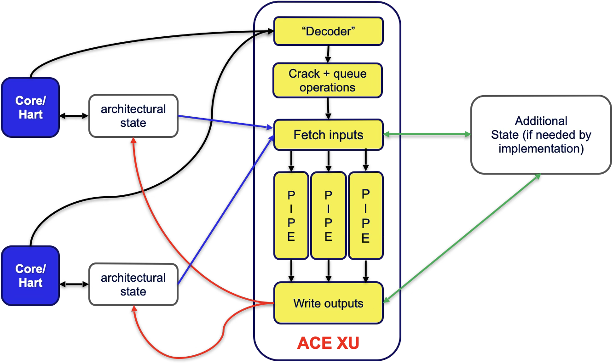

[separator=::,top=25%]
= White Paper: Atomic Cryptographic Extension (ACE) — Hardware-Enforced Stateful Cryptography
Author: Roberto Avanzi
:title-page: true
:bibtex-file: src/ace.bib
:bibtex-order: alphabetical
:bibtex-style: apa

[discrete]
== Executive Summary

Modern high-throughput cloud and client workloads demand low-latency, high-performance cryptography. However, existing hardware acceleration mechanisms force a compromise: general-purpose CPU instructions (e.g., AES-NI) offer high performance but expose raw keys and intermediate states in memory, while secure enclaves (TEEs) and Hardware Security Modules (HSMs) protect secrets but introduce severe performance penalties due to context-switch overhead, cache pollution, and non-uniform interfaces.

To resolve this fundamental tension, we propose the *Atomic Cryptographic Extension (ACE)*, an ISA-level architectural framework designed around the concept of *Cryptographic Contexts (CCs)*. A Cryptographic Context is an opaque, hardware-isolated data structure that encapsulates cryptographic keys, algorithm state, and usage policies. ACE provides hardware-enforced protection of these contexts within dedicated *Cryptographic Registers (CRs)*, and secure export to memory via *Sealed Cryptographic Contexts (SCCs)*, and later import of SCCs into CRs, using authenticated encryption.

By executing cryptographic operations atomically at the primitive level (e.g., full block encryptions or hash rounds) and referencing opaque Cryptographic Registers instead of raw keys, ACE significantly reduces key exposure in memory and prevents state-manipulation attacks. ACE provides a uniform, algorithm-agnostic ISA interface that scales across heterogeneous cores, preventing instruction set bloat while delivering HSM-grade security at CPU-instruction speeds.

We call on the industry to standardize Cryptographic Context formats and semantics to enable secure, seamless cryptographic interoperability across heterogeneous architectures.

<<<

== The Limits of Existing Approaches

=== -- {nbsp}{nbsp}Specialized Environments (HSMs and TEEs)

Historically, high-assurance environments have relied on Hardware Security Modules (HSMs) cite:[HSM-Overview] or secure coprocessors to isolate cryptographic keys. While highly secure, these systems suffer from significant invocation latency and setup overhead. To reduce this latency, modern SoCs utilize Trusted Execution Environments (TEEs) or secure enclaves (e.g., ARM TrustZone cite:[alves2004trustzone], Intel SGX cite:[intel-sgx]).

However, TEEs still introduce substantial performance penalties from context switches, memory encryption/decryption overhead cite:[DBLP-journals-iacr-Gueron16], cache pressure, and increased memory access latency. In cloud-scale systems executing millions of operations per second, these overheads degrade throughput and increase operational costs.

=== -- {nbsp}{nbsp}General-Purpose Environments & Key-Hiding ISAs

To bypass TEE overhead, general-purpose ISAs introduce cryptographic instructions (e.g., Intel AES-NI cite:[intel-AES-NI]). While fast, these instructions process keys in standard registers, exposing them to memory disclosure vulnerabilities cite:[DBLP-conf-raid-VeendCB12,DBLP-journals-csur-LouZJZ21] and cold boot attacks cite:[DBLP-journals-cacm-HaldermanSHCPCFAF09].

Hardware-assisted key-hiding mechanisms like Intel KeyLocker cite:[intel-keylocker] and IBM Protected Key cite:[IBM-z-arch] attempt to mitigate this by operating on encrypted keys decrypted internally by hardware. However, *hiding the key is insufficient to guarantee cryptographic security.*

Complex modes of operation (e.g., XTS cite:[nist-SP-800-38E], GCM-SIV cite:[RFC8452], OCB cite:[DBLP-journals-joc-KrovetzR21]) rely on the secrecy of derived keys, initialization vectors (IVs), and intermediate states (such as authentication tags). Exposing these intermediate values allows attackers to bypass confidentiality or forge messages without recovering the master key. Key-hiding-only ISAs fail to protect this runtime algorithmic state.

=== -- {nbsp}{nbsp}Instruction Set Proliferation

Furthermore, the traditional practice of adding dedicated instructions for every new cryptographic primitive or standard (e.g., national algorithms, post-quantum cryptography) is unsustainable.
This leads to instruction set bloat, which would be particularly problematic in RISC architectures with tight encoding spaces.  A scalable architecture must decouple the ISA from specific cryptographic primitives, providing a constant instruction footprint regardless of the underlying algorithms supported.

== A Comprehensive Approach

Instead of treating cryptography as stateless operations on raw keys, ACE models cryptographic execution as stateful operations on *Cryptographic Contexts (CCs)*.

=== -- {nbsp}{nbsp}Cryptographic Contexts (CCs)

A CC is an opaque, hardware-isolated object that encapsulates:

. *Key Material*: Master and derived keys;
. *Metadata*: Usage policies, algorithm identifiers, and environmental constraints (e.g., hardware configuration, device, privilege level, security state, as well as physical or virtual boot cycle); and
. *Algorithm State*: Intermediate values, IVs, and state machine stage.

Once provisioned, a CC's internal structure is completely opaque to software. It resides in dedicated, non-addressable *Cryptographic Registers* and can only be manipulated via well-defined architectural instructions.
Only the metadata information and certain algorithm state information can be made visible to software, while the rest, including key material and other internal derived state are kept hidden within the hardware.

=== -- {nbsp}{nbsp}ACE Instructions and the ACE Unit

ACE decouples the ISA from specific algorithms by defining a minimal, constant set of instructions. The two primary instructions are:

* *execute*: Performs a unit of algorithmic work (e.g., block encryption, hash absorption).
* *change state*: Transitions the cryptographic state machine between phases (e.g., from AAD processing to ciphertext processing in AEAD).

These instructions are executed *atomically* at the primitive level (e.g., full AES or Keccak rounds). Primitives are never split into individual rounds in software, eliminating side-channel leakage of intermediate round states cite:[DBLP-journals-tit-BouillaguetDDFKR12,DBLP-conf-crypto-Bar-OnDKRS18].

The ACE hardware unit can be implemented as a closely coupled core pipeline or as an attached accelerator shared among multiple heterogeneous cores, maintaining independent architectural state per hardware thread.
The figure below illustrates an attached implementation:
A separate architectural state is maintained for each hardware thread, while the unit itself is shared and can interleave pipelined operations from different requesters.

[width="66%",align="center"]

=== -- {nbsp}{nbsp}Lifecycle and Context Switching

To support context switching and virtualization, a CC can be exported to memory as a *Sealed Cryptographic Context (SCC)*. The hardware encrypts and authenticates the CC using a hardware-managed *Sealing Key* before writing it to memory, preserving all metadata and policy constraints. The Sealing Key can be reconfigured by Machine-mode software, enabling secure cryptographic isolation between process domains and seamless virtual machine (VM) migration.

== Advantages

By design, ACE eliminates traditional cryptographic attack surfaces while maximizing performance:

* *Zero-Exposure Security*: Keys, derived keys, and intermediate states never appear in software-visible registers or memory, neutralizing memory disclosure, cold boot, and transient execution attacks.
* *State-Machine Integrity*: Hardware-enforced state transitions prevent misuse or out-of-order execution of cryptographic phases (e.g., reusing IVs or bypassing authentication checks).
* *Side-Channel Mitigation*: Because algorithm execution is encapsulated within the ACE unit, hardware-level masking and countermeasures can be implemented transparently. Software requires no modification to benefit from these protections.
* *Elimination of Context-Switch Overhead*: High-performance cryptographic operations run in the application's context without requiring costly switches to TEEs or secure enclaves.
* *Algorithm Agility & Future-Proofing*: The ISA remains constant. New algorithms (including Post-Quantum Cryptography) can be supported by updating the ACE unit (either the hardware, or its microcode) without adding new CPU instructions.

== Call for Action

In modern heterogeneous cloud environments, cryptographic workloads must span multiple instruction set architectures (ISAs) and hardware platforms. To prevent fragmentation and enable secure interoperability, the industry must converge on common standards:

1. *Unified Formats*: Standardize the binary representations for Cryptographic Register initialization and Sealed Cryptographic Contexts (SCCs) to allow secure migration across heterogeneous systems.
2. *Semantic Specifications*: Establish a shared specification for cryptographic state machines, algorithm behaviors, and metadata policies to ensure consistent enforcement across different hardware implementations.

== Conclusion

The Atomic Cryptographic Extension (ACE) redefines hardware-accelerated cryptography by shifting from stateless key-hiding to stateful, policy-enforced execution. By encapsulating keys, state, and metadata into hardware-isolated Cryptographic Contexts, ACE delivers HSM-grade security at the speed of native CPU instructions. Standardizing these interfaces across the industry will pave the way for secure, high-performance, and agile cryptographic infrastructure across heterogeneous cloud and client systems.

include::bibliography.adoc[]
